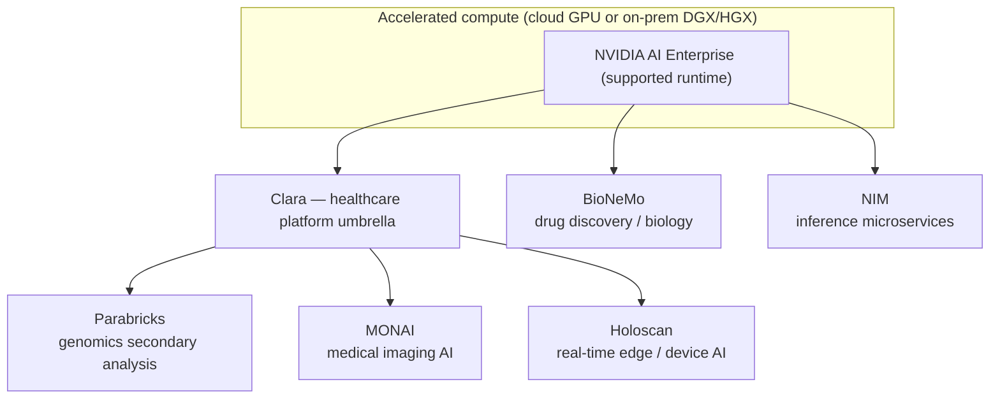
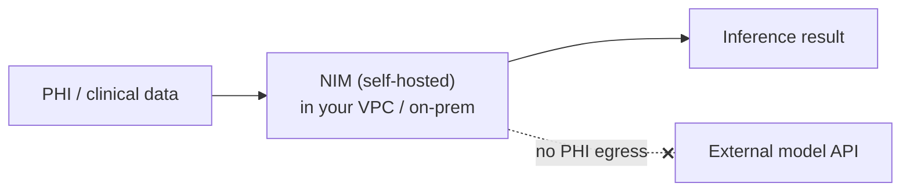

# NVIDIA for HLS

> _Last reviewed: 2026-06-28 — see the [freshness policy](../appendix/maintenance.md)._

## Learning objectives

After this chapter you will be able to:

- Place NVIDIA's healthcare stack (Clara, Parabricks, MONAI, BioNeMo, Holoscan, NIM) against HLS use cases.
- Explain why NVIDIA is an accelerated-compute layer that spans cloud and on-prem rather than a cloud itself.
- Decide when to reach for the NVIDIA stack and how it keeps PHI inside your boundary.

## NVIDIA's HLS positioning

NVIDIA is not a cloud and not a clinical-data platform — it is the **accelerated-compute layer** beneath HLS AI, imaging, and genomics, plus a set of healthcare-specific SDKs and pre-trained models on top. Its GPUs run on **every cloud** (AWS/GCP/Azure all offer NVIDIA instances) and **on-prem** (DGX/HGX systems), unified by **NVIDIA AI Enterprise** — a supported software runtime. Think of it as the "picks and shovels": you compose it *with* the platforms in the previous chapters rather than instead of them.

This cross-cutting nature is why NVIDIA shows up in three different parts of this bootcamp: genomics ([Part 7](../07-genomics/00-sequencing-pipelines.md)), medical imaging AI and drug discovery ([Part 6](../06-ai-ml/01-medical-imaging.md)), and on-prem/hybrid compute ([Part 4](./06-on-prem-hybrid.md)).

## The healthcare stack

| Component | Domain | What it is |
| --- | --- | --- |
| **Parabricks** | Genomics | GPU-accelerated secondary analysis (GATK, DeepVariant). A 30× genome that takes ~30 hours on CPU runs in well under an hour. See [Sequencing pipelines](../07-genomics/00-sequencing-pipelines.md). |
| **MONAI** | Medical imaging | Open-source PyTorch framework for medical-imaging deep learning (co-developed with King's College London); **MONAI Deploy** packages models for clinical use. See [Medical imaging AI](../06-ai-ml/01-medical-imaging.md). |
| **BioNeMo** | Biotech / drug discovery | Generative-AI platform for biology — protein structure, molecular generation, and other biopharma models; widely adopted by life-science R&D. |
| **Holoscan** | Medical devices | Real-time, low-latency edge AI for streaming sensor/video data (surgical video, ultrasound, endoscopy). |
| **Isaac for Healthcare** | Robotics | Simulation and AI for medical robotics and surgical systems. |
| **NIM** | Deployment | NVIDIA Inference Microservices — containerized, optimized model-serving you self-host. |
| **Clara** | Umbrella | NVIDIA's healthcare platform brand spanning the above imaging/genomics/device SDKs. |

## Cloud, on-prem, or both

Because the stack runs anywhere NVIDIA GPUs run, it sits naturally in **hybrid** HLS designs (see [On-premises & hybrid](./06-on-prem-hybrid.md)):

- **Cloud GPUs** — burst Parabricks or imaging-AI jobs onto cloud GPU instances; release them after.
- **On-prem DGX/HGX** — keep large genomics or imaging workloads on owned accelerated compute, co-located with the data (sunk cost, data-local, data sovereignty).
- **Edge** — Holoscan runs inference next to the device, where latency and connectivity demand it.

## PHI, NIM, and keeping data in your boundary

The most architecturally significant piece for an SA is **NIM**: self-hosted, containerized model inference. Because you run the model **inside your own environment** (your VPC or your on-prem cluster), **PHI never leaves your boundary** to reach a third-party model API. That sidesteps a major [HIPAA](../03-compliance/00-hipaa.md) and data-residency concern (no new business associate, no cross-border transfer) and is often the deciding factor for clinical GenAI in regulated or sovereign settings — compare with calling an external LLM API, which sends data out.

## When to reach for the NVIDIA stack

- **Genomics at scale or under SLA** — Parabricks when CPU pipelines are too slow or too costly (see [HealthOmics](../07-genomics/01-healthomics.md) for the managed alternative; Parabricks for raw acceleration on your own compute).
- **Medical imaging AI** — MONAI as the framework for training/deploying imaging models.
- **Drug discovery / computational biology** — BioNeMo for protein and molecule models.
- **Medical-device / real-time edge AI** — Holoscan.
- **Self-hosted GenAI over PHI** — NIM, to keep data in-boundary.
- **Data sovereignty / on-prem mandate** — the whole stack on DGX where data cannot leave.

## Labs

- [`RNASEQ`](https://github.com/anothernoise/RNASEQ) — the nf-core genomics pipeline; Parabricks is the GPU-accelerated path for the secondary-analysis steps.
- Medical-imaging and BioNeMo labs are good extension exercises (see the [bootcamp format](../00-orientation/03-bootcamp-format.md) for the lab model).

## Check yourself

1. Why is NVIDIA described as a layer you compose *with* AWS/GCP/Azure rather than an alternative to them?
2. A clinical team wants GenAI over patient notes but cannot send PHI to an external API. Which NVIDIA component addresses this, and how?
3. A diagnostics lab needs to cut its whole-genome secondary-analysis time from hours to minutes on its own hardware. Which component fits, and which managed alternative would you compare it against?

## Further reading

- [NVIDIA Healthcare & Life Sciences](https://www.nvidia.com/en-us/industries/healthcare-life-sciences/)
- [NVIDIA Clara](https://www.nvidia.com/en-us/clara/)
- [NVIDIA Parabricks](https://www.nvidia.com/en-us/clara/genomics/)
- [MONAI](https://monai.io/)
- [NVIDIA BioNeMo](https://www.nvidia.com/en-us/clara/bionemo/)
- [NVIDIA NIM](https://www.nvidia.com/en-us/ai/)
