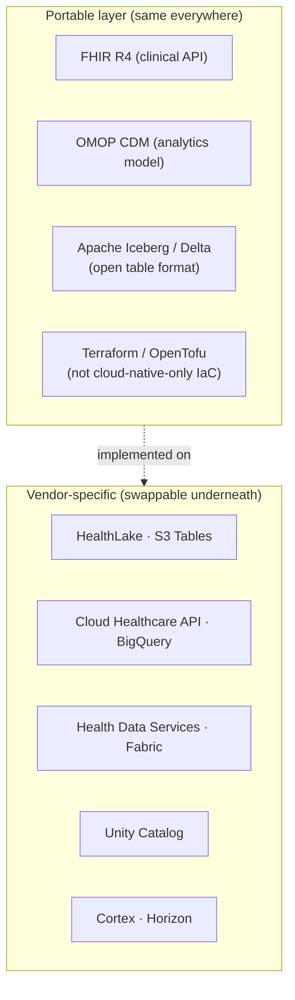

# Cloud portability & avoiding lock-in

> _Last reviewed: 2026-07-03 — see the [freshness policy](../appendix/maintenance.md)._

## Learning objectives

After this chapter you will be able to:

- Weigh vendor lock-in against the productivity of managed services, deliberately.
- Use open standards (FHIR, OMOP, Iceberg) as the portability layer across the five clouds.
- Recognize when cloud repatriation is the right call — and when it's fashion, not engineering.

## Lock-in is a trade-off, not automatically a mistake

Having read the [AWS](./01-aws.md), [GCP](./02-gcp.md), [Azure](./03-azure.md),
[Databricks](./04-databricks.md), and [Snowflake](./05-snowflake.md) chapters, you now know
each platform's proprietary managed services (HealthLake, Cloud Healthcare API, Health Data
Services, Unity Catalog, Cortex) are exactly what make them valuable — and exactly what makes
switching away from them expensive. **Lock-in is not automatically wrong** — see
[Trade-offs, TCO & cost](../01-foundations/03-tradeoffs-tco.md)'s build-vs-buy framework: you
are trading portability for velocity and lower operational burden. The job is to make that
trade **deliberately and by design**, not discover it by accident when a contract renewal or
an executive mandate forces a move.

This is now a live industry question, not a theoretical one: by some 2025–26 surveys, **86%
of enterprises already run multi-cloud specifically to avoid lock-in**, and a similar share of
CIOs report planning to repatriate at least some workloads from public cloud — the highest
rate on record. Vendor concentration risk is a board-level topic, and an HLS SA should be able
to answer "what would it cost us to leave this platform?" for any major design decision.

## The portability layer: open standards over proprietary services

The lowest-lock-in HLS architecture uses **open, portable standards at every layer**, with
cloud-specific managed services as an *implementation choice* behind them — not baked into
the data model or the API contract itself.

- **FHIR R4** as the clinical API contract means your consumers depend on the FHIR shape, not
  on HealthLake vs. Cloud Healthcare API vs. Health Data Services specifically (see
  [FHIR](../02-interoperability/01-fhir.md)) — swapping the underlying managed FHIR store is a
  migration project, not a rewrite of every consumer.
- **OMOP CDM** as the analytics model (see [OMOP on the cloud](../05-data-platforms/01-omop-on-cloud.md))
  means your queries and the OHDSI tool ecosystem work the same on Databricks, Snowflake, or
  BigQuery — the engine underneath is a deployment decision.
- **Apache Iceberg** (or Delta, similarly open) as the table format (see
  [variant store on AWS](../07-genomics/03-variant-store-aws.md) for a concrete example) keeps
  your data queryable by multiple engines rather than locked into one proprietary format.
- **Terraform/OpenTofu** instead of cloud-native-only IaC (CloudFormation, ARM templates)
  keeps your infrastructure-as-code portable across providers, even if you don't multi-cloud
  today.

## When repatriation or multi-cloud is the right call

- **Cost at scale.** Steady-state, predictable workloads sometimes genuinely cost less
  on owned infrastructure once you're large enough to amortize the operational burden — this
  is a TCO calculation (see [Trade-offs, TCO & cost](../01-foundations/03-tradeoffs-tco.md)),
  not a reflex.
- **Regulatory/residency requirements** that a specific provider can't satisfy in a specific
  region — see [regional compliance](../03-compliance/05-regional-compliance.md) — sometimes
  force a second provider or on-prem regardless of preference.
- **Negotiating leverage.** Even a credible *ability* to move (not necessarily moving) improves
  contract terms at renewal — this is a real, quantified motivator, not just theory: one
  well-known case avoided an estimated $7M over five years by maintaining portability; a UK
  government report estimated single-provider overreliance risk in the hundreds of millions.
- **When it's the wrong call:** repatriating or multi-clouding *without* the operational
  maturity to run what you're bringing back in-house often costs more than it saves — see the
  [on-premises & hybrid](./06-on-prem-hybrid.md) chapter's honest trade-off table before
  treating repatriation as a default good.

## Design guidance

1. **Push proprietary services to the edges, not the core.** Let the FHIR store, the
   warehouse engine, and the compute layer be swappable; keep the data model (FHIR/OMOP) and
   the infrastructure code (Terraform) portable regardless of what's underneath.
2. **Price the exit, even if you don't plan to leave.** As part of any major platform ADR (see
   [C4 & ADRs](../01-foundations/02-c4-and-adrs.md)), write down roughly what it would cost to
   migrate off — this number is useful negotiating leverage and an honest risk disclosure.
3. **Don't multi-cloud for its own sake.** Running two clouds to "avoid lock-in" that neither
   team has the operational depth to run well is often a worse trade than accepting the
   lock-in — see the [capability map](./00-overview-capability-map.md)'s guidance on matching
   platform to problem.
4. **Revisit at renewal, not continuously.** This is a periodic strategic check (tied to
   contract cycles), not something to re-litigate on every design decision.

## Check yourself

1. Why is choosing a proprietary managed service not automatically a mistake, even knowing it creates lock-in?
2. Name the three open standards this chapter identifies as the portability layer, and what each keeps swappable underneath it.
3. Give one legitimate reason to repatriate a workload and one situation where repatriating would likely be a mistake.

## Further reading

- [Trade-offs, TCO & cost](../01-foundations/03-tradeoffs-tco.md) · [Cloud capability map](./00-overview-capability-map.md)
- [On-premises & hybrid for HLS](./06-on-prem-hybrid.md)
- [Apache Iceberg](https://iceberg.apache.org/) · [OpenTofu](https://opentofu.org/)
- [Failure-mode case studies](../10-sa-craft/05-failure-mode-case-studies.md) — case 6 covers the 2024 CrowdStrike outage and vendor-concentration risk
