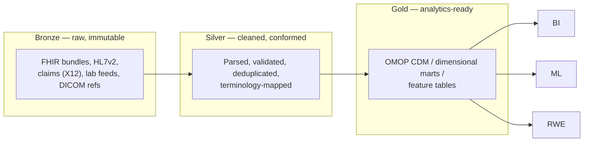

# Lakehouse vs warehouse

> _Last reviewed: 2026-06-28 — see the [freshness policy](../appendix/maintenance.md)._

## Learning objectives

After this chapter you will be able to:

- Distinguish data lake, data warehouse, and lakehouse — and when each fits HLS.
- Apply the medallion (bronze/silver/gold) pattern to clinical and claims data.
- Choose a modeling style (normalized, dimensional, OMOP) for the gold layer.

## Three architectures, one decision

HLS data platforms sit on a spectrum. The choice drives cost, governance, and what analytics are possible.

| | Data warehouse | Data lake | Lakehouse |
| --- | --- | --- | --- |
| Stores | Structured, modeled tables | Raw files (any format) | Raw files + ACID tables |
| Schema | On write (rigid) | On read (flexible) | Both |
| Strength | Fast SQL/BI on clean data | Cheap storage of everything | Both, in one place |
| HLS fit | Claims/financial reporting | Genomics, imaging, raw FHIR | RWD, OMOP, ML on mixed data |
| Examples | Snowflake, Redshift, BigQuery | S3/ADLS/GCS | Databricks (Delta), Snowflake (Iceberg) |

The **lakehouse** has become the default for HLS because the domain mixes petabyte-scale raw data (genomics, DICOM, raw FHIR bundles) with the need for governed, query-ready models (OMOP) — and you do not want to copy data between a separate lake and warehouse. See [Databricks](../04-cloud-platforms/04-databricks.md) and [Snowflake](../04-cloud-platforms/05-snowflake.md) for the platform options.

## The medallion pattern

The dominant lakehouse layout refines data in stages, so raw data stays auditable and each layer has a clear contract:

- **Bronze** keeps raw data exactly as received — your audit trail and your "re-do" insurance ([21 CFR Part 11](../03-compliance/02-gxp-part11.md) integrity, HIPAA traceability).
- **Silver** conforms and validates: parse FHIR/HL7v2, dedupe patients, map source codes to standard vocabularies (see [Clinical terminologies](../02-interoperability/03-terminologies.md)).
- **Gold** is what analysts and models consume — modeled for the question.

## Modeling the gold layer

The gold layer's model depends on the use case:

- **OMOP CDM** — for observational research, RWE, and cross-institution analytics. The standard choice for clinical RWD. See [OMOP on the cloud](./01-omop-on-cloud.md).
- **Dimensional (star schema)** — for BI and operational reporting (facts = encounters/claims, dimensions = patient/provider/date). Familiar to warehouse teams.
- **Feature tables** — denormalized, ML-ready tables for model training.
- **FHIR-shaped** — keep resources close to FHIR for app-facing serving.

You often build **more than one** gold model from the same silver layer — OMOP for research, a star schema for finance — which is exactly what the lakehouse enables without recopying raw data.

## Choosing for an HLS workload

1. **Mostly structured claims + BI, SQL team, minimal ops** → warehouse-style (Snowflake).
2. **Mixed raw + modeled, genomics/imaging, ML-heavy** → lakehouse (Databricks Delta or Snowflake + Iceberg).
3. **Pure object storage of raw genomics/DICOM with occasional batch** → a lake tier under either.

For most modern HLS data platforms the answer is a lakehouse with a medallion layout and an OMOP (or OMOP + dimensional) gold layer.

## Lab

[`hls-lakehouse-rwd`](https://github.com/anothernoise/hls-lakehouse-rwd) builds exactly this: bronze → silver → OMOP gold on Databricks and Snowflake.

## Check yourself

1. Why does the lakehouse suit HLS better than a pure warehouse or pure lake?
2. What belongs in bronze vs silver vs gold, and why keep bronze immutable?
3. When would you build two different gold models from the same silver layer?

## Further reading

- [Databricks lakehouse](https://www.databricks.com/product/data-lakehouse)
- [The medallion architecture](https://www.databricks.com/glossary/medallion-architecture)
- [Kimball dimensional modeling](https://www.kimballgroup.com/data-warehouse-business-intelligence-resources/kimball-techniques/dimensional-modeling-techniques/)
