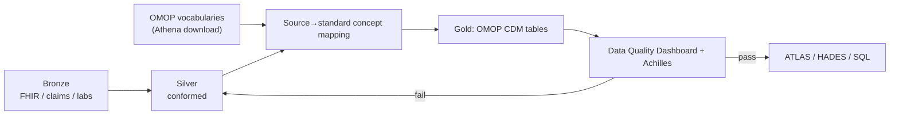

# OMOP on the cloud

> _Last reviewed: 2026-06-28 — see the [freshness policy](../appendix/maintenance.md)._

## Learning objectives

After this chapter you will be able to:

- Implement the OMOP CDM as a gold layer on a cloud lakehouse or warehouse.
- Sequence the ETL and data-quality steps that produce a trustworthy OMOP instance.
- Choose between Databricks, Snowflake, and BigQuery for an OMOP build.

## From the CDM spec to a running platform

[OMOP CDM](../02-interoperability/04-omop-cdm.md) defines *what* the model is. This chapter is about *building and operating* it on the cloud as the gold layer of a [lakehouse](./00-lakehouse-vs-warehouse.md). The work is mostly **ETL + vocabulary mapping + data quality**, not schema design — the schema is given.

## The build, step by step

1. **Load vocabularies.** Download the OMOP vocabulary tables from [Athena](https://athena.ohdsi.org/) and load `concept`, `concept_relationship`, `concept_ancestor`, etc. These are the backbone of every mapping.
2. **Stage and conform (silver).** Parse sources, dedupe patients into a single `person`, and derive `observation_period` windows.
3. **Map source codes to standard concepts.** ICD-10-CM → SNOMED, local labs → LOINC, drugs → RxNorm. **Track the unmapped rate** — unmapped clinical codes are lost evidence.
4. **Populate the CDM tables** (`condition_occurrence`, `drug_exposure`, `measurement`, `visit_occurrence`, …) referencing standard concepts.
5. **Run data quality.** [Achilles](https://github.com/OHDSI/Achilles) (characterization) and the [Data Quality Dashboard](https://github.com/OHDSI/DataQualityDashboard) catch ETL errors systematically. Treat DQ failures as blocking.
6. **Validate with the tools.** If [ATLAS](https://github.com/OHDSI/Atlas) can build a cohort on your CDM, the structure is sound.

## Platform options

| Platform | OMOP fit | Notes |
| --- | --- | --- |
| **Databricks** | Delta tables as CDM; Spark ETL; Glow to join genomics | Strong for large-scale ETL + ML; Unity Catalog governs PHI. See [Databricks](../04-cloud-platforms/04-databricks.md). |
| **Snowflake** | Native tables as CDM; SQL/Snowpark ETL | Strong for SQL-centric teams; dynamic masking + clean rooms for sharing. See [Snowflake](../04-cloud-platforms/05-snowflake.md). |
| **BigQuery** | CDM as columnar tables | Google publishes OMOP-on-BigQuery patterns; serverless scale. |

All three run the same OMOP schema; pick based on your team and the rest of the estate (see the [capability map](../04-cloud-platforms/00-overview-capability-map.md)).

## Operational considerations

- **Incremental ETL.** New data arrives continuously; design silver→gold to upsert, not full-reload, at RWD scale.
- **Vocabulary versioning.** OMOP vocabularies update; pin the version used for any reproducible study.
- **PHI governance.** The `person` table and dates are PHI — apply column masking / row filters (Unity Catalog, Snowflake masking) and audit access (see [Governance & data contracts](./03-governance-contracts.md)).
- **Provenance.** Keep bronze immutable and record ETL/version lineage so any analysis is reproducible.

## Lab

[`hls-lakehouse-rwd`](https://github.com/anothernoise/hls-lakehouse-rwd) — OMOP CDM gold layer on Databricks and Snowflake with vocabulary mapping and DQ checks.

## Check yourself

1. Why are the OMOP vocabulary tables loaded first, and what breaks without them?
2. What should an ETL do with source diagnosis codes that fail to map to a standard concept?
3. Why pin the vocabulary version for a published RWE study?

## Further reading

- [The Book of OHDSI](https://ohdsi.github.io/TheBookOfOhdsi/)
- [OMOP CDM v5.4](https://ohdsi.github.io/CommonDataModel/cdm54.html)
- [OHDSI tools (ATLAS, HADES, Achilles, DQD)](https://www.ohdsi.org/software-tools/)
