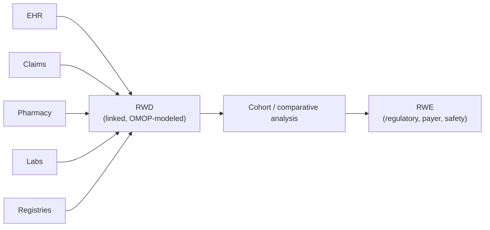
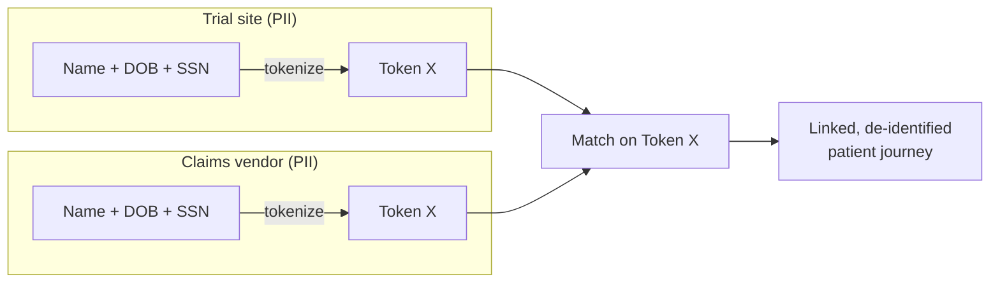

# Real-world data & evidence

## Learning objectives

After this chapter you will be able to:

- Distinguish RWD from RWE and name the major real-world data sources.
- Explain patient tokenization and how it links datasets without exposing PII.
- Reason about the regulatory acceptability of RWE for FDA/EMA submissions.

## RWD vs RWE

- **Real-World Data (RWD)** is health data collected outside controlled trials: EHRs, claims, pharmacy, labs, registries, wearables, and patient-reported data.
- **Real-World Evidence (RWE)** is the clinical evidence about a product's use, benefits, or risks *derived from analysing RWD*.

RWD is the raw material; RWE is the conclusion. The FDA's 21st Century Cures Act mandate accelerated RWE for regulatory decisions — label expansions, post-market safety, single-arm trials with external controls — making RWD platforms a core HLS workload. The standard analytic model for RWD is [OMOP](./01-omop-on-cloud.md).

## The hard problem: linkage across fragmented sources

A patient's data is scattered across providers, payers, and pharmacies — each holding a partial view, none allowed to share PII freely. The value of RWD comes from **linking** these into a longitudinal patient journey. But you cannot share names and MRNs across organisations under [HIPAA](../03-compliance/00-hipaa.md) and [GDPR](../03-compliance/03-gdpr-residency.md). This is what **tokenization** solves.

## Patient tokenization

Tokenization replaces a patient's direct identifiers (name, DOB, SSN) with an irreversible, consistent **token** computed by a standard algorithm. The same patient produces the same token at every source — so datasets can be **linked by matching tokens, without any party ever exposing PII**.

- Tokens are generated by privacy-preserving software (e.g. Datavant, HealthVerity) running **inside each data holder's environment** — raw PII never leaves.
- Multiple token types (different identifier combinations) improve match rates while resisting re-identification.
- The result is **de-identified linked data**: you get the longitudinal journey without the identities. This is now foundational in clinical development — tokenizing a trial so its participants can be followed in EHR/claims data after the study has grown rapidly and is becoming a default.

Tokenization complements, not replaces, the methods in [De-identification & consent](../03-compliance/04-deidentification-consent.md): you still manage re-identification risk on the linked dataset, and consent must permit the linkage.

### Tools, best practices & scaling

**Tools / ecosystem.** The market is dominated by specialist vendors — **Datavant** (the
de-facto network), **HealthVerity**, and others — plus payer/EHR-native tokenization.
A token vendor provides: the tokenization software that runs *inside* each data holder, a
matching/linkage service, and often a marketplace of pre-tokenized datasets (claims,
labs, mortality). Some organisations run **in-house** tokenization for internal linkage.

**Best practices:**

- **Tokenize at the source, never centralize PII.** The software runs where the PII already
  lives; only tokens (plus de-identified payload) leave. A central PII pile defeats the point.
- **Use multiple token types.** Different identifier combinations (e.g. name+DOB+SSN vs
  name+DOB+gender+ZIP) raise match rates and provide fallback when one identifier is missing —
  while a "double-blind"/site-specific token step limits cross-dataset re-identification.
- **Govern the *linked* result.** Linkage increases re-identification risk; run an Expert
  Determination on the joined dataset and apply [governance](./03-governance-contracts.md)
  (masking, access control, audit) — tokenization is not a HIPAA exemption.
- **Confirm consent/legal basis** covers secondary linkage before you do it.
- **Measure match quality.** Track match rate and false-match risk; a bad link is worse than
  no link in an RWE study.

**Scaling:**

- Tokenization is **embarrassingly parallel** — token generation is a per-record hash-style
  transform; run it as a batch job (e.g. Spark on the [lakehouse](./00-lakehouse-vs-warehouse.md))
  over millions of records.
- The expensive part is **matching/linkage** at population scale; push it to the warehouse/
  lakehouse engine (token-keyed joins) or the vendor's linkage service rather than bespoke code.
- Make linkage **incremental** — re-tokenizing the whole cohort when a new source arrives
  does not scale; design for additive joins (the same N+1 discipline as variant stores).

## Is RWE good enough for regulators?

RWD is messy — missing data, confounding, inconsistent capture. Regulators accept RWE when the data and methods are credible:

- **Fitness for use** — is the RWD relevant and reliable for the specific question? (FDA emphasises data relevance and reliability.)
- **Transparency & reproducibility** — pre-specify the analysis; pin data and vocabulary versions; use validated tooling (OHDSI HADES) so results can be reproduced.
- **Provenance** — auditable lineage from source to result (this is where the immutable bronze layer and [data contracts](./03-governance-contracts.md) earn their keep).

The SA's job: build the RWD platform so that *provenance, reproducibility, and governance* are intrinsic — because that, not raw volume, is what makes RWE defensible.

## Lab

[`hls-lakehouse-rwd`](https://github.com/anothernoise/hls-lakehouse-rwd) — RWD lakehouse with OMOP gold; an extension exercise adds tokenized linkage of two synthetic sources.

## Check yourself

1. A sponsor wants to follow trial participants in claims data after the trial ends, without exposing their identities. What technique enables this, and where are tokens generated?
2. Why is "more data" not sufficient to make RWE acceptable to a regulator — what matters more?
3. How do tokenization and de-identification relate; does tokenizing remove the need to manage re-identification risk?

## Further reading

- [FDA Real-World Evidence program](https://www.fda.gov/science-research/science-and-research-special-topics/real-world-evidence)
- [OHDSI / The Book of OHDSI](https://ohdsi.github.io/TheBookOfOhdsi/)
- [Datavant — RWD linkage & tokenization](https://www.datavant.com/)
