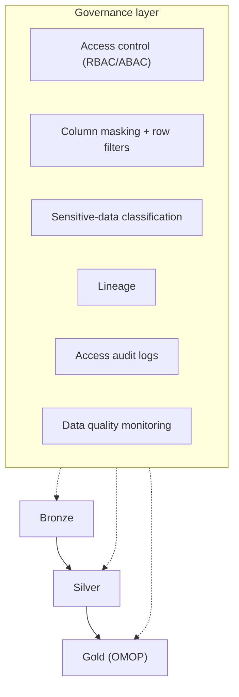
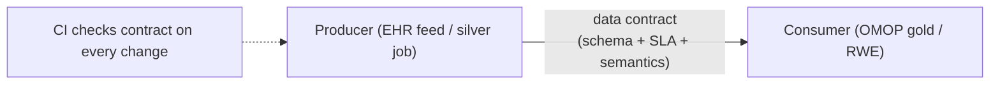

# Governance & data contracts

> _Last reviewed: 2026-06-28 — see the [freshness policy](../appendix/maintenance.md)._

## Learning objectives

After this chapter you will be able to:

- Apply fine-grained governance (access control, masking, lineage, audit) to a PHI data platform.
- Use data contracts to make pipelines reliable and changes safe.
- Map governance controls to the compliance regimes the platform must satisfy.

## Why governance is an architecture concern, not an afterthought

On an HLS data platform, governance *is* part of the design. Who can see which PHI columns, how access is audited, and how data quality is guaranteed are not features you bolt on — they determine whether the platform is deployable under [HIPAA](../03-compliance/00-hipaa.md)/[HITRUST](../03-compliance/01-hitrust.md)/[GxP](../03-compliance/02-gxp-part11.md) and trustworthy for [RWE](./02-rwd-rwe.md).

## The governance stack

- **Access control** — least privilege via roles/attributes; deny by default. Authorized clinicians vs. analysts vs. researchers get different views.
- **Dynamic masking & row filters** — serve one table to many trust levels: analysts see masked/de-identified values, authorized users see clear text. (Unity Catalog on [Databricks](../04-cloud-platforms/04-databricks.md); dynamic data masking on [Snowflake](../04-cloud-platforms/05-snowflake.md).)
- **Sensitive-data classification** — tag PHI/PII columns (auto-classification) so masking and policy apply uniformly.
- **Lineage** — trace every gold column back to its source; essential for RWE provenance and audits. See [Data lineage & provenance](./07-data-lineage-provenance.md) for the full architecture treatment.
- **Audit logs** — who accessed which PHI, when (HIPAA Security Rule; retain per policy).
- **Data quality monitoring** — freshness, completeness, validity; catch silent breakage.

Codify all of this as **policy-as-code + IaC** so controls are uniform and *provable* — exactly what a HITRUST assessor wants to sample.

## Data contracts

A **data contract** is an explicit, versioned agreement between a data producer and its consumers about a dataset's schema, semantics, quality, and SLAs. On HLS platforms — where an upstream EHR feed change can silently corrupt an OMOP table feeding an RWE study — contracts prevent expensive, late surprises.

A contract typically specifies:

- **Schema** — fields, types, and required-ness (e.g. `person_id` non-null, `condition_concept_id` is a valid OMOP standard concept).
- **Semantics** — what each field means and its allowed code system (see [terminologies](../02-interoperability/03-terminologies.md)).
- **Quality SLAs** — freshness, completeness, unmapped-code ceiling.
- **Change policy** — how breaking changes are versioned and communicated.
- **Ownership** — who is accountable.

Enforce contracts in CI: validate schema and quality expectations on every pipeline change, so a breaking change fails the build rather than the study. The same discipline applies to event streams via a schema registry — see [Event-driven & real-time architecture on modern infra](../08-integration/09-event-streaming-modern-infra.md).

## Mapping controls to compliance

| Control | Satisfies |
| --- | --- |
| Encryption at rest/in transit | HIPAA Security Rule; GDPR safeguards |
| RBAC/ABAC + MFA + masking | HIPAA minimum-necessary; HITRUST access controls |
| Immutable audit logs (6 yr) | HIPAA §164.312(b); 21 CFR Part 11 audit trail |
| Lineage + versioned ETL | RWE provenance; GxP data integrity (ALCOA+) |
| Residency-pinned storage | GDPR/EHDS; Canadian residency (see [regional compliance](../03-compliance/05-regional-compliance.md)) |

Design once, map to each regime — the "assess once, report many" idea from HITRUST generalizes across the platform.

## Check yourself

1. How do you serve a single OMOP table to both analysts (de-identified) and authorized clinicians (clear text) without copying it?
2. What does a data contract specify, and how does enforcing it in CI prevent a corrupted RWE study?
3. Pick three governance controls and name the compliance requirement each satisfies.

## Further reading

- [Unity Catalog](https://www.databricks.com/product/unity-catalog) · [Snowflake Horizon](https://www.snowflake.com/en/product/features/horizon/)
- [Data contracts (datacontract.com)](https://datacontract.com/)
- [NIST SP 800-66r2 (HIPAA Security)](https://csrc.nist.gov/publications/detail/sp/800-66/rev-2/final)
