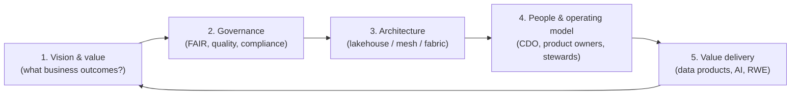

# Data strategy in an HLS/biotech company

> _Last reviewed: 2026-06-29 — see the [freshness policy](../appendix/maintenance.md)._

## Learning objectives

After this chapter you will be able to:

- Frame a data strategy for an HLS/biotech organization, not just a platform.
- Apply FAIR principles and choose a data-architecture style (lakehouse / mesh / fabric).
- Explain the SA's role in data strategy and the biotech-specific wrinkles.

## Why strategy, not just a platform

In biotech and HLS, **data is the asset** — the output of expensive experiments, trials, and care — and increasingly the fuel for AI. Yet most organizations' data is trapped in silos: R&D instruments, the LIMS, the EHR, the CRO's systems, claims feeds. A **data strategy** is the plan that turns that scattered data into a reusable, governed, AI-ready asset aligned to business goals. It is a level above the [lakehouse](./00-lakehouse-vs-warehouse.md) and [OMOP](./01-omop-on-cloud.md) chapters — those are *how*; strategy is *what, why, and in what order*.

## A five-part framework

1. **Vision & value.** Tie data work to outcomes — faster drug discovery, AI-ready R&D, RWE for regulators, commercial insight. Without a value thesis, "data strategy" becomes a platform shopping list. Leadership (often a **Chief Data Officer**) owns the vision.
2. **Governance.** Quality, lineage, access, and compliance as platform primitives ([governance & data contracts](./03-governance-contracts.md)) — plus the FAIR principles below. In regulated work this includes [GxP data integrity / ALCOA+](../03-compliance/02-gxp-part11.md).
3. **Architecture.** Pick a style for the org's shape (next section), built on the [lakehouse](./00-lakehouse-vs-warehouse.md) and standard models ([OMOP](./01-omop-on-cloud.md)).
4. **People & operating model.** Roles (CDO, data product owners, stewards, platform team), funding, and how decisions get made — the part that actually determines success.
5. **Value delivery.** Ship **data products** and AI/RWE use cases iteratively; measure adoption, not just pipelines built.

## FAIR — the north star for HLS data

The dominant principle set in life-science data strategy is **FAIR**: data should be **F**indable, **A**ccessible, **I**nteroperable, and **R**eusable. FAIR is what makes data *AI-ready* — the 2025–26 industry consensus is that the barrier to AI in pharma isn't models, it's non-FAIR data. Practically: catalog and richly describe data (Findable), control but enable access (Accessible), use standard models and vocabularies — FHIR/OMOP/[terminologies](../02-interoperability/03-terminologies.md) — (Interoperable), and license/document for reuse (Reusable).

## Choosing a data-architecture style

| Style | Idea | Fits when |
| --- | --- | --- |
| **Lakehouse** | One governed platform, medallion layers | Most orgs; the default substrate ([lakehouse](./00-lakehouse-vs-warehouse.md)) |
| **Data mesh** | Domain teams own **data products**; central self-serve platform + federated governance — see [Data mesh in HLS](./05-data-mesh.md) | Large orgs with strong domains (R&D, clinical, commercial) and platform maturity |
| **Data fabric** | Metadata/virtualization layer over many sources | Lots of legacy systems you can't consolidate yet |
| **Data-as-a-product** | Treat each dataset as a product with an owner, SLA, contract | A discipline you can adopt within any of the above |

These are not exclusive: a common HLS pattern is a **lakehouse substrate + data-as-a-product discipline**, evolving toward **mesh** as domains mature.

## Biotech-specific wrinkles

- **R&D vs commercial divide.** R&D data (instruments, assays, multi-omics) and commercial/clinical data (claims, EHR, RWD) have different shapes, owners, and regulations — the strategy must bridge them, not pretend they're one.
- **Instrument & lab data.** High-volume, heterogeneous output from sequencers, imagers, and lab instruments (via the [LIMS](../02-interoperability/03-terminologies.md)) — capture it FAIR at the source.
- **GxP data integrity.** R&D/manufacturing data supporting submissions must satisfy ALCOA+ and [21 CFR Part 11](../03-compliance/02-gxp-part11.md) — strategy and governance must encode it.
- **RWD acquisition & partnerships.** Much value comes from *external* data (claims, registries) linked via [tokenization](./02-rwd-rwe.md); sourcing, contracts, and clean-room collaboration are strategy decisions.
- **Build vs buy.** Specialist platforms (Benchling, Veeva, etc.) vs a general lakehouse — a recurring [trade-off](../01-foundations/03-tradeoffs-tco.md).

## A maturity model

A useful ladder to place an org and set the next step:

1. **Ad hoc** — data in silos, copied by hand, no catalog.
2. **Managed** — central platform, basic governance and access control.
3. **FAIR** — cataloged, standard-modeled, quality-monitored, reusable.
4. **AI-ready** — governed, FAIR data feeding ML/RWE with lineage and reproducibility.

## The SA's role

You are rarely *the* CDO, but you turn strategy into architecture: choosing the platform style, encoding FAIR and governance as IaC and [data contracts](./03-governance-contracts.md), designing the [OMOP](./01-omop-on-cloud.md)/FHIR backbone, and sequencing delivery so the first data products ship before the grand platform is "done." Strategy that never reaches an architecture is a slide deck; your job is to land it.

## Check yourself

1. Why is "data strategy" more than choosing a lakehouse?
2. What do the four FAIR letters stand for, and why is FAIR the prerequisite for AI in pharma?
3. Name two biotech-specific factors a generic enterprise data strategy would miss.

## Further reading

- [GO FAIR — FAIR principles](https://www.go-fair.org/fair-principles/)
- [Data mesh (Zhamak Dehghani)](https://martinfowler.com/articles/data-mesh-principles.html)
- [DAMA-DMBOK (data management body of knowledge)](https://www.dama.org/cpages/body-of-knowledge)
