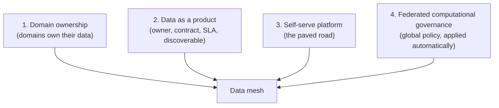

# Data mesh in HLS

> _Last reviewed: 2026-06-29 — see the [freshness policy](../appendix/maintenance.md)._

## Learning objectives

After this chapter you will be able to:

- Explain Zhamak Dehghani's four data-mesh principles and what they decentralize.
- Apply each principle to an HLS/biotech organization's domains.
- Decide when a data mesh fits — and why federated governance is the HLS linchpin.

## From a central data lake to a mesh

As an HLS organization scales, the classic pattern — one central data team running one monolithic [lakehouse](./00-lakehouse-vs-warehouse.md) — becomes a bottleneck. That central team can't possibly understand the semantics of every domain (a genomics assay, a trial protocol, a claims feed) and becomes a queue everyone waits behind. **Data mesh** (coined by Zhamak Dehghani in 2019) is the response: decentralize data ownership to the domains that know the data, while a shared platform and *global* governance keep it interoperable and compliant. It is an **organizational + architectural paradigm**, not a product you buy — and it sits inside the broader [data strategy](./04-data-strategy.md).

## The four principles (Dehghani)

## Each principle, applied to HLS

### 1. Domain-oriented ownership

The team that produces and understands the data owns it as a published asset — not a central team that has to reverse-engineer its meaning. Natural HLS domains:

- **Discovery / R&D** (assays, screening, multi-omics)
- **Translational / genomics** (sequencing, variants)
- **Clinical / trials** (EDC, EHR, lab)
- **Real-world / commercial** (claims, RWD, market)
- **Manufacturing / quality** (GxP, batch)

The genomics team owning the [variant data product](../07-genomics/02-variant-stores.md) — with their interpretation expertise — beats a central team guessing at VCF semantics.

### 2. Data as a product

Each domain publishes **data products** — not raw tables — with an owner, a documented interface and [data contract](./03-governance-contracts.md), a quality SLA, and discoverability in a catalog. HLS examples: an "OMOP cohort" product, an "annotated tumor-variant cohort," a "trial outcomes" product, a "tokenized RWD linkage" product. Consumers in other domains find and trust them without a meeting.

### 3. Self-serve data platform

Domains can't each build their own infrastructure, so a platform team provides the **paved road**: the lakehouse substrate, the catalog and governance layer ([Unity Catalog](../04-cloud-platforms/04-databricks.md) / [Horizon](../04-cloud-platforms/05-snowflake.md)), CI/CD, templates, and standard exporters. Domains ship products on it without re-inventing plumbing — and without going around the compliance controls baked into it.

### 4. Federated computational governance — the HLS linchpin

This is where HLS data mesh lives or dies. Dehghani's fourth principle puts a federated governance group in charge of *global* rules — and explicitly includes **industry regulation**. In HLS those global rules are non-negotiable: PHI access control, de-identification, consent/[DUO](../07-genomics/04-genomics-data-standards.md), [GxP data integrity](../03-compliance/02-gxp-part11.md), and data residency. The word that matters is **computational**: these policies are encoded as **policy-as-code** and enforced *automatically and uniformly* across every domain and product — not left to each domain's good intentions.

> **Decentralize ownership, never decentralize compliance.** A mesh that lets each domain set its own PHI rules is a breach waiting to happen. Federated computational governance is what makes a mesh safe in a regulated setting (see [governance & data contracts](./03-governance-contracts.md) and [security review](../10-sa-craft/02-security-review.md)).

## When a data mesh fits (and when not)

| Lean data mesh when… | Stay centralized (lakehouse) when… |
| --- | --- |
| Many strong, distinct domains, each with data expertise | One or few domains; a small data team |
| The central team is a delivery bottleneck | The central team keeps up fine |
| Platform + governance are mature enough to pave the road | You don't yet have a self-serve platform or policy-as-code |
| You can enforce compliance *computationally* across domains | Compliance would fragment if decentralized |

Most HLS organizations should **start centralized**, adopt the **data-as-a-product discipline** within it, and evolve toward a mesh only as domains and platform maturity grow (the maturity ladder in [data strategy](./04-data-strategy.md)). Data mesh is an answer to *scale and organizational complexity*, not a starter architecture.

## Pitfalls

- **Compliance fragmentation.** The biggest HLS risk — decentralizing PHI/consent/GxP control. Mitigate with federated *computational* governance, not policy PDFs.
- **Premature adoption.** Mesh without platform/governance maturity just creates governed-on-paper silos.
- **"Mesh-washing."** Renaming existing silos "domains" without product thinking, contracts, or a self-serve platform.
- **Duplicated effort.** Without the paved road, every domain rebuilds infra; the platform principle exists to prevent this.

## Check yourself

1. What does data mesh decentralize, and what does it deliberately keep global?
2. Why is federated *computational* governance the make-or-break principle in HLS specifically?
3. Give two signals that an organization should adopt a mesh — and two that it should stay centralized.

## Further reading

- [Data Mesh Principles and Logical Architecture (Zhamak Dehghani, martinfowler.com)](https://martinfowler.com/articles/data-mesh-principles.html)
- [*Data Mesh* (Dehghani, O'Reilly)](https://www.oreilly.com/library/view/data-mesh/9781492092384/) · [datamesh-architecture.com](https://www.datamesh-architecture.com/)
- [Data strategy in an HLS/biotech company](./04-data-strategy.md) · [Governance & data contracts](./03-governance-contracts.md)
