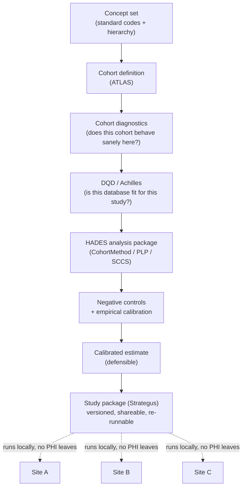

# OHDSI end-to-end: from cohort to calibrated evidence

> _Last reviewed: 2026-07-03 — see the [freshness policy](../appendix/maintenance.md)._

## Learning objectives

After this chapter you will be able to:

- Trace the full OHDSI workflow from a cohort definition to a defensible, calibrated result.
- Explain why cohort diagnostics and negative controls exist, and what failure mode each one catches.
- Package a study so it runs unchanged across a network of sites without any patient-level data leaving a site.

## A schema is not a study

[OMOP CDM](../02-interoperability/04-omop-cdm.md) gives every institution the same tables and
vocabulary, which is necessary but not sufficient for evidence. **Getting to a number you can
defend to a regulator or a payer** requires a specific, disciplined pipeline that the OHDSI
community built precisely because raw observational data is noisy, biased, and inconsistent
across sites. This chapter is the deep dive the OMOP chapter's "OHDSI analytics ecosystem" section
only introduces — the actual sequence a real-world evidence study runs.

## 1. Concept sets and cohort definitions

A **concept set** is a named group of standard concepts (e.g. "Type 2 diabetes" = a SNOMED code
plus its descendants) built in **Athena**, the OMOP vocabulary browser. A **cohort definition** is
a set of people who satisfy criteria over time — an index event, inclusion rules, and (for some
designs) an exit strategy — expressed against concept sets, not raw source codes. This is the
first place precision matters: too broad a concept set drags in unrelated patients; too narrow
one silently excludes real cases the ICD-10-to-SNOMED mapping missed.

## 2. ATLAS — authoring without hand-written SQL

**ATLAS** is OHDSI's web application for building all of the above visually — concept set
browsing, cohort definition, cohort characterization (baseline patient profile), and incidence-rate
calculation — and it compiles definitions to portable SQL that runs against any OMOP CDM. Most
analysts never hand-write the cohort SQL; they author in ATLAS and let it generate (and version)
the query. Treat ATLAS the way you'd treat a low-code layer over the rest of this pipeline: fast
to author in, but every cohort it produces still needs the validation step below before you trust
it in a study.

## 3. Cohort diagnostics — validate before you trust

**Cohort Diagnostics** is a dedicated HADES R package that runs *before* a cohort is used in any
real analysis, and it is the step teams most often skip under deadline pressure — which is exactly
when it catches the most expensive mistakes. It checks:

- **Incidence rate over time and across databases** — a cohort whose incidence swings wildly
  between sites (or across calendar years, e.g. around an ICD-9→ICD-10 transition) signals a
  definition or mapping problem, not a real epidemiological trend.
- **Index-event breakdown** — which specific codes actually triggered cohort entry at each site;
  reveals when a "typical" trigger you assumed is rare or absent at a given site.
- **Orphan concepts** — codes present in the data that *should* have matched your concept set's
  intent but weren't included (usually a vocabulary-mapping gap), and the reverse: concepts in
  your set that never actually occur in this database.
- **Time distributions** — how much observation time surrounds the index event, since thin
  follow-up quietly invalidates outcome-window assumptions.

**Design implication:** in a network study, the *same* cohort definition can behave sensibly at
one site and nonsensically at another purely because of local coding practice — this is precisely
why cohort diagnostics run **per site**, not once centrally.

## 4. DQD and Achilles, in the study context

[OMOP on the cloud](./01-omop-on-cloud.md)-time ETL validation already introduced **Achilles**
(database characterization) and the **Data Quality Dashboard (DQD)**. In a study pipeline they
reappear with a narrower purpose: a **per-study fitness gate**. A database can pass ETL-time DQD
checks generally and still be unfit for *this specific study* — e.g. too few years of drug
exposure captured to assess a five-year outcome. Re-running DQD/Achilles scoped to the study's
actual data window is standard practice, not redundant with the earlier ETL validation.

## 5. HADES — the analysis itself

**HADES** (Health Analytics Data-to-Evidence Suite) is the family of R packages that perform the
actual statistical work, all built on the same target/comparator/outcome cohort framework so
methods are consistent across studies:

| Package | Design | Answers |
| --- | --- | --- |
| **CohortMethod** | New-user comparative cohort, propensity-score adjusted | "Does drug A vs drug B change the risk of outcome X?" |
| **SelfControlledCaseSeries (SCCS)** | Within-person, self-controlled | "Does risk of X change in the period after exposure, compared to the same person's baseline?" |
| **PatientLevelPrediction (PLP)** | Supervised prediction model | "Given this patient's history, what's their risk of X in the next year?" |
| **CaseControl** | Case-control, matched on risk sets | "Among people with outcome X, were they more likely to have been exposed?" |

## 6. Negative controls & empirical calibration — the defensibility mechanism

This is OHDSI's most important methodological contribution, and the one most teams outside the
community skip: **observational analyses have systematic error (residual confounding, measurement
error) that a p-value from the naive statistical model does not capture.** The fix:

1. **Choose negative control outcomes** — outcomes with **no plausible causal relationship** to
   the exposure being studied (and, in some designs, negative control exposures, or synthetic
   *positive* controls with an injected known effect size).
2. **Run the exact same analysis pipeline against every negative control**, unchanged. If the
   method were unbiased, every negative control's estimated effect should center on the null
   (relative risk of 1).
3. **Empirical calibration** uses the *actual distribution* of negative-control estimates from
   this specific database and method to recalibrate the real result's confidence interval and
   p-value — reporting significance relative to the method's demonstrated real-world error rate on
   this data, not an idealized textbook assumption.

A result that looks statistically significant before calibration can become non-significant after
— and that is the pipeline working correctly, not failing. **Skipping this step is why so much
observational research doesn't replicate**; it is the single highest-leverage step in this whole
chapter for anyone deciding whether to trust an RWE result (see [RWD & RWE](./02-rwd-rwe.md) on
regulatory acceptability of RWE more broadly).

## 7. The study package — reproducible and network-ready

**Strategus** (and the broader "OHDSI study package" convention) bundles everything above — concept
sets, cohort definitions, the analysis specification, the negative-control set, and execution
settings — into one versioned R package. Handed to any site in a network study, it runs
**locally against that site's own OMOP CDM** and returns only aggregate, de-identified results —
never patient-level data. This is what makes a 30-hospital OHDSI network study operationally
possible without a single new data-sharing agreement moving PHI between institutions, and it is
the same "run once, execute everywhere unchanged" property that made OMOP itself valuable in the
first place.

## Design guidance

1. **Never skip cohort diagnostics** under deadline pressure — it is cheapest to run before the
   study, not after a reviewer asks why your incidence rate looks implausible.
2. **Re-run DQD/Achilles scoped to the study window**, not just at ETL time — database fitness is
   study-specific.
3. **Always include negative controls** and report calibrated, not raw, estimates — an
   uncalibrated observational result is not yet evidence.
4. **Package the study, don't script it ad hoc** — a Strategus-style package is what lets the same
   analysis run unchanged at every network site, which is the whole point of standardizing to OMOP.
5. **Treat per-site diagnostics as a first-class output**, not a side artifact — a cohort that
   misbehaves at one site is information about that site's data, not noise to average away.

## Check yourself

1. A cohort's incidence rate is 5x higher at one network site than every other. What OHDSI tool
   surfaces this, and what are two plausible explanations?
2. Why can a result be statistically significant before empirical calibration and not significant
   after — and which of the two should you report?
3. How does a Strategus-style study package let a 30-hospital network study run without a new
   data-sharing agreement per site?

## Further reading

- [The Book of OHDSI — Cohort Diagnostics](https://ohdsi.github.io/TheBookOfOhdsi/)
- [OHDSI HADES](https://ohdsi.github.io/Hades/) · [OHDSI Strategus](https://ohdsi.github.io/Strategus/)
- [EmpiricalCalibration R package](https://ohdsi.github.io/EmpiricalCalibration/)
- [OMOP Common Data Model](../02-interoperability/04-omop-cdm.md) · [Real-world data & evidence](./02-rwd-rwe.md)
