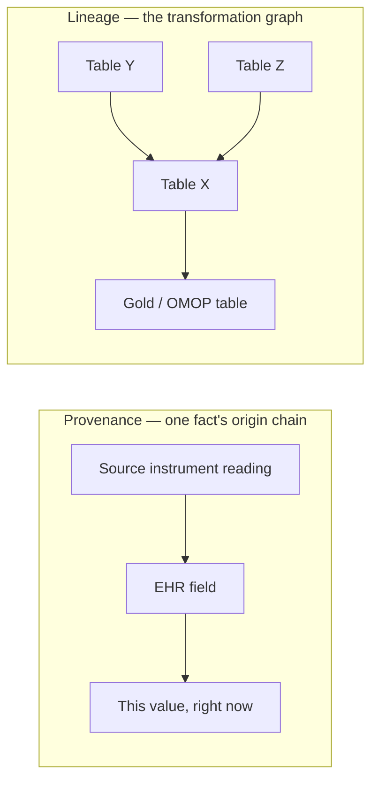
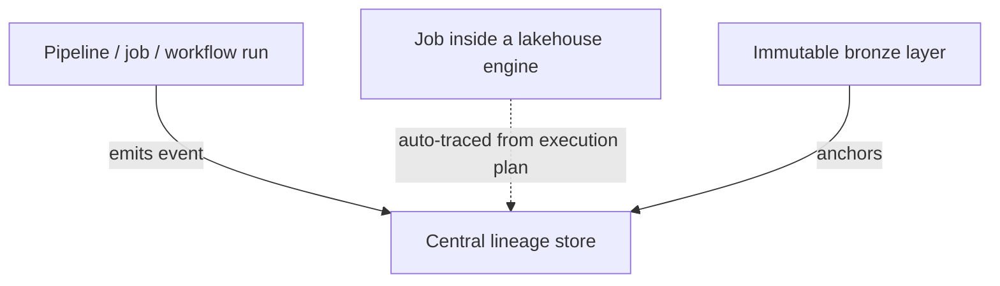

# Data lineage & provenance

> _Last reviewed: 2026-07-06 — see the [freshness policy](../appendix/maintenance.md)._

## Learning objectives

After this chapter you will be able to:

- Distinguish data provenance from data lineage and explain why HLS platforms need both.
- Choose between catalog-push and automatic column-level lineage capture for a given platform.
- Design lineage/provenance emission points into a pipeline from day one instead of reconstructing history after the fact.

## Two related but different questions

This book has needed lineage and provenance in nearly every data-heavy chapter without ever
naming them as their own subject: [governance & data contracts](./03-governance-contracts.md)
lists lineage as a governance primitive, [RWD & RWE](./02-rwd-rwe.md) says regulators expect
"auditable lineage from source to result," [MLOps & model governance](../06-ai-ml/04-mlops-governance.md)
requires training-data lineage for every production model, and
[AWS HealthOmics](../07-genomics/01-healthomics.md) advertises "built-in provenance" as a headline
feature. This chapter unifies that recurring requirement into one architecture pattern instead of
leaving it implicit in seven different places.

- **Provenance** — the origin and chain of custody of **one specific fact**: where did *this*
  value come from, literally, back to its source (a specific instrument reading, a specific EHR
  field, a specific FHIR resource version)? Answers "can I trust this data point, and where did it
  originate?"
- **Lineage** — the map of **transformations a dataset or column goes through** across systems:
  how did table X get derived from tables Y and Z? Answers "if I change something upstream, what
  breaks downstream?" and "if this number looks wrong, where do I look?"

## Why HLS needs both as first-class, not bolted on

- **OMOP ETL** needs lineage to explain how a coded value was derived from a source code (see
  [OMOP CDM](../02-interoperability/04-omop-cdm.md)'s vocabulary mapping).
- **RWE credibility** explicitly requires auditable provenance from source to result — regulators
  weigh this alongside statistical rigor (see [RWD & RWE](./02-rwd-rwe.md) and
  [OHDSI end-to-end](./06-ohdsi-study-package.md), where a calibrated result is only defensible if
  you can trace exactly which cohort and analysis version produced it).
- **MLOps governance** requires that every production model trace to its training data, code, and
  approver — lineage *is* the audit trail a [regulated AI artifact](../06-ai-ml/07-regulated-ai-artifacts.md)
  package depends on.
- **GxP data integrity (ALCOA+)** requires an audit trail for regulated records — provenance by
  another name, at the record level rather than the dataset level.
- **Genomics workflow engines** (HealthOmics, and workflow orchestration generally) treat run
  provenance — exact inputs, workflow version, and parameters for every execution — as a core
  deliverable, not an add-on.

## Capturing lineage: three architecture patterns

1. **Catalog-based / metadata-push lineage.** Each pipeline or job explicitly emits a lineage
   event — "this run read tables A and B, wrote table C" — to a central metadata store. Requires
   instrumenting every tool that touches the data, but works across a heterogeneous stack (a
   lakehouse job, a genomics workflow engine, and an ML training run can all emit to the same
   store).
2. **Automatic column-level lineage.** Increasingly built into lakehouse/warehouse platforms —
   Databricks' Unity Catalog and Snowflake's access-history-based lineage both parse the actual
   SQL/Spark execution plan to trace lineage automatically, with zero pipeline-author effort. The
   trade-off: it only covers what runs *inside* that platform — a genomics workflow engine running
   outside the lakehouse won't show up without an explicit bridge.
3. **The immutable bronze layer as a provenance anchor.** In the [medallion pattern](../04-cloud-platforms/00-overview-capability-map.md),
   the bronze layer — a raw, unmodified copy of source data — *is* the provenance anchor: every
   downstream silver/gold table's lineage ultimately traces back to a specific bronze snapshot.
   This is why medallion architecture is as much a provenance pattern as a data-quality one.

When lineage needs to span genuinely heterogeneous tools — a lakehouse, a genomics workflow
engine, and an MLOps registry, none of which natively understand each other's execution plans — a
shared, open lineage standard (**OpenLineage**, integrated by tools like Airflow, Spark, and dbt;
or the more general **W3C PROV** data model) lets each tool emit events in one common format to a
single central store, instead of every pairwise integration being bespoke.

## Design guidance

1. **Design emission points into every pipeline from day one** — the same discipline as designing
   audit logging in from the start (see the [HITRUST evidence pack lab](../03-compliance/08-hitrust-evidence-lab.md)),
   not something reconstructed from job logs under audit pressure.
2. **Use automatic lineage where the platform offers it**, and reserve manual instrumentation for
   the boundaries the platform can't see across (e.g. a genomics engine feeding a lakehouse).
3. **Treat the bronze layer as non-negotiable** — a "cleaned up" pipeline that discards the raw
   input has also discarded its own provenance anchor.
4. **Adopt a shared lineage format (OpenLineage/PROV) once your stack crosses more than two
   genuinely different tools** — bespoke pairwise lineage integrations don't scale past that.
5. **Distinguish which question you're actually answering** — "can I trust this value" is
   provenance; "what breaks if I change this upstream table" is lineage — and design the capture
   mechanism for the question you need answered, not lineage-in-general.

## Check yourself

1. A stakeholder asks "where did this specific lab value in the OMOP `measurement` table
   ultimately come from?" Is that a provenance question or a lineage question, and why does the
   distinction matter for how you'd answer it?
2. Why does automatic column-level lineage inside a lakehouse platform not automatically cover a
   genomics workflow engine's provenance, even if both feed the same downstream table?
3. Why is the immutable bronze layer described as a "provenance anchor," and what would be lost if
   a pipeline skipped it and wrote directly to a cleaned silver table?

## Further reading

- [OpenLineage](https://openlineage.io/) · [W3C PROV](https://www.w3.org/TR/prov-overview/)
- [Databricks Unity Catalog — lineage](https://www.databricks.com/product/unity-catalog)
- [Governance & data contracts](./03-governance-contracts.md) · [Real-world data & evidence](./02-rwd-rwe.md)
- [Failure-mode case studies](../10-sa-craft/05-failure-mode-case-studies.md) — case 1 covers the Duke "Potti scandal," a landmark irreproducibility failure from missing provenance
