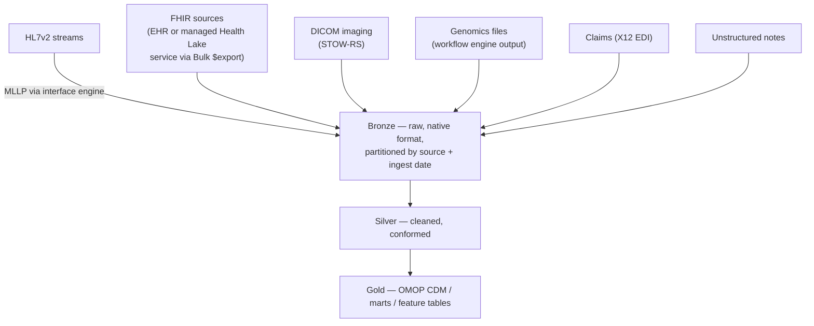

# Building a health data lake & lakehouse: a practical guide

> _Last reviewed: 2026-07-08 — see the [freshness policy](../appendix/maintenance.md)._

## Learning objectives

After this chapter you will be able to:

- Distinguish a managed "health lake" (FHIR-normalizing PaaS service) from a general-purpose lakehouse, and design how the two combine.
- Choose the right ingestion pattern for each HLS data modality — HL7v2, FHIR, DICOM, genomics, claims, notes — instead of forcing all of them through one pipeline shape.
- Pick file formats and partitioning suited to HLS data, and follow a build sequence that avoids the most common early mistakes.

## Two things the industry calls "health lake"

[Lakehouse vs warehouse](./00-lakehouse-vs-warehouse.md) already establishes *why* HLS data
platforms converge on a lakehouse and *what* the medallion layers do. This chapter is the
practical build guide — and the first thing to untangle is that "health lake" means two different
things in the industry, and a real platform needs both:

1. **A managed, FHIR-specific PaaS service** — AWS HealthLake, Azure Health Data Services (FHIR
   service), GCP Healthcare API — that ingests clinical data, normalizes it to FHIR R4, and gives
   you a queryable store with REST search, Bulk `$export`, and SMART on FHIR out of the box.
2. **A general-purpose lakehouse** — the [medallion](./00-lakehouse-vs-warehouse.md) platform that
   absorbs *everything*: FHIR, HL7v2, claims, imaging metadata, genomics, and unstructured notes,
   refined into governed, query-ready gold tables.

In practice you build both together: the managed FHIR service is usually the **normalization
layer for the FHIR/clinical modality specifically**, and it feeds the lakehouse's bronze/silver via
Bulk `$export` — the exact same pattern as pulling from any EHR's FHIR endpoint. The lakehouse is
the umbrella that also ingests the modalities the managed service was never meant to handle
(imaging pixels, genomic files, claims EDI).

## Ingestion patterns per modality

A health lake fails when every source is forced through the same ETL shape. Each modality has a
native transport and a native landing format — respect it at ingest, and normalize downstream:

| Modality | Native transport | Ingestion pattern | Cross-reference |
| --- | --- | --- | --- |
| **HL7v2** (ADT/ORU/ORM) | MLLP over TCP | Continuous stream via an interface engine into a message bus (Kafka/Kinesis/Event Hubs), landed in bronze as-received | [HL7v2](../02-interoperability/00-hl7v2.md) |
| **FHIR** | REST API / Bulk `$export` | Scheduled batch NDJSON export — the dominant analytics-feed pattern, whether the source is an EHR or a managed Health Lake service | [FHIR — Bulk Data](../02-interoperability/01-fhir.md) |
| **DICOM imaging** | DICOMweb STOW-RS | Push pixel data + metadata; store pixel data as **native DICOM objects** in object storage, index metadata separately in a queryable table — never flatten pixels into rows | [DICOM & medical imaging](../02-interoperability/02-dicom-imaging.md) |
| **Genomics** | Workflow engine output | FASTQ/BAM/CRAM/VCF land as native files referenced by pointer; called variants flow into a queryable variant store | [Variant stores & scale](../07-genomics/02-variant-stores.md) · [Workflow orchestration](../07-genomics/05-workflow-orchestration.md) |
| **Claims** | X12 EDI batch files | Parsed into bronze, mapped toward OMOP-adjacent claims tables | [Document & claims standards](../02-interoperability/09-cda-x12-claims.md) |
| **Unstructured notes** | Document/text feed | Landed as raw text in bronze; NLP extraction happens downstream, not at ingest | [Clinical NLP](../06-ai-ml/00-clinical-nlp.md) |

**Design implication:** give each modality its own native ingestion path into a **common bronze
convention** (partitioned by source system + ingest date), rather than routing everything through
one general-purpose ETL tool. The commonality is the *bronze contract*, not the pipeline mechanics.

## Where the managed Health Lake service fits

| Service | Gives you | Still yours to build |
| --- | --- | --- |
| **AWS HealthLake** | Managed FHIR R4 store, REST search, Bulk `$export`, SMART on FHIR, legacy-record transform | Lakehouse silver/gold, OMOP mapping, joins with imaging/genomics/claims |
| **Azure Health Data Services (FHIR service)** | Managed FHIR store integrated with Azure's broader health data services | Same — the lakehouse layer above it |
| **GCP Healthcare API** | Managed FHIR (and HL7v2/DICOM) store with native BigQuery streaming | Same — though its BigQuery streaming narrows the silver-layer gap for the FHIR modality specifically |

The managed service saves you standing up a FHIR server and gives you conformant search for free —
but it is **not a substitute for the lakehouse**. Treat its output the same way you'd treat any
EHR's FHIR endpoint: pull it via Bulk `$export` into bronze, and let the same silver/gold pipeline
that handles every other source handle it too. Building a special-cased pipeline just because the
source happens to be a managed service is a common, avoidable complexity trap.

## File formats and partitioning for HLS data

- **Tabular data** (parsed FHIR/HL7v2/claims) — land as **Parquet under an Iceberg or Delta Lake
  table format** for ACID transactions, schema evolution, and time travel; see
  [Variant store on AWS](../07-genomics/03-variant-store-aws.md) for the same Iceberg-based pattern
  applied to variant data at even larger scale.
- **Partition bronze by source system + ingestion date**, not by patient — partitioning by patient
  creates a huge number of tiny files and skewed partitions at real volume; ingestion-date
  partitioning matches how data actually arrives and keeps files right-sized.
- **Partition gold OMOP tables by a domain-appropriate key** — e.g. `condition_occurrence` by
  `condition_start_date` year/month — so common analytic queries (a date-bounded cohort) prune
  partitions instead of scanning everything.
- **Keep large binary modalities as native files, referenced by pointer.** DICOM pixel data and
  BAM/CRAM files belong in object storage as-is, indexed by a metadata table that stores the file's
  URI — **do not** try to flatten imaging or genomic bytes into Parquet rows. This is the single
  most common early-build mistake, and it usually comes from over-generalizing the "everything is a
  table" instinct from the clinical/claims side of the platform.
- **Design for schema evolution, not schema rigidity.** FHIR and HL7v2 sources drift — new USCDI
  elements, vendor-specific Z-segments and extensions — so bronze/silver need a table format that
  tolerates additive schema change, plus a [data contract](./03-governance-contracts.md) at the
  silver boundary so a genuinely breaking source change **fails the pipeline loudly** instead of
  silently corrupting gold.

## A build sequence

Build depth-first on one source, not breadth-first across all of them:

1. **Stand up bronze first, empty of business logic.** Land every source's native format,
   partitioned by source + date, before writing a single transformation. This proves ingestion
   works in isolation from modeling decisions.
2. **Wire one source fully end-to-end before adding the next.** Take FHIR Bulk `$export` all the
   way through bronze → silver → OMOP gold, validated with [Achilles/DQD](./06-ohdsi-study-package.md),
   before touching claims or imaging. A working narrow pipeline de-risks the pattern for every
   source that follows it.
3. **Add governance from the first source, not after the second.** Access control, masking, and
   [lineage emission points](./07-data-lineage-provenance.md) are far cheaper to design in from
   table one than to retrofit once several tables and consumers already depend on the platform.
4. **Bring in a managed Health Lake service (if used) as another bronze/silver source, not a
   special case** — its Bulk `$export` gets the same treatment as any other FHIR endpoint.
5. **Add imaging and genomics as their own ingestion paths, in parallel — don't wait.** They don't
   depend on the clinical/claims track being "done"; their pointer-based silver tables can be built
   concurrently once the bronze convention is settled.
6. **Validate before declaring gold done.** Run [Achilles/DQD](./06-ohdsi-study-package.md) against
   the OMOP gold layer, and don't point a real analysis at it until that passes.

## Design guidance

1. **Respect each modality's native transport at ingest** — normalize downstream, not at the door.
2. **Treat a managed Health Lake service as one bronze source among several**, not a shortcut that
   replaces the lakehouse.
3. **Never flatten large binary data into tabular rows** — pointer-based indexing is the correct
   pattern for imaging and genomics, every time.
4. **Partition by source + date, not by patient**, to avoid small-file explosion.
5. **Build one source end-to-end before adding breadth** — a fully validated narrow pipeline is
   worth more early than five half-built wide ones.

## Check yourself

1. Why isn't a managed Health Lake service (AWS HealthLake, Azure Health Data Services, GCP
   Healthcare API) a substitute for the broader lakehouse, even though it handles FHIR well?
2. A new engineer proposes flattening DICOM pixel data into Parquet rows alongside the clinical
   tables "for consistency." What should you tell them, and why?
3. Why does partitioning bronze by patient ID cause problems at scale that partitioning by source
   system + ingest date avoids?

## Further reading

- [Lakehouse vs warehouse](./00-lakehouse-vs-warehouse.md) · [OMOP on the cloud](./01-omop-on-cloud.md)
- [AWS HealthLake](https://aws.amazon.com/healthlake/) · [Azure Health Data Services](https://learn.microsoft.com/en-us/azure/healthcare-apis/) · [GCP Healthcare API](https://cloud.google.com/healthcare-api)
- [Governance & data contracts](./03-governance-contracts.md) · [Data lineage & provenance](./07-data-lineage-provenance.md)
