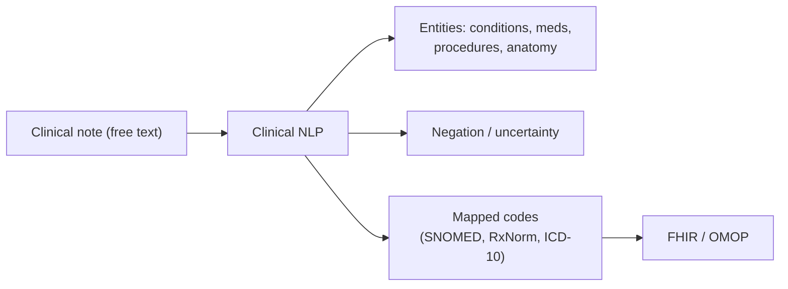

# Clinical NLP

## Learning objectives

After this chapter you will be able to:

- Explain what clinical NLP extracts and why unstructured notes matter.
- Choose between managed clinical-NLP services and custom/LLM approaches.
- Design an NLP pipeline that maps text to standard terminologies under PHI constraints.

## Why clinical NLP

Most clinical information lives in **unstructured text** — progress notes, discharge summaries, radiology reports, pathology reports. Structured fields capture a fraction of what the clinician knew. Clinical NLP turns that free text into structured, coded data: diagnoses, medications, procedures, anatomy, severity, negation ("no evidence of pneumonia"), and temporality.

The output feeds analytics, [OMOP](../02-interoperability/04-omop-cdm.md) population, cohort selection, and RWE — extracting facts that were never in the structured record.

## What makes it hard

- **Negation & uncertainty** — "no chest pain", "cannot rule out" invert meaning; naive keyword matching fails.
- **Abbreviations & context** — "MS" = multiple sclerosis, mitral stenosis, or morphine sulfate depending on context.
- **De-identification** — notes hide identifiers in prose (see [De-identification & consent](../03-compliance/04-deidentification-consent.md)); scrubbing text is harder than dropping columns.
- **Terminology mapping** — extracted concepts must map to standard codes (see [terminologies](../02-interoperability/03-terminologies.md)) to be useful.

## Approaches

| Approach | When |
| --- | --- |
| **Managed services** — AWS Comprehend Medical, GCP Healthcare NL API, Azure Text Analytics for Health | Fast start, standard entities + code mapping, HIPAA-eligible. Default choice. |
| **Open-source / framework** — spaCy/medspaCy, John Snow Labs Spark NLP, cTAKES | Custom entities, on-prem control, large-batch processing. |
| **LLMs** (Bedrock, Vertex, Azure OpenAI, self-hosted NIM) | Flexible extraction, summarization, reasoning over notes — but require careful evaluation and PHI controls. |

The managed services (see the [cloud platform chapters](../04-cloud-platforms/00-overview-capability-map.md)) already map to ICD-10-CM/RxNorm/SNOMED and are HIPAA-eligible — usually the pragmatic starting point.

## Design under PHI constraints

- **Keep PHI in-boundary.** Prefer HIPAA-eligible managed NLP, or self-hosted models (e.g. [NVIDIA NIM](../04-cloud-platforms/07-nvidia.md)) so notes are not sent to an un-covered API.
- **Human-in-the-loop for clinical use.** NLP output informing care needs review; extraction errors have clinical consequences.
- **Evaluate against a gold standard.** Measure precision/recall on annotated notes per entity type — especially negation.
- **Map, then validate.** Send extracted codes through a terminology service to confirm they are valid standard concepts.

## Lab

Clinical NLP pairs naturally with the [`RAGonGCP`](https://github.com/anothernoise/RAGonGCP) lab (extract + index clinical text) and feeds the [`hls-lakehouse-rwd`](https://github.com/anothernoise/hls-lakehouse-rwd) OMOP pipeline.

## Check yourself

1. Why is negation detection essential, and what goes wrong without it?
2. When would you choose a managed clinical-NLP service over an LLM, and vice versa?
3. How do you keep PHI in-boundary when running NLP over clinical notes?

## Further reading

- [AWS Comprehend Medical](https://aws.amazon.com/comprehend/medical/)
- [GCP Healthcare Natural Language API](https://cloud.google.com/healthcare-api/docs/concepts/nlp)
- [Azure Text Analytics for Health](https://learn.microsoft.com/en-us/azure/ai-services/language-service/text-analytics-for-health/overview)
