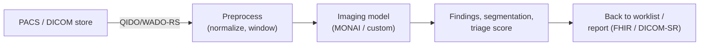

# Medical imaging AI

## Learning objectives

After this chapter you will be able to:

- Describe the medical-imaging AI pipeline from DICOM to inference to clinical workflow.
- Place MONAI and the managed imaging services in an architecture.
- Account for the regulatory and integration realities of imaging AI.

## The opportunity and the constraint

Medical imaging (radiology, pathology, ophthalmology) is the most mature clinical AI domain — most FDA-cleared AI devices are imaging. The data is [DICOM](../02-interoperability/02-dicom-imaging.md); the models are deep neural networks; the constraint is that imaging AI used for diagnosis is usually a regulated [medical device](./05-fda-samd.md) and must fit into the radiologist's existing workflow (PACS, worklist) to be adopted.

## Building blocks

- **MONAI** — the open-source PyTorch framework for medical-imaging deep learning (training, transforms, model zoo); **MONAI Deploy** packages models as clinical inference apps. Co-developed by [NVIDIA](../04-cloud-platforms/07-nvidia.md). The default framework for custom imaging AI.
- **Managed imaging stores** — AWS HealthImaging, GCP Cloud Healthcare API DICOM, Azure DICOM service provide DICOMweb access to feed pipelines (see [capability map](../04-cloud-platforms/00-overview-capability-map.md)).
- **GPU compute** — training and inference run on NVIDIA GPUs (cloud or on-prem DGX); large 3D volumes are memory-hungry.
- **Viewers** — OHIF and PACS integrations surface AI output where radiologists already work.

## Architecture realities

- **Workflow integration is the adoption gate.** An accurate model that radiologists must leave their PACS to use will not be used. Results must return to the **worklist** (prioritize a likely-positive study) or the **report** (as a DICOM Structured Report or FHIR `Observation`/`DiagnosticReport`).
- **Data volume & tiering.** Studies are large; keep compute co-located with the imaging store and tier cold studies (see [DICOM](../02-interoperability/02-dicom-imaging.md) and [cost](../01-foundations/03-tradeoffs-tco.md)).
- **De-identification is two-layer.** Imaging AI training data must scrub both DICOM tags **and** burned-in pixel annotations (see [de-identification](../03-compliance/04-deidentification-consent.md)).
- **Edge/real-time.** For intra-procedure or device-attached inference, [Holoscan](../04-cloud-platforms/07-nvidia.md) runs at the edge with low latency.

## Regulatory reality

Imaging AI that informs diagnosis is typically [SaMD](./05-fda-samd.md). Design for it from the start: define the intended use, lock or PCCP-manage the model, log inputs/outputs for traceability, and plan the validation evidence. A research prototype and a cleared product are very different builds — know which you are making.

## Lab

A MONAI segmentation/classification model on a public dataset (e.g. TCIA) deployed against a local DICOM store is a strong extension lab (see the [bootcamp lab model](../00-orientation/03-bootcamp-format.md)).

## Check yourself

1. Why is workflow integration (worklist/report) the make-or-break factor for imaging-AI adoption?
2. What two layers must de-identification address for imaging training data?
3. When does an imaging model become a regulated medical device, and what does that imply for the architecture?

## Further reading

- [MONAI](https://monai.io/) · [MONAI Deploy](https://monai.io/deploy.html)
- [AWS HealthImaging](https://aws.amazon.com/healthimaging/)
- [FDA: AI/ML-enabled medical devices list](https://www.fda.gov/medical-devices/software-medical-device-samd/artificial-intelligence-and-machine-learning-aiml-enabled-medical-devices)
