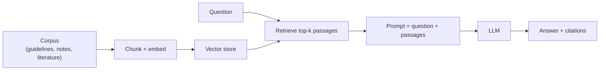

# RAG over clinical corpora

> _Last reviewed: 2026-06-28 — see the [freshness policy](../appendix/maintenance.md)._

## Learning objectives

After this chapter you will be able to:

- Explain retrieval-augmented generation and why it fits clinical/biomedical use cases.
- Design a RAG architecture that keeps PHI in-boundary and cites its sources.
- Identify the evaluation and safety controls clinical RAG requires.

## Why RAG in HLS

Large language models are fluent but ungrounded — they hallucinate, and they do not know your institution's documents. **Retrieval-Augmented Generation (RAG)** grounds an LLM by retrieving relevant passages from a trusted corpus and putting them in the prompt, so answers are based on real sources and can cite them. In HLS this is the dominant pattern for: clinical guideline Q&A, summarizing a patient's chart, searching biomedical literature, and answering questions over policies or trial protocols — domains where a wrong, uncited answer is unacceptable.

## Architecture choices

- **Embeddings + vector store** — chunk documents, embed them, and store vectors (BigQuery/Vertex Vector Search, OpenSearch, pgvector, Snowflake). Retrieval quality dominates answer quality.
- **Generation** — a foundation model (Bedrock, Vertex/Gemini or MedLM, Azure OpenAI) or a **self-hosted model** ([NVIDIA NIM](../04-cloud-platforms/07-nvidia.md)) for PHI control.
- **Domain tuning** — biomedical embeddings and medical-tuned models (MedLM/MedGemma) improve retrieval and answers over clinical text.

The [`RAGonGCP`](https://github.com/anothernoise/RAGonGCP) lab implements this on Vertex AI + BigQuery; see also [GCP for HLS](../04-cloud-platforms/02-gcp.md).

## Keeping PHI in-boundary

If the corpus or the question contains PHI:

- **Use HIPAA-eligible, BAA-covered services**, or **self-host** the model (NIM) so PHI never reaches an un-covered API (see [HIPAA](../03-compliance/00-hipaa.md) on the BAA surface).
- **Keep the vector store in your governed environment** — embeddings of PHI are still PHI-adjacent.
- **Apply access control at retrieval** — a user must only retrieve passages they are authorized to see (don't let RAG bypass record-level permissions).

## Safety & evaluation (non-negotiable for clinical use)

- **Always cite sources.** A clinical answer without traceable citations is not usable; surface the retrieved passages.
- **Ground strictly.** Instruct and evaluate the model to answer *only* from retrieved context and to say "not found" rather than guess.
- **Evaluate retrieval and generation separately** — measure retrieval recall and answer faithfulness against a curated question set; track hallucination rate.
- **Human-in-the-loop** for anything informing care; log prompts, retrieved context, and outputs for audit.
- **Guardrails** — filter PHI/PII from outputs where required (e.g. Snowflake Cortex Guard, model-level filters).

## Lab

[`RAGonGCP`](https://github.com/anothernoise/RAGonGCP) — retrieval-augmented generation over a clinical/biomedical corpus on Vertex AI + BigQuery, with citations.

## Check yourself

1. What problem does RAG solve that a bare LLM does not, and why does that matter clinically?
2. Two ways to keep PHI in-boundary in a clinical RAG system?
3. Why evaluate retrieval and generation separately, and what metric targets hallucination?

## Further reading

- [`RAGonGCP`](https://github.com/anothernoise/RAGonGCP)
- [Vertex AI Search for Healthcare](https://cloud.google.com/generative-ai-app-builder/docs/about-healthcare-search)
- [Amazon Bedrock Knowledge Bases](https://aws.amazon.com/bedrock/knowledge-bases/)
