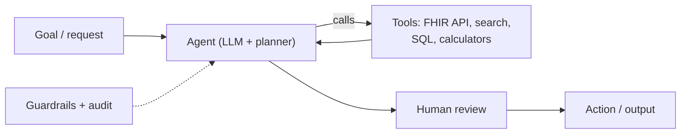

# Agentic AI

> _Last reviewed: 2026-06-28 — see the [freshness policy](../appendix/maintenance.md)._

## Learning objectives

After this chapter you will be able to:

- Explain what distinguishes an agent from a single LLM call, and where agents fit in HLS.
- Design an agentic architecture with tools, guardrails, and human oversight.
- Reason about the safety and compliance risks agents introduce in healthcare.

## From answering to acting

A RAG system *answers*; an **agent** *acts* — it plans, calls tools (APIs, search, databases), observes results, and iterates toward a goal. In HLS, agentic patterns target multi-step work: triaging and routing referrals, gathering data from FHIR + claims + labs to assemble a prior-authorization packet, drafting documentation, or orchestrating a research-data query across sources.

The [`aws-health-agents`](https://github.com/anothernoise/aws-health-agents) lab implements this on Amazon Bedrock; see [AWS for HLS](../04-cloud-platforms/01-aws.md).

## Building blocks

- **Planner/orchestrator** — Bedrock Agents/AgentCore, Vertex agents, Azure AI agents, or frameworks (LangGraph, etc.).
- **Tools** — scoped, audited functions: a FHIR read with a [SMART](../02-interoperability/05-smart-on-fhir.md) `system` scope, a SQL query against governed tables, a guideline lookup (RAG).
- **Memory & state** — conversation and task state, scoped to the authorized user/patient.
- **Models** — managed foundation models or self-hosted ([NIM](../04-cloud-platforms/07-nvidia.md)) for PHI control.

## Why healthcare raises the stakes

Agents are powerful precisely because they *act* — which is also the risk. An agent that can write to systems or trigger actions must be constrained:

- **Least-privilege tools.** Each tool gets the minimum scope; an agent reading a patient's meds should not hold delete or cross-patient access (mirror [SMART scopes](../02-interoperability/05-smart-on-fhir.md) and [HIPAA](../03-compliance/00-hipaa.md) minimum-necessary).
- **Human-in-the-loop for consequential actions.** Drafting is fine to automate; *submitting* an order, a claim, or anything affecting care needs human approval. Default to advisory, not autonomous, in clinical contexts.
- **Guardrails.** Constrain tool use, validate outputs, filter PHI from any external call, and block out-of-scope actions.
- **Full audit.** Log the plan, every tool call, inputs, and outputs — both for HIPAA audit and for debugging non-deterministic behavior.
- **PHI boundary.** Keep models and tools inside the governed environment; don't let an agent exfiltrate PHI to an un-covered service.

## Design guidance

1. Start **advisory** (agent drafts, human acts), graduate to automation only for low-risk, reversible steps.
2. Make tools **narrow and typed** — small, well-scoped tools are safer and easier to audit than one broad tool.
3. Treat the agent as an **untrusted actor** at the boundary: authorize every tool call as if a user made it.
4. Evaluate end-to-end on realistic tasks; track task success, unsafe-action rate, and cost per task.

## Lab

[`aws-health-agents`](https://github.com/anothernoise/aws-health-agents) — agentic AI over health data on Amazon Bedrock (tools, guardrails, CDK).

## Check yourself

1. What distinguishes an agent from a RAG system, and why does "acting" raise the compliance stakes?
2. Which agent actions should require human-in-the-loop in a clinical setting, and which can be automated?
3. Why scope each tool narrowly, and how does that relate to HIPAA minimum-necessary?

## Further reading

- [`aws-health-agents`](https://github.com/anothernoise/aws-health-agents)
- [Amazon Bedrock Agents](https://aws.amazon.com/bedrock/agents/)
- [SMART Backend Services](https://hl7.org/fhir/smart-app-launch/backend-services.html)
- [AI agents on FHIR](../02-interoperability/14-ai-agents-on-fhir.md) — the MCP-based tool-calling pattern over a FHIR store
