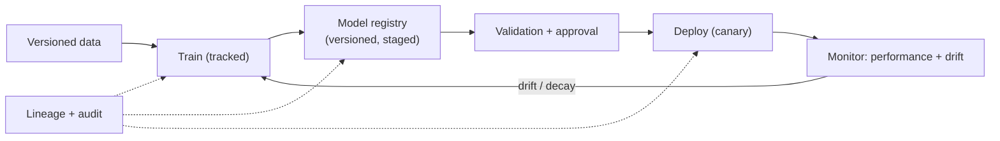

# MLOps & model governance

## Learning objectives

After this chapter you will be able to:

- Design an MLOps lifecycle for clinical models with reproducibility and monitoring.
- Explain model governance: versioning, validation, approval, and drift detection.
- Connect MLOps practices to regulatory expectations for clinical AI.

## MLOps is the difference between a demo and a deployed model

A model in a notebook is a demo. A model that clinicians rely on needs the same rigor as any production system — plus the regulatory traceability HLS demands. **MLOps** is the practice that gets it there: reproducible training, versioned artifacts, controlled deployment, and continuous monitoring.

## The lifecycle

- **Versioned data & features** — pin the training dataset and feature definitions; you must be able to reproduce a model exactly (and prove what it was trained on).
- **Experiment tracking** — record parameters, metrics, and artifacts (MLflow, Vertex, SageMaker, Azure ML).
- **Model registry** — versioned models with stages (staging → production) and metadata (intended use, training data, metrics).
- **Validation & approval** — evaluate against a held-out, representative set; check subgroup performance (fairness across age/sex/race — a clinical-safety issue); require human sign-off before production.
- **Controlled deployment** — canary/shadow deploys; ability to roll back instantly.
- **Monitoring** — track live performance and **drift** (data drift and concept drift). Clinical models decay as practice, populations, and instruments change.

## Model governance

Governance is the control layer over the lifecycle — who approved what, on what evidence, and is it still valid:

- **Versioning & lineage** — every production model traces to its data, code, and approver.
- **Intended-use statement** — what the model is for, its population, and its limits (the boundary regulators and clinicians both care about).
- **Subgroup & bias evaluation** — documented performance across populations.
- **Change control** — model updates follow an approval process; for regulated devices this ties to a [PCCP](./05-fda-samd.md).
- **Audit & explainability** — log inputs/outputs; provide the explanation clinicians need to trust and to contest a result.

## Connecting to regulation

For clinical AI that is a [medical device](./05-fda-samd.md), MLOps *is* part of the regulatory story. FDA's **Good Machine Learning Practice (GMLP)** principles map directly onto MLOps: data quality and representativeness, reproducible training, rigorous validation, monitoring of deployed performance, and managed change. A platform that already does disciplined MLOps is most of the way to producing the evidence a submission needs (see also [GxP & validation](../03-compliance/02-gxp-part11.md) for the analogous discipline in regulated software).

## Design guidance

1. **Reproducibility first.** If you cannot rebuild a model exactly, you cannot defend it.
2. **Monitor for drift from day one** — a clinical model that was accurate at launch may not be in a year.
3. **Govern the boundary** — intended use, subgroup performance, and approval are not paperwork; they are clinical safety.
4. **Keep PHI in-boundary** across training and serving (see [HIPAA](../03-compliance/00-hipaa.md)).

## Check yourself

1. Why is exact reproducibility of a trained model both an engineering and a regulatory requirement?
2. What is model drift, and why is it especially dangerous for clinical models?
3. How do FDA GMLP principles map onto standard MLOps practice?

## Further reading

- [FDA Good Machine Learning Practice (GMLP)](https://www.fda.gov/medical-devices/software-medical-device-samd/good-machine-learning-practice-medical-device-development-guiding-principles)
- [MLflow](https://mlflow.org/) · [Vertex AI MLOps](https://cloud.google.com/vertex-ai/docs/start/introduction-mlops)
