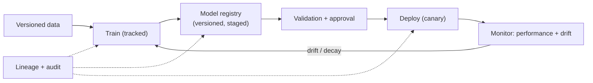

# MLOps & model governance

> _Last reviewed: 2026-06-28 — see the [freshness policy](../appendix/maintenance.md)._

## Learning objectives

After this chapter you will be able to:

- Design an MLOps lifecycle for clinical models with reproducibility and monitoring.
- Explain model governance: versioning, validation, approval, and drift detection.
- Connect MLOps practices to regulatory expectations for clinical AI.

## MLOps is the difference between a demo and a deployed model

A model in a notebook is a demo. A model that clinicians rely on needs the same rigor as any production system — plus the regulatory traceability HLS demands. **MLOps** is the practice that gets it there: reproducible training, versioned artifacts, controlled deployment, and continuous monitoring.

## The lifecycle

- **Versioned data & features** — pin the training dataset and feature definitions; you must be able to reproduce a model exactly (and prove what it was trained on).
- **Experiment tracking** — record parameters, metrics, and artifacts (MLflow, Vertex, SageMaker, Azure ML).
- **Model registry** — versioned models with stages (staging → production) and metadata (intended use, training data, metrics).
- **Validation & approval** — evaluate against a held-out, representative set; check subgroup performance (fairness across age/sex/race — a clinical-safety issue); require human sign-off before production.
- **Controlled deployment** — canary/shadow deploys; ability to roll back instantly.
- **Monitoring** — track live performance and **drift** (data drift and concept drift). Clinical models decay as practice, populations, and instruments change.

## Model governance

Governance is the control layer over the lifecycle — who approved what, on what evidence, and is it still valid:

- **Versioning & lineage** — every production model traces to its data, code, and approver (see [Data lineage & provenance](../05-data-platforms/07-data-lineage-provenance.md) for the underlying capture architecture).
- **Intended-use statement** — what the model is for, its population, and its limits (the boundary regulators and clinicians both care about).
- **Subgroup & bias evaluation** — documented performance across populations.
- **Change control** — model updates follow an approval process; for regulated devices this ties to a [PCCP](./05-fda-samd.md).
- **Audit & explainability** — log inputs/outputs; provide the explanation clinicians need to trust and to contest a result.

## Connecting to regulation

For clinical AI that is a [medical device](./05-fda-samd.md), MLOps *is* part of the regulatory story. FDA's **Good Machine Learning Practice (GMLP)** principles map directly onto MLOps: data quality and representativeness, reproducible training, rigorous validation, monitoring of deployed performance, and managed change. A platform that already does disciplined MLOps is most of the way to producing the evidence a submission needs (see also [GxP & validation](../03-compliance/02-gxp-part11.md) for the analogous discipline in regulated software).

## ONC HTI-1: AI transparency for clinical decision support

Not all clinical AI is an FDA device, but if it ships **inside certified health IT** (e.g. an EHR), it is now caught by **ONC's HTI-1 final rule** (finalized Dec 2023; certified-health-IT compliance from **Jan 1, 2025**). HTI-1 is the first US regulation squarely targeting AI *transparency* in healthcare, and it changes what your AI platform must expose:

- **Predictive DSI.** HTI-1 replaces the old Clinical Decision Support criterion with **Decision Support Interventions** — split into *evidence-based* DSI (classic rules/alerts) and **Predictive DSI** (models that produce a prediction/classification/recommendation). Predictive DSI carries the new obligations.
- **FAVES.** Developers must enable users to judge whether a DSI is **F**air, **A**ppropriate, **V**alid, **E**ffective, and **S**afe.
- **Source attributes ("nutrition label").** For each Predictive DSI, ~31 **source attributes** must be disclosed — what data it was trained on, intended use, output, performance and validation, fairness/bias measures, and how it should (and shouldn't) be used.
- **Intervention risk management (IRM).** Developers must document and apply risk-management practices and **data-governance** procedures across the model's lifecycle (accuracy, validity, reliability, safety, fairness).

For an SA this means your [MLOps](#the-lifecycle) artifacts *are* the compliance evidence: the registry metadata, intended-use statement, subgroup-performance results, and data lineage you already keep map almost one-to-one onto HTI-1 source attributes. Design to emit them. See [Regulated AI artifacts](./07-regulated-ai-artifacts.md) for the concrete artifact set (intended use, risk file, validation plan, PCCP, post-market monitoring, change control) and a direct map from architecture decisions to the risk controls and evidence they produce. (A follow-on **HTI-2** rulemaking, proposed in 2024, extends interoperability/API and information-sharing requirements; track it if you build for certified health IT.) See also the US landscape in [FHIR profiles & regulation](../02-interoperability/06-fhir-profiles-us-ca.md).

## Design guidance

1. **Reproducibility first.** If you cannot rebuild a model exactly, you cannot defend it.
2. **Monitor for drift from day one** — a clinical model that was accurate at launch may not be in a year.
3. **Govern the boundary** — intended use, subgroup performance, and approval are not paperwork; they are clinical safety.
4. **Keep PHI in-boundary** across training and serving (see [HIPAA](../03-compliance/00-hipaa.md)).

## Check yourself

1. Why is exact reproducibility of a trained model both an engineering and a regulatory requirement?
2. What is model drift, and why is it especially dangerous for clinical models?
3. How do FDA GMLP principles map onto standard MLOps practice?

## Further reading

- [FDA Good Machine Learning Practice (GMLP)](https://www.fda.gov/medical-devices/software-medical-device-samd/good-machine-learning-practice-medical-device-development-guiding-principles)
- [MLflow](https://mlflow.org/) · [Vertex AI MLOps](https://cloud.google.com/vertex-ai/docs/start/introduction-mlops)
