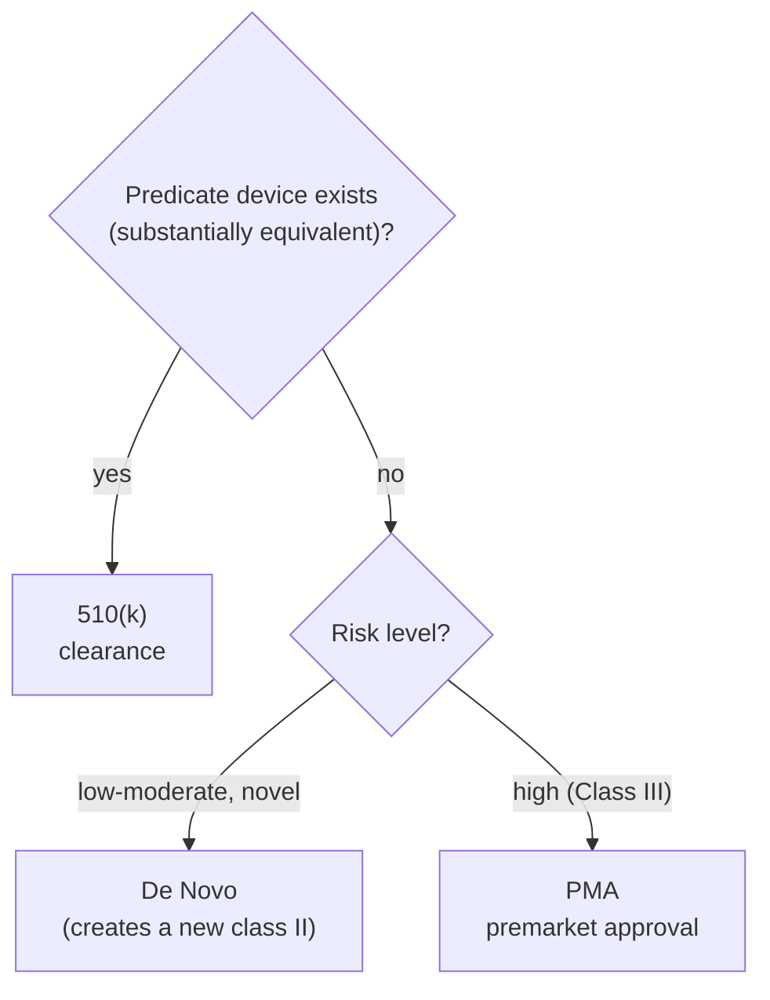

# FDA SaMD & GMLP

> _Last reviewed: 2026-06-28 — see the [freshness policy](../appendix/maintenance.md)._

## Learning objectives

After this chapter you will be able to:

- Determine when health software is a regulated medical device (SaMD).
- Distinguish the FDA pathways — 510(k), De Novo, PMA — and the Health Canada route.
- Explain how AI/ML devices manage change via a Predetermined Change Control Plan (PCCP).

## When software becomes a device

**Software as a Medical Device (SaMD)** is software intended for a medical purpose — diagnosis, treatment, prevention — without being part of a hardware device. The intended-use claim is what triggers regulation: a tool that *flags a possible stroke on a CT* is a device; one that *only displays images* generally is not. Clinical-decision-support carve-outs exist, but if the software drives a clinical decision and the clinician can't independently review the basis, it is likely a device.

This is the [Part 3 GxP](../03-compliance/02-gxp-part11.md) world's sibling: GxP governs *how regulated systems are built and validated*; device regulation governs *whether the product itself may be marketed*.

## FDA pathways

The pathway depends on **risk** and whether a similar device already exists:

| Pathway | For | Bar |
| --- | --- | --- |
| **510(k)** | A device **substantially equivalent** to a legally-marketed predicate | Demonstrate equivalence; most AI devices clear here |
| **De Novo** | A **novel** low-to-moderate-risk device with no predicate | Establish safety/effectiveness; creates a new device type/class |
| **PMA** | **High-risk (Class III)** devices | Most rigorous: clinical evidence of safety and effectiveness |

The vast majority of cleared AI/ML devices go through **510(k)**; De Novo handles genuinely novel moderate-risk tools; PMA is reserved for the highest-risk devices.

## GMLP — Good Machine Learning Practice

FDA (with Health Canada and the UK MHRA) published **Good Machine Learning Practice** guiding principles for AI/ML devices. They map onto disciplined [MLOps](./04-mlops-governance.md): representative data, sound training/validation separation, demonstrated performance (including across subgroups), human-factors consideration, and monitoring of deployed models. Build to GMLP and you generate much of the submission evidence as a byproduct.

## Managing change: the PCCP

AI models improve with retraining — but a cleared device normally needs a new submission for significant changes. The **Predetermined Change Control Plan (PCCP)** (FDA final guidance, December 2024) resolves this: a sponsor pre-specifies the changes a model may undergo and how they'll be validated, and the FDA reviews that plan up front. Conforming changes can then ship **without a new submission**. A PCCP has three parts:

1. **Description of Modifications** — what may change (e.g. retraining on new data).
2. **Modification Protocol** — how each change is implemented, validated, and verified.
3. **Impact Assessment** — the risk analysis of the changes.

PCCPs apply across 510(k), De Novo, and PMA submissions for AI-enabled devices. For an SA, a PCCP is what lets a clinical model keep learning post-deployment within a controlled, pre-agreed envelope — design the MLOps pipeline to honor it.

## Health Canada

Canada classifies medical devices **Class I–IV** (I lowest risk, IV highest):

- **Medical Device Licence (MDL)** is required for Class II–IV devices; Class I importers/distributors need an **MDEL**.
- **MDSAP** (Medical Device Single Audit Program) certification is **required for Class II–IV** MDLs — a single quality-system audit recognized by Canada, the US, Australia, Brazil, and Japan, built on **ISO 13485**.
- Review targets scale with class (longer for III/IV).

For a product entering both markets, plan for **FDA pathway + Health Canada MDL/MDSAP** together; MDSAP's multi-country recognition reduces duplicate auditing. See [Regional compliance](../03-compliance/05-regional-compliance.md).

## Design implications for the SA

- **Fix the intended use early** — it determines device status, class, and pathway, and therefore the whole evidence burden.
- **Lock or PCCP-manage the model** — decide up front whether the model is static or adaptive, and design MLOps accordingly.
- **Engineer traceability** — log inputs/outputs, version everything, and keep validation evidence (GMLP + [21 CFR Part 11](../03-compliance/02-gxp-part11.md) discipline).
- **Plan QMS early** — ISO 13485 / MDSAP is a long lead item, not a launch-week task.

## Check yourself

1. What makes a piece of software a regulated medical device rather than a wellness or display tool?
2. When would a device use De Novo instead of 510(k) or PMA?
3. What does a PCCP let an AI device do, and what are its three components?

## Further reading

- [FDA Software as a Medical Device (SaMD)](https://www.fda.gov/medical-devices/digital-health-center-excellence/software-medical-device-samd)
- [FDA PCCP guidance for AI-enabled devices (2024)](https://www.fda.gov/regulatory-information/search-fda-guidance-documents/marketing-submission-recommendations-predetermined-change-control-plan-artificial-intelligence)
- [Good Machine Learning Practice principles](https://www.fda.gov/medical-devices/software-medical-device-samd/good-machine-learning-practice-medical-device-development-guiding-principles)
- [Health Canada — medical device licensing & MDSAP](https://www.canada.ca/en/health-canada/services/drugs-health-products/medical-devices.html)
