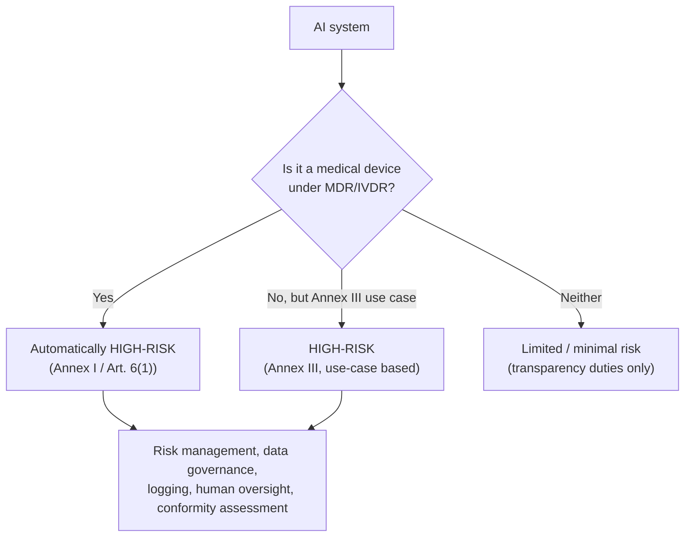

# EU AI Act & global AI regulation

> _Last reviewed: 2026-06-29 — see the [freshness policy](../appendix/maintenance.md)._

## Learning objectives

After this chapter you will be able to:

- Explain how the EU AI Act classifies medical AI as high-risk and what that requires.
- Reason about the AI Act's interplay with MDR/IVDR CE marking.
- Place [ONC HTI-1](./04-mlops-governance.md) and the EU AI Act as parallel, not identical, AI-transparency regimes.

## Why a second AI regulation chapter

[FDA SaMD/GMLP](./05-fda-samd.md) covers the US device pathway; [ONC HTI-1](./04-mlops-governance.md)
covers US certified-health-IT transparency. If your AI touches the **EU**, a third regime
applies — the **EU AI Act** — with its own classification, obligations, and timeline. It is
the world's first comprehensive, cross-sector AI law, and healthcare AI sits squarely in its
highest-scrutiny tier.

## Medical AI is (almost always) high-risk

The AI Act classifies systems into risk tiers; **AI embedded in or acting as a medical device
regulated under MDR/IVDR is automatically high-risk** — there is no separate "is this
high-risk?" test to argue your way out of for a CE-marked SaMD.

## The split timeline (a genuinely confusing part)

The Act's high-risk obligations apply on **two different dates** depending on classification:

- **Annex III (use-case-based high-risk systems)** — most obligations entered into application
  **August 2, 2026**.
- **Article 6(1) / Annex I (products under existing EU harmonisation law)** — this is the bucket
  that covers **CE-marked medical devices and IVDs under MDR/IVDR**, and it does not apply
  until **August 2, 2027**.

So a medical-device AI has an extra year's runway relative to a standalone high-risk AI tool —
but the obligations, once they land, are broader than MDR alone requires. The EU's proposed
**"Digital Omnibus on AI"** package (announced November 2025) may shift these dates further;
treat them as the current best estimate, not fixed.

## Interplay with MDR/IVDR: one QMS, two regulations

The good news: **MDR/IVDR certification remains the sole market-access pathway** for
CE-marked AI devices — there is no separate "AI Act CE mark." You can (and should) integrate
AI Act requirements into your **existing Quality Management System** documentation, and a
single Notified Body conformity assessment is permitted where it is accredited under both
frameworks.

The catch: **MDR compliance is necessary but not sufficient.** The AI Act layers on
obligations with no direct MDR equivalent — most notably:

- **Incident reporting to Market Surveillance Authorities within 15 days** for serious
  incidents — a separate, faster clock than typical MDR vigilance reporting.
- **Data governance documentation** — training/validation/test data provenance, quality, and
  bias mitigation, in a specified format.
- **Human oversight design requirements** — the system must be designed so a human can
  meaningfully intervene, not just receive an output.
- **Logging and traceability** — automatic event logging over the system's lifetime.

## EU AI Act vs ONC HTI-1: parallel, not identical

Both regimes demand AI transparency in health contexts, but they are not interchangeable —
building to one does not automatically satisfy the other:

| | EU AI Act (health) | ONC HTI-1 (US) |
| --- | --- | --- |
| Scope | Any high-risk AI system, healthcare included | AI/Predictive DSI *inside certified health IT* only |
| Trigger | Risk classification (Annex I/III) | Shipping a Predictive DSI in certified EHR tech |
| Core artifact | Conformity assessment + QMS documentation | "Source attributes" disclosure (~31 elements) + FAVES |
| Enforcement | Market Surveillance Authorities, CE marking | ASTP/ONC certification program |
| Incident reporting | 15 days (serious incidents) | Not incident-specific; ties to certification maintenance |

**Design implication:** a global health-AI product usually needs **both** artifact sets — MLOps
practices (see [MLOps & model governance](./04-mlops-governance.md)) that emit HTI-1 source
attributes **and** a QMS-integrated AI Act risk file, ideally from the same underlying
governance data rather than two parallel paper trails.

## Design guidance

1. **Classify early.** Decide whether your AI is a medical device under MDR/IVDR (and
   therefore Annex I/Art. 6(1)) or a standalone Annex III use case — the deadline and
   assessment path differ by a year.
2. **One governance system, multiple outputs.** Design MLOps/governance data capture once (see
   [MLOps & model governance](./04-mlops-governance.md)) and generate HTI-1 source attributes,
   AI Act risk documentation, and FDA GMLP evidence from the same lineage.
3. **Design for human oversight from day one** — this is an EU AI Act structural requirement,
   not a UI nicety to add later.
4. **Track the timeline as live.** The Digital Omnibus proposal means dates here are more
   likely than most in this book to shift; re-verify before a launch decision.

## Check yourself

1. Why is most medical SaMD automatically high-risk under the EU AI Act, with no separate test?
2. What is the practical difference between the Annex III and Article 6(1)/Annex I compliance dates for a CE-marked AI device?
3. Name two obligations the EU AI Act adds on top of MDR that MDR alone does not require.

## Further reading

- [EU AI Act (official text)](https://artificialintelligenceact.eu/)
- [EU AI Act and medical devices — high-risk compliance](https://www.reedsmith.com/our-insights/blogs/viewpoints/102kq35/the-eu-ai-act-and-medical-devices-navigating-high-risk-compliance/)
- [FDA SaMD & GMLP](./05-fda-samd.md) · [MLOps & model governance](./04-mlops-governance.md) (ONC HTI-1)
