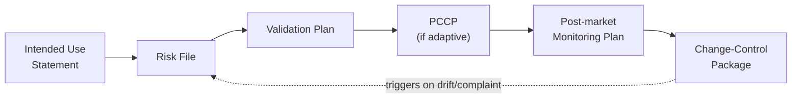

# Regulated AI artifacts: the concrete evidence package

> _Last reviewed: 2026-07-03 — see the [freshness policy](../appendix/maintenance.md)._

## Learning objectives

After this chapter you will be able to:

- Name and draft the concrete artifact set a regulated clinical AI system actually needs to produce.
- Distinguish analytical validation from clinical validation, and know what belongs in each.
- Trace a specific architecture decision to the risk control it satisfies and the evidence artifact that proves it — so governance isn't paperwork bolted on after the design is done.

## From concept to artifact

[FDA SaMD & GMLP](./05-fda-samd.md) and [MLOps & model governance](./04-mlops-governance.md)
establish *what the regulatory concepts are* — intended use, GMLP, PCCP, subgroup evaluation.
This chapter is the concrete follow-through: **the actual document set an auditor, a regulator, or
a hospital's AI governance committee will ask to see**, and — the part most architecture chapters
skip — a direct map from *the design decisions you make* to *the risk they control* to *the
artifact that proves it*.

## The six artifacts

### 1. Intended Use Statement

The single document everything else derives from — get it wrong and every downstream artifact is
scoped wrong too. It states: the clinical question the model answers, the target population
(explicitly, including who it was *not* validated on), the intended user (a radiologist reviewing
a flagged image, not a patient reading a score unsupervised), the output and its form (a binary
flag, a risk score, a differential ranking), and — just as important — an **explicit
out-of-scope** section naming uses the model was not validated for. This is what [FDA SaMD](./05-fda-samd.md)
calls the "intended use claim," and it's also the anchor for the **intended use** field HTI-1
requires as a source attribute (see [MLOps & model governance](./04-mlops-governance.md)).

### 2. Risk File

An ISO 14971-style hazard log, adapted for AI-specific failure modes beyond classic software
hazards:

| Hazard | Example | Typical control |
| --- | --- | --- |
| Distribution shift | Model trained pre-pandemic underperforms on a changed patient mix | Ongoing drift monitoring (below) |
| Subgroup underperformance | Model performs worse on a demographic underrepresented in training data | Mandatory subgroup validation before release |
| Automation bias / over-reliance | Clinician defers to the model even when it's wrong | Confidence/explanation surfaced in the UI; human-factors testing |
| Silent failure | Model returns a plausible-looking but wrong output with no error signal | Output range/sanity checks; confidence thresholds that trigger a "low confidence" flag |

Each row needs a severity/probability estimate, the control measure, and a documented residual-risk
acceptability judgment — the same discipline as a medical-device risk file, just with AI-specific
rows added. See [AI risk & mitigation](./08-ai-risk-mitigation.md) for the full taxonomy that
populates this file, including proxy-label bias, feedback loops, and GenAI-specific failure modes.

### 3. Validation Plan

Pre-specify this **before you unblind any result** — a plan written after you've seen the numbers
is not a validation plan, it's a post-hoc rationalization. It has two distinct halves that are
often conflated:

- **Analytical validation** — does the model perform as intended on data? Requires a held-out test
  set that is genuinely disjoint from training (by patient, and ideally by site/time period, to
  catch leakage and distribution shift), fixed metrics and acceptance thresholds, and a
  pre-specified subgroup analysis plan.
- **Clinical validation** — does using the model change patient outcomes or clinical decisions for
  the better? This is a different, harder question than analytical accuracy, and regulators
  increasingly ask for both — a model can be analytically accurate and still make care worse if it
  changes clinician behavior in unintended ways (automation bias, alert fatigue).

### 4. PCCP (when the model is adaptive)

[FDA SaMD](./05-fda-samd.md) already covers what a **Predetermined Change Control Plan** is; here
is what it looks like concretely for a model that retrains periodically:

- **Description of Modifications** — e.g. "quarterly retraining on new data from the same source
  population, same feature set, same architecture."
- **Modification Protocol** — the exact validation each retrained version must pass before
  deployment (same held-out test set methodology as the original submission), and who signs off.
- **Impact Assessment** — the bounded risk of the *change itself*, not the model in general — e.g.
  "retraining cannot alter the intended use, target population, or output type without triggering a
  new submission."

A well-scoped PCCP is what lets routine retraining ship without a new submission every quarter —
but only changes that stay inside its pre-specified envelope qualify; anything else is a new
submission, not a PCCP-covered change.

### 5. Post-Market Monitoring Plan

What you commit to watching *after* deployment, with pre-defined trigger actions, not just
dashboards nobody acts on:

- **Real-world performance monitoring** against the same metrics validated pre-deployment, on a
  cadence stated up front (not "whenever someone looks").
- **Drift detection thresholds** — a specific numeric trigger (not "if it looks off") that
  initiates an investigation or a rollback.
- **Complaint handling / adverse event pathway** — for a legally marketed device, this connects to
  FDA's Medical Device Reporting (MDR) obligations; know the reporting threshold and timeline
  before you need them, not after an incident.
- **Periodic re-validation cadence** — a scheduled re-run of the validation plan against recent
  data, independent of whether drift monitoring has fired.

### 6. Change-Control Package

The record generated **every time anything changes**, whether or not it falls inside a PCCP: what
changed, why, the evidence it was validated against the Modification Protocol (or, if outside the
PCCP's scope, that a new submission was filed), who approved it, and the effective date. This is
where your [MLOps model registry](./04-mlops-governance.md) metadata — version, training data
lineage, approval sign-off — *is* the compliance evidence, if you design the registry to emit it
in this shape from day one rather than reconstructing it under audit pressure.

## From architecture decision to evidence artifact

The mapping most teams miss: **specific design choices are risk controls, and the artifact that
documents them is not extra work — it's the natural output of building the system correctly.**

| Architecture decision | AI risk control | Evidence artifact it produces |
| --- | --- | --- |
| Held-out test set, disjoint by patient/site/time | Mitigates overfitting and undetected distribution shift | Validation Plan + test-results appendix |
| Immutable, versioned model registry with data lineage | Mitigates untracked/unauthorized model change | Change-Control Package entries |
| Subgroup performance dashboards in production | Mitigates undetected bias or fairness degradation over time | Post-Market Monitoring Plan + periodic fairness report |
| Canary / shadow deployment before full rollout | Mitigates unsafe rollout of a regressed model | Deployment validation evidence inside the Change-Control Package |
| Confidence score / explanation surfaced in clinician UI | Mitigates automation bias and over-reliance | Human-factors section of the Validation Plan |
| Pre-specified retraining protocol (a scoped PCCP) | Mitigates the need for a new submission per retrain, without ceding control | PCCP + Modification Protocol evidence log |
| Immutable audit log of every model input/output | Mitigates inability to investigate an adverse event after the fact | Supports Post-Market Monitoring and any MDR investigation |
| Automated drift-detection job with a numeric trigger | Mitigates silent performance decay going unnoticed | Post-Market Monitoring Plan trigger log |

Read this table in either direction: if you're designing, start from the left column and ask what
evidence it will generate; if you're assembling a submission or an audit response, start from the
right column and work backward to the decision that produced it.

## Design guidance

1. **Write the Intended Use Statement first** — every other artifact inherits its scope from it.
2. **Freeze the Validation Plan before unblinding results** — a plan written after the fact proves
   nothing.
3. **Design the model registry to emit Change-Control evidence automatically** — don't plan to
   reconstruct history from Slack messages under audit pressure.
4. **Give every monitoring metric a numeric trigger and an owner** — a dashboard nobody is
   accountable for acting on is not a control.
5. **Treat the architecture-decision-to-artifact map as a design checklist**, not a compliance
   afterthought — run it during design review, not before a submission deadline.

## Check yourself

1. Why must a Validation Plan be written and frozen before you unblind results, rather than
   afterward?
2. Name two AI-specific hazards a classic (non-AI) software risk file would likely miss.
3. Pick one architecture decision from the mapping table and explain, in your own words, which
   specific failure it prevents and which artifact proves it was controlled.

## Further reading

- [ISO 14971 — risk management for medical devices](https://www.iso.org/standard/72704.html)
- [ISO/IEC 42001 — AI management systems](https://www.iso.org/standard/81230.html)
- [FDA SaMD & GMLP](./05-fda-samd.md) · [MLOps & model governance](./04-mlops-governance.md)
- [IMDRF — SaMD risk categorization framework](https://www.imdrf.org/documents/software-medical-device-samd-possible-framework-risk-categorization-and-corresponding)
