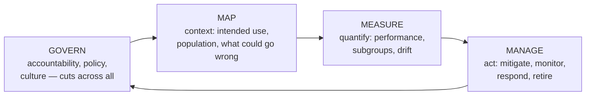

# AI risk & mitigation in healthcare

> _Last reviewed: 2026-07-16 — see the [freshness policy](../appendix/maintenance.md)._

## Learning objectives

After this chapter you will be able to:

- Use the NIST AI Risk Management Framework's four functions to structure health-AI risk work.
- Name the specific ways clinical AI fails, and the concrete architectural mitigation for each.
- Recognize proxy-variable bias and distribution shift in a real system before they cause harm.

## The substance behind the risk file

[Regulated AI artifacts](./07-regulated-ai-artifacts.md) tells you a **risk file** is a required
deliverable and shows its shape. This chapter is what goes *in* it: the actual taxonomy of how
clinical AI fails, and what you build to prevent each failure. [Ethics in health informatics &
AI](../03-compliance/10-informatics-ethics.md) covers whether you *should* build something; this
covers what breaks once you have.

## NIST AI RMF: the organizing frame

The **NIST AI Risk Management Framework (AI 100-1)** is the de-facto vocabulary for AI risk work,
including in health, and it organizes everything into four functions:

NIST added a **Generative AI Profile (AI 600-1, July 2024)** layering GenAI-specific risks —
including *confabulation*, data privacy, information integrity, information security, and harmful
bias — on top of the base framework. It supplements AI 100-1 rather than replacing it: the base
gives you the governance process, the profile gives you the GenAI risk taxonomy.

For an SA, the practical value is that **Govern/Map/Measure/Manage maps cleanly onto artifacts you
already owe** — Map produces the intended use statement and risk file, Measure produces the
validation plan and subgroup results, Manage produces the post-market monitoring plan and
change-control package.

## The health-AI risk taxonomy

| Risk | How it shows up in health | Architectural mitigation |
| --- | --- | --- |
| **Proxy / label bias** | The label you can measure isn't the thing you care about | Interrogate the label before the model; test the proxy against the true target across subgroups |
| **Distribution shift / drift** | Population, coding practice, instruments, or care patterns change post-deployment | Drift monitoring with a numeric trigger; scheduled re-validation independent of drift alarms |
| **Subgroup underperformance** | Aggregate accuracy hides worse performance for an under-represented group | Subgroup evaluation as a release gate; stratified monitoring in production |
| **Automation bias** | Clinicians defer to the model even when it is wrong | Surface confidence and rationale; human-factors testing; avoid single-number outputs presented as verdicts |
| **Silent failure** | Model returns a plausible, wrong output with no error signal | Input range/sanity checks; confidence thresholds that emit an explicit "low confidence" state |
| **Alert fatigue from low precision** | A technically "good" model at population scale still floods clinicians | Optimize for positive predictive value at the operating threshold, not AUROC — see [streaming analytics](../08-integration/04-realtime-streaming-analytics.md) |
| **Privacy leakage / memorization** | A model reproduces training data, including PHI, in its output | Train in-boundary; de-identify training data; test for memorization; output filtering |
| **Adversarial input / prompt injection** | Malicious content in a note or document steers an LLM-based system | Treat retrieved content as untrusted data, never instructions; constrain tool permissions |
| **Feedback loops** | Model changes clinician behavior, which changes the data it is retrained on | Track the intervention's effect on the label; never retrain naively on post-deployment data |
| **Confabulation (GenAI)** | Fluent, confident, fabricated clinical content | Ground in retrieved sources ([RAG](./02-rag-clinical.md)); cite provenance; require human sign-off |

## Worked example 1: proxy bias, and why it is the hardest to see

The landmark case is **Obermeyer et al. (Science, 2019)**, which dissected a commercial algorithm
used across US health systems to identify patients for extra care management. The algorithm
predicted **health care costs** as a stand-in for **health needs** — a reasonable-seeming proxy,
since sicker patients generally cost more. But less money is spent on Black patients at the same
level of illness, so the model inferred they were healthier. At a given risk score, Black patients
were substantially sicker than White patients; correcting the disparity would have raised the share
of Black patients flagged for additional help from **17.7% to 46.5%**. Reformulating the target to
combine cost with active chronic conditions **reduced the bias by around 84%**.

Nothing about the modeling was technically wrong. **The bias entered through the label**, before a
single line of training code — which is why proxy bias survives model-level fairness audits and why
the mitigation is to interrogate the target variable itself:

- Ask explicitly: *what do we actually care about, and what are we measuring instead?*
- Test whether the gap between proxy and true target differs by subgroup — that gap **is** the bias.
- Prefer a composite or more direct label even at some cost to measured accuracy.

## Worked example 2: performance that didn't survive contact with another hospital

**Wong et al. (JAMA Internal Medicine, 2021)** externally validated a widely deployed proprietary
sepsis prediction model across 38,455 hospitalizations. Against vendor-cited internal performance
in the 0.76–0.83 AUC range, the external result was **AUC 0.63**, with **sensitivity of 33%** — it
missed roughly two-thirds of sepsis cases — while still generating enough alerts that clinicians
would work through a large number of false positives per true case.

Two lessons an SA should carry: **internal validation does not transfer**, and a model can fail on
*both* axes at once — missing real cases while flooding clinicians — which is the combination that
destroys trust in every subsequent model the team deploys. External, site-specific validation
before go-live is the mitigation, and it is not optional. (See
[failure-mode case studies](../10-sa-craft/05-failure-mode-case-studies.md) for the same
analysis applied across other HLS domains.)

## GenAI- and agent-specific risks

Beyond the table above, LLM-based clinical systems add failure modes with no classical-ML analogue:

- **Confabulation with fluency.** A fabricated drug interaction stated in confident clinical prose
  is more dangerous than an obviously broken output, because it passes casual review. Grounding
  and provenance citation are the structural mitigation, not prompt instructions.
- **Prompt injection through clinical content.** A note, PDF, or retrieved document can carry text
  that an agent interprets as instructions. **Content retrieved from any source is data, never
  commands** — this is an architectural boundary, and it matters most for
  [agentic systems](./03-agentic-ai.md) and [AI agents on FHIR](../02-interoperability/14-ai-agents-on-fhir.md)
  that hold real tool permissions.
- **Over-broad tool permissions.** An agent that can write to the chart is a different risk class
  than one that can only read. Scope tool access to the minimum the intended use requires.
- **Non-determinism complicates validation.** The same input can yield different outputs, so
  single-run validation proves less than it does for a deterministic model; evaluate distributions
  of behavior, and pin versions.

## Mitigation practices that generalize

1. **Interrogate the label before the model.** Most consequential bias enters through the target
   variable, not the algorithm.
2. **Validate externally, on your own population**, before deployment — vendor-reported performance
   is a hypothesis about your site, not a result.
3. **Make subgroup performance a release gate**, and monitor it stratified in production, not just
   in aggregate.
4. **Give every monitored risk a numeric trigger and a named owner** — an unowned dashboard is not
   a control (the same rule as [regulated AI artifacts](./07-regulated-ai-artifacts.md)).
5. **Optimize the operating threshold for clinical utility**, not for a headline discrimination
   metric — precision at the deployed threshold is what clinicians experience.
6. **Design the human-oversight path as a real intervention point**, not an acknowledgment click —
   an EU AI Act requirement as well as a safety one (see [EU AI Act](./06-eu-ai-act.md)).
7. **Retire models deliberately.** "Manage" includes decommissioning; a model nobody owns anymore
   but that still runs is an unmonitored clinical intervention.

## Check yourself

1. Why did the Obermeyer algorithm's bias survive despite no technical flaw in the model, and what
   is the general lesson about where bias enters?
2. A vendor reports AUC 0.80 for a sepsis model. What does the Wong et al. external validation
   suggest you require before deploying it, and why?
3. Why is retrieved clinical content treated as data rather than instructions in an agentic system,
   and what breaks if you don't?

## Further reading

- [NIST AI Risk Management Framework (AI 100-1)](https://nvlpubs.nist.gov/nistpubs/ai/nist.ai.100-1.pdf) · [Generative AI Profile (AI 600-1)](https://nvlpubs.nist.gov/nistpubs/ai/NIST.AI.600-1.pdf)
- [Obermeyer et al. — Dissecting racial bias in an algorithm used to manage the health of populations (Science, 2019)](https://www.science.org/doi/10.1126/science.aax2342)
- [Wong et al. — External validation of a widely implemented proprietary sepsis prediction model (JAMA Intern Med, 2021)](https://jamanetwork.com/journals/jamainternalmedicine/fullarticle/2781307)
- [Regulated AI artifacts](./07-regulated-ai-artifacts.md) · [Ethics in health informatics & AI](../03-compliance/10-informatics-ethics.md)
