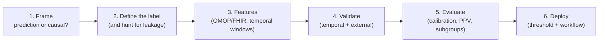

# Machine learning on clinical data: predictive modeling in practice

> _Last reviewed: 2026-07-16 — see the [freshness policy](../appendix/maintenance.md)._

## Learning objectives

After this chapter you will be able to:

- Frame a clinical ML problem correctly — including recognizing when the question is causal, not predictive.
- Avoid the label-leakage and validation mistakes that make clinical models look excellent in development and fail in deployment.
- Evaluate a clinical model on the axes that actually determine whether it helps: calibration, precision at the operating threshold, and subgroup performance.

## The most common clinical ML, finally covered

Part 6 covers ML on **text** ([clinical NLP](./00-clinical-nlp.md)), on **pixels**
([medical imaging AI](./01-medical-imaging.md)), on **retrieval**
([RAG](./02-rag-clinical.md)), and the governance around all of it. What it hasn't covered is the
workhorse: **supervised prediction on structured EHR, claims, and registry data** — readmission
risk, deterioration, no-show, disease onset, cost. This is the ML most HLS organizations actually
build, and it fails in specific, well-documented ways that generic ML training does not warn you
about.

## 1. Prediction is not causation — and the difference is clinical

The single most consequential framing error in clinical ML: a model that **predicts** an outcome
gets interpreted as telling you **what to do about it**. They are different questions and need
different methods.

- *"Which patients will be readmitted?"* — prediction. Supervised ML is the right tool.
- *"Will this intervention reduce readmission?"* — causal. Needs a
  [comparative-effectiveness design](../05-data-platforms/06-ohdsi-study-package.md) (or a trial),
  not a classifier.

The classic illustration: a model may learn that asthmatic patients presenting with pneumonia have
*lower* mortality — true in the data, because they are triaged straight to intensive care. Acting
on it as if it were causal inverts the correct clinical decision. **A predictive model reflects the
care system that generated its data, including the interventions that already worked.** If someone
asks a predictive model a causal question, the answer is a different study design, not a better
model.

## 2. The label problem, and leakage

Most clinical ML failures are label failures, not algorithm failures.

- **Define the outcome precisely** — "readmission" means which window, which admission types,
  transfers included or not? An imprecise label produces a model that predicts an artifact of your
  cohort definition. The [OHDSI cohort-definition discipline](../05-data-platforms/06-ohdsi-study-package.md)
  applies directly.
- **Label leakage** is the dominant silent killer: a feature that encodes the outcome. A discharge
  disposition code, a billing code assigned at the end of the encounter, or a medication only
  ordered after diagnosis will all yield superb development performance and useless deployment
  performance, because at prediction time they don't exist yet.
- **The fix is a prediction-time discipline**: for every feature, ask *would this value be
  available, with this value, at the moment the model actually runs?* Anything else is leakage.
- **Proxy labels carry bias** — see [AI risk & mitigation](./08-ai-risk-mitigation.md) for why
  choosing cost as a stand-in for need embedded racial bias in a widely deployed algorithm.

## 3. Features from clinical data

- **Source from a standard model where possible.** Building features off [OMOP](../02-interoperability/04-omop-cdm.md)
  rather than raw source schemas means the feature definitions port across sites — the same
  property that makes OMOP valuable for research makes models reproducible.
- **Everything is temporal.** Define an explicit observation window (lookback) and prediction
  horizon, and enforce that no feature crosses the index date.
- **Missingness is informative, not just missing.** A lab that was never ordered tells you the
  clinician didn't suspect the condition. Imputing it to a population mean discards real signal —
  and worse, ties the model to local ordering practice, which is a major reason models don't
  transfer between sites.
- **Beware site-specific artifacts.** Local coding habits, EHR configuration, and even scanner or
  analyzer models become features the model happily learns and that don't generalize.

## 4. Validation that survives deployment

A random train/test split is the wrong default for clinical data, because deployment is always
**forward in time and often at another site**:

| Strategy | What it tests | When required |
| --- | --- | --- |
| **Random split** | Almost nothing about deployment | Early iteration only |
| **Temporal validation** | Train on earlier period, test on later — does it survive practice change? | Always |
| **External / multi-site** | Does it survive a different population and coding practice? | Before any deployment beyond the development site |

The [Wong et al. sepsis validation](./08-ai-risk-mitigation.md) is the cautionary case: internally
reported AUC in the 0.76–0.83 range, externally measured at **0.63** with **33% sensitivity**.
Vendor-reported performance is a hypothesis about your site, never a result.

## 5. Evaluation: the metrics that decide whether it helps

**Discrimination is not enough.** AUROC answers "can it rank patients?" — necessary, and routinely
over-reported at the expense of everything that determines clinical usefulness:

- **Calibration** — do predicted probabilities match observed frequencies? A model saying "20%
  risk" for a group where 60% have the event is dangerously miscalibrated even at excellent AUROC.
  Clinicians act on the number, so calibration is what makes a risk score safe to use. Check the
  calibration curve, and re-check it after any population shift.
- **AUPRC for rare outcomes.** With a 2% event rate, AUROC flatters a model badly; precision-recall
  reflects reality far better.
- **Precision (PPV) at the actual operating threshold.** This is what clinicians experience — how
  many alerts they chase per true case. It is the direct link to
  [alert fatigue](../08-integration/04-realtime-streaming-analytics.md), and it is the number to
  put in front of a clinical stakeholder rather than AUROC.
- **Net benefit / decision curve analysis** — evaluates whether acting on the model beats
  treat-all or treat-none across plausible thresholds. The closest single answer to "is this
  clinically worth deploying?"
- **Subgroup performance** — stratified by age, sex, race/ethnicity, and site. A release gate, per
  [AI risk & mitigation](./08-ai-risk-mitigation.md), not a follow-up study.

**On class imbalance:** resist aggressive resampling as a reflex. Oversampling and class weighting
distort predicted probabilities and therefore **break calibration** — often trading the metric that
matters for one that doesn't. Prefer keeping the natural prevalence and choosing the threshold
deliberately.

## 6. Deployment and reporting

- **The threshold is a clinical decision, not a default.** 0.5 is arbitrary. Choose it from the
  cost asymmetry between a missed case and a false alarm, with clinical stakeholders, and revisit
  it after observing real alert volume.
- **Workflow integration decides adoption**, exactly as with [imaging AI](./01-medical-imaging.md)
  and the [documentation-burden](../08-integration/07-ehr-usability-documentation-burden.md)
  constraint: a score that requires leaving the EHR will not be used.
- **Report to a standard.** **TRIPOD+AI** (BMJ, April 2024) is the current reporting guideline for
  clinical prediction models using regression *or* machine learning, superseding TRIPOD 2015. Even
  for an internal model that will never be published, its checklist is an excellent completeness
  test — and it aligns closely with the evidence a [regulated AI artifact](./07-regulated-ai-artifacts.md)
  package needs.
- **Reuse the OHDSI stack when you're already on OMOP.** The **PatientLevelPrediction** package
  ([OHDSI end-to-end](../05-data-platforms/06-ohdsi-study-package.md)) implements this whole
  pipeline against the CDM with the validation discipline built in — and produces a study package
  that runs unchanged at other sites, which is external validation nearly for free.

## Design guidance

1. **Ask whether the question is predictive or causal** before choosing any method.
2. **Audit every feature for prediction-time availability** — leakage is the default failure, not
   the exotic one.
3. **Never ship on a random split.** Temporal validation always; external validation before
   deployment beyond the development site.
4. **Report calibration and PPV-at-threshold alongside AUROC** — and lead with them when talking to
   clinicians.
5. **Treat missingness as signal**, and be suspicious of any feature whose predictive power comes
   from local ordering practice.

## Check yourself

1. A model finds that asthmatic pneumonia patients have lower mortality. Why is acting on this
   clinically dangerous, and what does it reveal about predictive models generally?
2. Your model has AUROC 0.88 on a random split. Name two validation steps still required before
   deployment, and one metric more informative than AUROC for a 2%-prevalence outcome.
3. Why can aggressive oversampling to fix class imbalance make a clinical model *less* useful even
   when it improves a headline metric?

## Further reading

- [TRIPOD+AI statement (BMJ, 2024)](https://www.bmj.com/content/385/bmj-2023-078378)
- [OHDSI PatientLevelPrediction](https://ohdsi.github.io/PatientLevelPrediction/)
- [AI risk & mitigation](./08-ai-risk-mitigation.md) · [MLOps & model governance](./04-mlops-governance.md) · [OHDSI end-to-end](../05-data-platforms/06-ohdsi-study-package.md)
