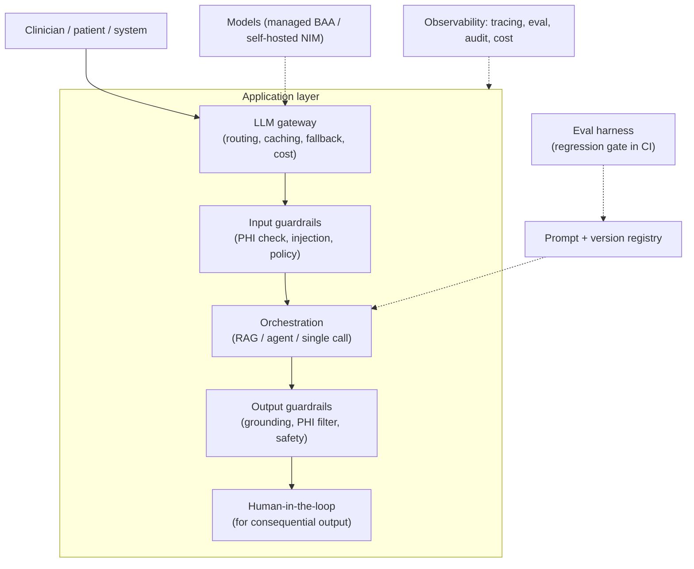

# Building a production GenAI application for HLS

> _Last reviewed: 2026-07-20 — see the [freshness policy](../appendix/maintenance.md)._

## Learning objectives

After this chapter you will be able to:

- Assemble the production stack around an LLM — the parts a demo skips but a deployed HLS app cannot.
- Place an LLM gateway, guardrails, an eval harness, and a prompt registry in a coherent architecture.
- Design the PHI-safe inference boundary and the observability that a clinical GenAI system needs to be operable and auditable.

## The gap between a demo and a deployed GenAI app

[RAG over clinical corpora](./02-rag-clinical.md) and [Agentic AI](./03-agentic-ai.md) cover the
two dominant GenAI *patterns*; [AI risk & mitigation](./08-ai-risk-mitigation.md) covers what goes
wrong. What neither covers is the **production application architecture** — the scaffolding a
net-new HLS GenAI product actually needs around the model to be safe, operable, auditable, and
affordable. A notebook that calls a model is a demo. The difference is this chapter.

## The LLM gateway

A single choke point every model call routes through — the same idea as an
[API gateway](../08-integration/02-api-management.md), applied to model traffic. It gives you one
place to enforce cross-cutting concerns instead of scattering them across every feature:

- **Routing & fallback** — send a request to the right model, and fail over to a backup when a
  provider is down or rate-limited (clinical apps can't just error out).
- **Caching** — cache identical or semantically similar requests to cut cost and latency.
- **Cost & rate control** — per-tenant/per-user budgets and throttling; GenAI cost scales with
  usage in a way that surprises teams (see [TCO](../01-foundations/03-tradeoffs-tco.md)).
- **Central logging** — one audit point for every model interaction, which HIPAA and any incident
  investigation will need.

Whether you build this or adopt an existing LLM-gateway component, **the architectural requirement
is that no feature calls a model directly** — every call is mediated, so policy and observability
are uniform.

## Guardrails: two stages, both required

Guardrails run at the boundary, on the way in and the way out — and they are distinct jobs:

- **Input guardrails** — **PHI detection** (do we intend to send this to this model?),
  **prompt-injection defense** (treat any retrieved or user-supplied content as data, never
  instructions — see [AI risk & mitigation](./08-ai-risk-mitigation.md)), and policy checks
  (is this request in scope for the app's intended use?).
- **Output guardrails** — **grounding/faithfulness checks** (did the answer stay within retrieved
  sources, or confabulate?), **PHI filtering** where outputs cross a boundary, and safety/content
  checks before anything reaches a user or another system.

For clinical use these are not optional polish — an ungrounded, unfiltered output is the failure
mode the [ethics](../03-compliance/10-informatics-ethics.md) and risk chapters are built around.

## The eval harness: your regression gate

The highest-leverage thing separating a maintainable GenAI app from an unmaintainable one is an
**evaluation harness** — a curated test set the app is scored against on every change, run as a
**gate in CI** exactly like unit tests gate traditional code:

- **A curated question/answer set** representative of real use, with known-good behavior.
- **Metrics that matter for the use case** — retrieval recall and answer faithfulness for
  [RAG](./02-rag-clinical.md); task success and unsafe-action rate for [agents](./03-agentic-ai.md);
  hallucination/confabulation rate for anything clinical.
- **Run before every prompt, model, or config change.** Because a "small" prompt tweak or a model
  version bump can silently regress quality, the eval is what catches it before production does.
- **Non-determinism means evaluate distributions.** The same input can vary; score across runs, not
  once (the point made in [AI risk & mitigation](./08-ai-risk-mitigation.md)).

This is the GenAI analogue of the [validation plan](./07-regulated-ai-artifacts.md) discipline —
and if the app is a regulated device, the eval harness *is* much of the validation evidence.

## Prompt & version management

Treat prompts, retrieval configs, model settings, and eval thresholds as **versioned artifacts**,
not strings buried in code — the same instinct as the [model registry](./04-mlops-governance.md)
for classical ML:

- **A prompt registry** so every prompt has a version, an owner, and a change history — because "who
  changed the system prompt and when" is a real audit and debugging question.
- **Config as data** — model, temperature, retrieval parameters, and thresholds versioned together,
  so a deployed behavior is reproducible and roll-back-able.
- **This feeds the [change-control package](./07-regulated-ai-artifacts.md)** directly for regulated
  systems: a prompt change is a change that may need review.

## The PHI-safe inference boundary

The defining HLS constraint, carried over from [RAG](./02-rag-clinical.md#keeping-phi-in-boundary)
and applied to the whole app:

- **Use HIPAA-eligible, BAA-covered model endpoints**, or **self-host** ([NVIDIA NIM](../04-cloud-platforms/07-nvidia.md))
  so PHI never reaches an un-covered API.
- **The gateway is where you enforce this** — it can block or route around any egress of PHI to a
  non-covered provider, which is far more reliable than trusting every feature to do it.
- **Embeddings and vector stores of PHI are still PHI-adjacent** — keep them in the governed
  environment.
- **Retrieval must respect record-level access** — a user must not retrieve, via the model, content
  they couldn't access directly (the [consent](../03-compliance/09-consent-management-architecture.md)
  and governance boundary doesn't stop at the model's edge).

## Observability & operations

A clinical GenAI app is a production system and needs the operational surface of one:

- **Tracing** — capture the full chain (prompt, retrieved context, tool calls, output) for every
  request, so a bad answer is debuggable after the fact — impossible to reconstruct otherwise given
  non-determinism.
- **Audit logging** — who asked what, what the model saw, what it returned; a
  [HIPAA](../03-compliance/00-hipaa.md) requirement and the basis of any incident review.
- **Cost & latency monitoring** — per-feature and per-tenant, with alerts; both can degrade
  silently.
- **Online quality monitoring** — sample production traffic against the eval metrics, because
  offline eval doesn't catch distribution shift in real usage (the same
  [drift](./08-ai-risk-mitigation.md) discipline as classical ML).

## Design guidance

1. **Route every model call through a gateway** — it's the only place cross-cutting policy, PHI
   egress control, cost limits, and audit stay uniform.
2. **Build the eval harness before scaling features**, and gate CI on it — it's what makes the app
   changeable without silent regressions.
3. **Version prompts and configs like code**, with owners and history — for both debugging and
   regulated change control.
4. **Enforce the PHI boundary at the gateway**, not feature-by-feature — centralized is
   enforceable; scattered is hope.
5. **Instrument for non-determinism** — trace everything, evaluate distributions, and monitor
   production quality, because you cannot reproduce a failure you didn't capture.
6. **Keep humans in the loop for consequential output** — the [agentic](./03-agentic-ai.md)
   advisory-first rule applies to the whole app.

## Check yourself

1. Why should every model call route through an LLM gateway rather than each feature calling the
   model API directly — name two things the gateway enforces that would otherwise be scattered.
2. What does an eval harness give a GenAI app that ad hoc manual testing does not, and why is
   running it in CI the point?
3. Why are input and output guardrails different jobs, and what does each specifically protect
   against in a clinical app?

## Further reading

- [RAG over clinical corpora](./02-rag-clinical.md) · [Agentic AI](./03-agentic-ai.md) · [AI risk & mitigation](./08-ai-risk-mitigation.md)
- [Regulated AI artifacts](./07-regulated-ai-artifacts.md) · [MLOps & model governance](./04-mlops-governance.md)
- [NVIDIA NIM (self-hosted inference)](https://www.nvidia.com/en-us/ai/) · [NeMo Guardrails](https://github.com/NVIDIA/NeMo-Guardrails)
