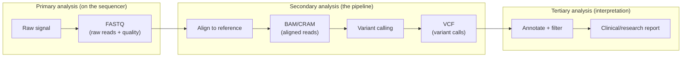
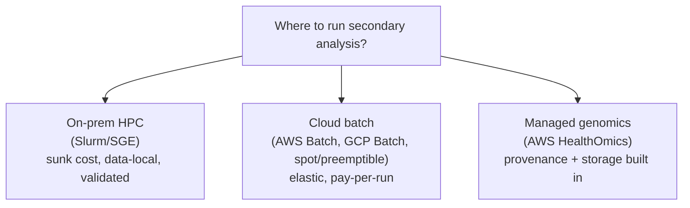

# Sequencing pipelines

## Learning objectives

After this chapter you will be able to:

- Trace the genomics data flow from raw reads to variant calls and name the file formats at each stage.
- Explain primary, secondary, and tertiary analysis and where the SA's architecture work concentrates.
- Choose an execution model (on-prem HPC, cloud batch, managed) and a workflow engine for a sequencing workload.

## Why genomics is an architectural category of its own

Genomics is the most **data-intensive** and **compute-intensive** workload in HLS. A single whole-genome sequence (WGS) at 30× coverage produces ~100 GB of raw data; a population study is petabytes. The work is embarrassingly parallel batch computing, not request/response — so the architecture looks more like HPC and data engineering than like a clinical app. This is the pharma/diagnostics side of the [HLS map](../00-orientation/01-hls-industry-map.md), where the dominant question is *throughput, cost, and reproducibility*, and (in clinical diagnostics) **GxP-grade provenance** (see [GxP & 21 CFR Part 11](../03-compliance/02-gxp-part11.md)).

## The data flow: FASTQ → BAM → VCF

Genomics analysis is conventionally split into three phases:

- **Primary** — the sequencer converts raw signal to **FASTQ** (base calls + quality scores). Usually handled by the instrument vendor.
- **Secondary** — align reads to a reference genome (producing **BAM**, or its compressed form **CRAM**), then call variants (producing **VCF**). This is the compute-heavy core and where most architecture work lands.
- **Tertiary** — annotate variants (functional impact, population frequency, clinical significance), filter, and interpret into a report. More data-engineering and knowledge-base work than raw compute. See [Variant stores & scale](./02-variant-stores.md).

| Format | Stage | What it is |
| --- | --- | --- |
| FASTQ | Primary out | Raw reads with per-base quality |
| BAM / CRAM | Secondary | Reads aligned to a reference (CRAM is reference-compressed, much smaller) |
| VCF / gVCF | Secondary out | Variant calls (gVCF retains per-position info for joint genotyping) |

## Secondary analysis: tools and standards

- **GATK Best Practices** (Broad Institute) is the de-facto standard germline SNV/InDel workflow: pre-process FASTQ → analysis-ready BAM → call variants → VCF.
- **DRAGEN** (Illumina) and **NVIDIA Parabricks** are hardware-accelerated implementations — a 30× genome that takes ~30 hours on CPU can run in well under an hour on FPGA/GPU. The accuracy/throughput trade-off matters at population scale.
- Reproducibility and benchmarking against truth sets (e.g., precisionFDA / Genome in a Bottle) are part of validating a clinical pipeline.

## Workflow engines and reproducibility

Genomics pipelines are multi-step DAGs that must be **reproducible** — the same inputs and pipeline version must yield the same outputs (a regulatory and scientific requirement). Don't hand-roll this; use a workflow engine:

- **Nextflow** + **nf-core** — a curated, community-reviewed set of portable, versioned pipelines (e.g., `nf-core/rnaseq`, `nf-core/sarek` for variant calling). The [`RNASEQ`](https://github.com/anothernoise/RNASEQ) lab uses nf-core.
- **WDL** (+ Cromwell/miniwdl) and **CWL** — alternative standards; WDL is common in the Broad/Terra ecosystem.
- **Snakemake** — Python-based, popular in research.

Pin pipeline **versions** and **container images** so any result can be regenerated — this is both reproducibility and, in clinical settings, GxP evidence.

## Execution models

- **On-prem HPC** — Slurm/SGE clusters with shared parallel storage. Common where data is large and local, the cluster is a sunk cost, or a validated environment exists (see [On-premises & hybrid](../04-cloud-platforms/06-on-prem-hybrid.md)).
- **Cloud batch** — AWS Batch / GCP Batch / Azure Batch with spot/preemptible instances for cost. Elastic: spin up thousands of cores for a run, release them after. Strong fit for variable or bursty load.
- **Managed genomics** — AWS HealthOmics runs Nextflow/WDL/CWL workflows with purpose-built storage and built-in provenance. See [AWS HealthOmics](./01-healthomics.md).

**Cost levers** (see [Trade-offs, TCO & cost](../01-foundations/03-tradeoffs-tco.md)): use spot/preemptible for fault-tolerant steps; store CRAM not BAM; archive raw FASTQ after QC; keep compute and storage co-located to avoid egress on terabyte-scale files.

## Lab

[`RNASEQ`](https://github.com/anothernoise/RNASEQ) — an nf-core/Nextflow RNA-seq pipeline you can run locally or map onto cloud batch / HealthOmics.

## Check yourself

1. Name the three analysis phases and the primary file format produced at the end of each.
2. Why use a workflow engine like Nextflow/nf-core rather than a shell script for a sequencing pipeline — and why does version pinning matter in a clinical context?
3. A diagnostics lab has a large validated on-prem HPC cluster but occasional 10× spikes in sequencing volume. What execution model fits, and which chapter covers the connectivity concern?

## Further reading

- [GATK Best Practices](https://gatk.broadinstitute.org/hc/en-us/sections/360007226651-Best-Practices-Workflows)
- [nf-core pipelines](https://nf-co.re/)
- [Nextflow](https://www.nextflow.io/)
- [precisionFDA Truth Challenges](https://precision.fda.gov/challenges)
