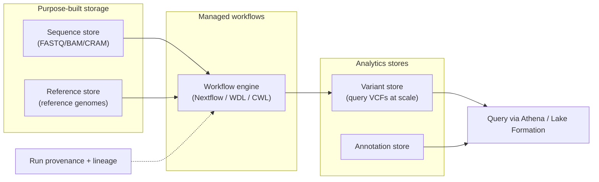

# AWS HealthOmics

> _Last reviewed: 2026-06-28 — see the [freshness policy](../appendix/maintenance.md)._

## Learning objectives

After this chapter you will be able to:

- Describe the three HealthOmics stores and the workflow engine, and how they fit together.
- Explain what HealthOmics provides over rolling your own genomics stack on AWS Batch.
- Decide when managed genomics is the right call versus on-prem HPC or plain cloud batch.

## What HealthOmics is

AWS HealthOmics is a **purpose-built managed service for genomics and multi-omics** data. It is AWS's answer to a recurring problem: teams build genomics pipelines on raw compute and storage, then struggle with the *non-pipeline* parts — purpose-built storage for huge files, reproducible workflow execution, and the **provenance** that clinical and regulated use demands. HealthOmics bundles those concerns into one service. It is the most complete managed genomics offering across the clouds (see the [capability map](../04-cloud-platforms/00-overview-capability-map.md)).

## The components

| Component | Role |
| --- | --- |
| **Sequence store** | Purpose-built, cost-tiered storage for FASTQ/BAM/CRAM with domain-aware compression and access. |
| **Reference store** | Managed reference genomes that workflows align against. |
| **Workflow engine** | Runs **Nextflow, WDL, and CWL** pipelines as managed runs — no cluster to operate. Captures run provenance. |
| **Variant store** | Stores called variants for scalable, SQL-queryable analysis (via Athena / Lake Formation). See [Variant stores & scale](./02-variant-stores.md). |
| **Annotation store** | Stores and joins annotation data to variants. |

## What it gives you over DIY on AWS Batch

You *can* build a genomics stack from S3 + AWS Batch + your own Nextflow setup (see [Sequencing pipelines](./00-sequencing-pipelines.md)). HealthOmics earns its place by providing:

- **Provenance and reproducibility out of the box** — each run records inputs, workflow version, and parameters. This is the evidence a clinical/GxP environment needs (see [GxP & 21 CFR Part 11](../03-compliance/02-gxp-part11.md)); reconstructing it yourself on Batch is real work.
- **Purpose-built storage economics** — sequence stores are tuned for genomics access patterns and cost, versus naive S3.
- **Less operational surface** — no Batch compute environment, queue, or scheduler to own.
- **Integrated analytics** — variant/annotation stores query through Athena and govern through Lake Formation, fitting the rest of an AWS data architecture.

The trade-off is the usual managed-service one: less control and some lock-in, in exchange for less operational burden and built-in provenance.

## HIPAA and governance

HealthOmics is HIPAA-eligible and integrates with the AWS controls you design elsewhere (see [AWS for HLS](../04-cloud-platforms/01-aws.md) and [HIPAA](../03-compliance/00-hipaa.md)): KMS encryption, IAM least privilege, Lake Formation governance over the variant/annotation stores, and CloudTrail for audit. Genomic data is **inherently identifying** — it is one of the harder things to de-identify (see [De-identification & consent](../03-compliance/04-deidentification-consent.md)) — so treat the sequence and variant stores as high-sensitivity PHI.

## When to choose it

| Choose HealthOmics when… | Choose plain cloud batch / on-prem HPC when… |
| --- | --- |
| You want managed workflows + storage + provenance with minimal ops | You need maximum control or have heavy customization |
| Clinical/regulated use needs built-in run provenance | A validated on-prem HPC investment already exists |
| You're already on AWS and want integrated analytics | Cost at very high scale favors self-managed spot fleets |
| Variable/bursty load with no desire to run a cluster | Disconnected/sovereign on-prem requirement |

## Lab

The [`RNASEQ`](https://github.com/anothernoise/RNASEQ) nf-core pipeline can be packaged as a HealthOmics workflow (Nextflow), giving you the same pipeline with managed execution and provenance.

## Check yourself

1. Name the three HealthOmics store types and the role of the workflow engine.
2. What does HealthOmics provide that a DIY S3 + AWS Batch genomics stack makes you build yourself — and why does it matter in a clinical setting?
3. Why should the sequence and variant stores be treated as high-sensitivity PHI even though they contain "just" sequence data?

## Further reading

- [AWS HealthOmics](https://aws.amazon.com/healthomics/)
- [HealthOmics workflows (Nextflow/WDL/CWL)](https://docs.aws.amazon.com/omics/latest/dev/workflows.html)
- [HealthOmics variant and annotation stores](https://docs.aws.amazon.com/omics/latest/dev/analytics.html)
