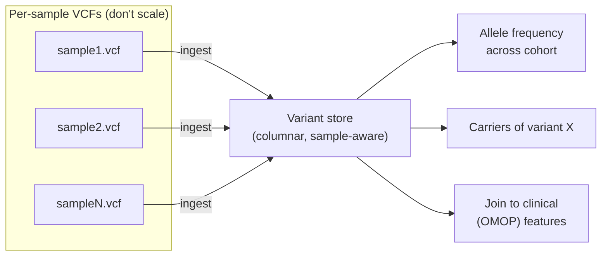

# Variant stores & scale

> _Last reviewed: 2026-06-28 — see the [freshness policy](../appendix/maintenance.md)._

## Learning objectives

After this chapter you will be able to:

- Explain why per-sample VCF files do not scale to population-level analysis.
- Compare the major approaches to storing and querying variants at scale.
- Reason about joint genotyping, the "N+1 problem," and cost at population scale.

## The problem: VCF doesn't scale across samples

A **VCF** file is excellent for one sample's variants. But research and clinical-grade genomics ask **cross-sample** questions — "how many people in this cohort carry this variant?", "what is the allele frequency here?" — and per-sample VCFs are the wrong shape for that:

- A cohort is thousands of separate VCF files; answering one cohort question means opening all of them.
- VCFs are text, row-oriented (one row per variant), and not indexed for columnar/aggregate queries.
- Naively merging VCFs produces an enormous, sparse matrix (variants × samples) that explodes in size.

At tens of thousands of genomes this becomes intractable. You need a **variant store**: a columnar, queryable representation of variants across many samples.

## Joint genotyping and the N+1 problem

Calling variants per-sample and merging is statistically weaker than **joint genotyping** — calling variants across all samples together (the GATK Best Practices approach uses per-sample **gVCFs** that retain reference-confidence at every position, then joint-genotypes them). gVCFs are what make scalable, re-runnable joint analysis possible.

The **N+1 problem**: when sample N+1 arrives, do you have to re-process all N previous samples? Naive joint genotyping says yes — prohibitively expensive at scale. Modern variant stores and approaches (e.g., GATK's GenomicsDB, scalable variant stores) are designed to **incrementally** incorporate new samples without full reprocessing. When you evaluate a variant-store technology, "how does it handle the N+1 sample?" is a key architectural question.

## Approaches to storing variants at scale

| Approach | What it is | Good for |
| --- | --- | --- |
| **Hail** | Scalable genomics framework on Spark; the `MatrixTable` represents variants × samples efficiently | Large-scale research, population genetics, GWAS |
| **Glow** | Open-source genomics on Spark → Delta Lake (Databricks) | Joining genomics with clinical features in a [lakehouse](../04-cloud-platforms/04-databricks.md) |
| **TileDB-VCF** | Sparse-array storage purpose-built for variant data | Incremental ingest, dense cohort queries |
| **AWS HealthOmics variant store** | Managed variant store queryable via Athena | AWS-native, SQL access, managed ([HealthOmics](./01-healthomics.md)) |
| **BigQuery** | Variant data as columnar warehouse tables | GCP-native, SQL at scale |
| **GenomicsDB** | GATK's datastore for incremental joint genotyping | The joint-genotyping step itself |

The common thread: move from **row-oriented per-sample files** to a **columnar, sample-aware store** that supports aggregate queries and incremental sample addition — then make it joinable to clinical data.

## Joining genomics to clinical data

The payoff of a variant store is **integration**: linking variants to phenotypes, outcomes, and treatments. That means joining the variant store to clinical data — typically the [OMOP CDM](../02-interoperability/04-omop-cdm.md) in a [lakehouse](../05-data-platforms/00-lakehouse-vs-warehouse.md). Glow → Delta (Databricks) and HealthOmics variant store → Athena/Lake Formation are both designed for exactly this genomics-plus-clinical join, which underpins target discovery, biomarker analysis, and precision medicine.

## Scale and cost considerations

- **Storage format matters.** CRAM over BAM, columnar variant stores over merged VCFs — orders of magnitude difference at population scale.
- **Archive raw, keep derived hot.** FASTQ/CRAM can move to archive tiers after QC; the variant store stays query-hot.
- **Co-locate compute and storage.** Population-scale joins move terabytes; cross-region/cross-cloud egress is a budget killer (see [Trade-offs, TCO & cost](../01-foundations/03-tradeoffs-tco.md)).
- **Privacy.** Genomic data is inherently re-identifying and cannot be meaningfully "anonymized" the way structured fields can — govern variant stores as high-sensitivity PHI with strict access control and audit (see [De-identification & consent](../03-compliance/04-deidentification-consent.md)).

## Check yourself

1. Why does a folder of 10,000 per-sample VCFs fail to answer "what is the allele frequency of variant X in this cohort?" efficiently?
2. What is the N+1 problem in joint genotyping, and why is it an architectural concern when choosing a variant store?
3. You want to correlate a variant with patient outcomes. Which clinical data model and which platform pattern would you join the variant store to?

## Further reading

- [Hail](https://hail.is/)
- [Glow — genomics on Spark](https://projectglow.io/)
- [TileDB-VCF](https://docs.tiledb.com/main/genomics)
- [GATK joint genotyping & GenomicsDB](https://gatk.broadinstitute.org/hc/en-us/articles/360035890411-GenomicsDB)
