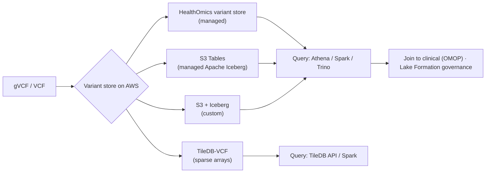

# Variant store on AWS: design & implementation

## Learning objectives

After this chapter you will be able to:

- Compare the concrete options for a population-scale variant store on AWS.
- Choose between managed (HealthOmics), managed-Iceberg (S3 Tables), and DIY (Iceberg/TileDB).
- Design partitioning, incremental ingest, and clinical joins for variant data.

## From "what" to "how" on AWS

[Variant stores & scale](./02-variant-stores.md) covered *why* per-sample VCFs don't scale and *what* a columnar, sample-aware store must do. This chapter is the **AWS implementation** — the build the genomics platform actually ships, and a hands-on lab. The recurring requirements: cross-sample queries (allele frequency, carriers), **incremental** sample addition (the N+1 problem), a join to clinical data ([OMOP](../02-interoperability/04-omop-cdm.md)), and PHI-grade governance.

## The options

| Option | What it is | Ops burden | Best when |
| --- | --- | --- | --- |
| **HealthOmics variant store** | Managed: ingest VCFs, query via Athena/Lake Formation; built-in provenance with [HealthOmics](./01-healthomics.md) workflows | Lowest | You want managed genomics end-to-end with audit, on AWS |
| **S3 Tables** | AWS-managed **Apache Iceberg** tables in S3 with automatic compaction/maintenance | Low–medium | You want open Iceberg + SQL without operating table maintenance |
| **S3 + Iceberg (custom)** | DIY: convert VCF→Parquet, define your own Iceberg tables on S3, query with Athena/Spark/Trino | Medium–high | You need full control of schema, partitioning, and engines |
| **TileDB-VCF** | Sparse multi-dimensional array storage purpose-built for variant data | Medium | Dense cohort queries, efficient incremental ingest, array semantics |

## Why Iceberg matters here

Variant data is huge, append-heavy (new samples), and schema-evolving (new annotations). **Apache Iceberg** (open table format) gives ACID transactions, schema evolution, partition evolution, and time travel on S3 — exactly the properties a growing variant store needs. **S3 Tables** is AWS's managed-Iceberg option: you get Iceberg semantics without running compaction and snapshot expiration yourself. The **custom S3+Iceberg** path trades that convenience for full control (custom partitioning, your choice of Athena/Spark/Trino/EMR).

## Design considerations

- **Model + partition for the query.** Store one row per (variant, sample) call in a long/columnar layout; partition by chromosome (and often by sample batch) so cohort scans prune aggressively. Right-size Parquet files (avoid the small-files problem — what S3 Tables auto-compaction solves for you).
- **Incremental ingest (N+1).** Use gVCFs and an append/merge strategy (Iceberg upserts, or HealthOmics import jobs) so sample N+1 doesn't reprocess all N. Validate this explicitly when choosing a store.
- **Join to clinical data.** Land the variant store and the [OMOP](../02-interoperability/04-omop-cdm.md) gold layer in the same lake so genotype↔phenotype joins are a query, not a data movement (the payoff — target discovery, biomarkers).
- **Governance.** Genomic data is inherently re-identifying — govern as high-sensitivity PHI: Lake Formation column/row controls, KMS, and audit (see [governance](../05-data-platforms/03-governance-contracts.md) and [de-identification](../03-compliance/04-deidentification-consent.md)).
- **Cost.** Compute-dominated queries; co-locate with storage to avoid egress, use columnar pruning, and archive raw FASTQ/CRAM after QC (see [TCO](../01-foundations/03-tradeoffs-tco.md)).

## Choosing

1. **Want managed genomics with provenance, all-AWS?** HealthOmics variant store.
2. **Want open Iceberg + SQL, minimal table ops?** S3 Tables.
3. **Need full control of layout/engines, or multi-cloud portability?** Custom S3 + Iceberg.
4. **Array-style cohort queries and incremental ingest are central?** TileDB-VCF.

Many platforms combine them: HealthOmics for ingest/provenance, Iceberg/S3 Tables for the analytical store joined to OMOP.

## Lab

[`hls-variant-store-aws`](https://github.com/anothernoise/hls-variant-store-aws) — build and benchmark the same cohort queries across a HealthOmics variant store, an S3 Tables (managed Iceberg) table, and a custom S3+Iceberg layout, then join to synthetic OMOP clinical data.

## Check yourself

1. Why does Apache Iceberg suit a growing variant store, and what does S3 Tables add over rolling your own Iceberg?
2. How do you keep sample N+1 from reprocessing all prior samples, and which design choices support it?
3. Why land the variant store and the OMOP gold layer in the same lake?

## Further reading

- [AWS HealthOmics analytics (variant/annotation stores)](https://docs.aws.amazon.com/omics/latest/dev/analytics.html)
- [Amazon S3 Tables (managed Iceberg)](https://aws.amazon.com/s3/features/tables/)
- [Apache Iceberg](https://iceberg.apache.org/) · [TileDB-VCF](https://docs.tiledb.com/main/genomics)
- [AWS genomics reference architectures](https://aws.amazon.com/health/genomics/)
