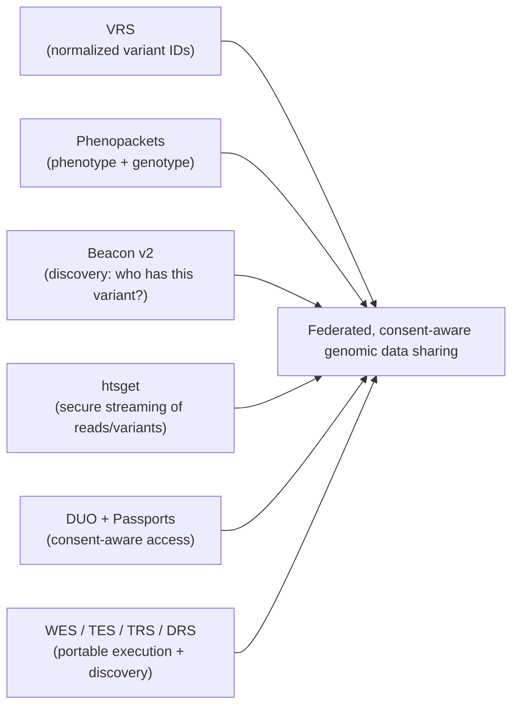
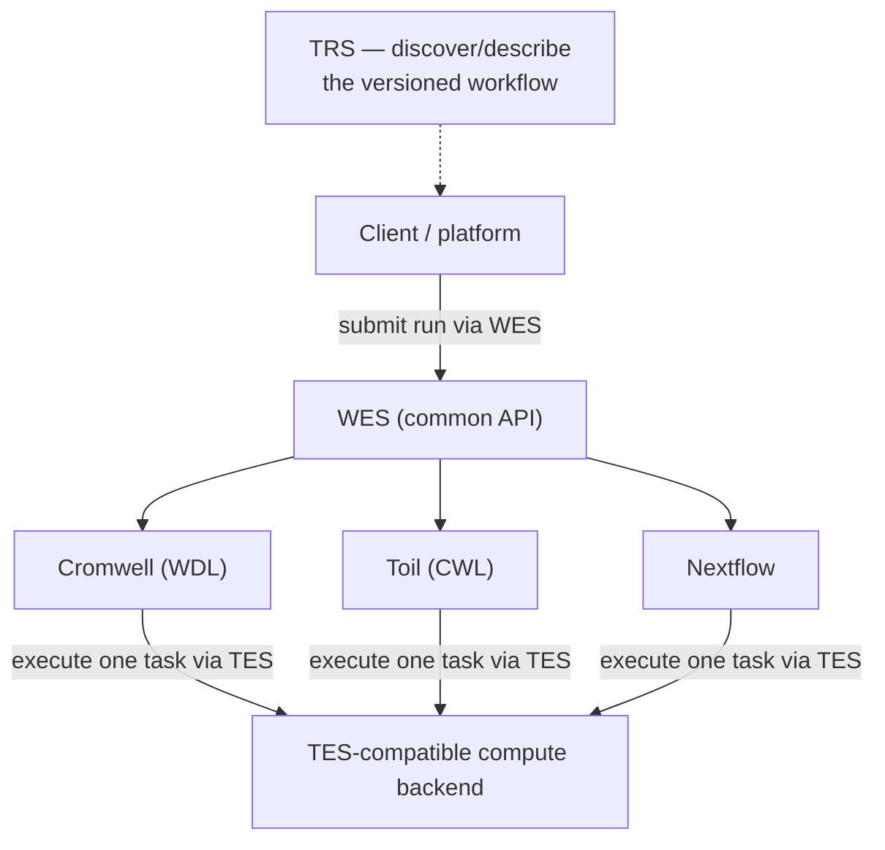

# Genomics data standards & GA4GH

> _Last reviewed: 2026-07-08 — see the [freshness policy](../appendix/maintenance.md)._

## Learning objectives

After this chapter you will be able to:

- Explain why genomics needs data-sharing standards beyond file formats, and how GA4GH's Driver Project model keeps those standards grounded in real deployments.
- Place the key GA4GH standards across their Work Streams — data use/identity, genomic knowledge, cloud execution, and large-scale genomics.
- Design federated, consent-aware genomic data sharing, and know where GA4GH's Cloud work stream connects to the workflow-orchestration decisions made elsewhere in this book.

## Beyond FASTQ/BAM/VCF

Earlier chapters covered the [pipeline file formats](./00-sequencing-pipelines.md) (FASTQ→BAM→VCF)
and [storing variants at scale](./02-variant-stores.md). But genomics' real promise — discovery
across populations — requires **sharing** data across institutions and borders, and that needs
standards for *how to identify a variant*, *how to ask who has it*, *how to stream it securely*,
*who is allowed to*, and — increasingly — *how to run the same pipeline portably across
institutions in the first place*. The **Global Alliance for Genomics and Health (GA4GH)** publishes
exactly these.

## GA4GH as an organization: Driver Projects and Work Streams

GA4GH is not just a list of specifications — it's an international standards body that
deliberately grounds every standard in a real deployment before finalizing it. **Driver Projects**
are large genomics initiatives (national sequencing programs, research consortia, disease-matching
networks) that supply real requirements and pilot each standard before it's broadly adopted;
well-known examples include the **1000 Genomes Project**, the **Genomics England 100,000 Genomes
Project**, the US **All of Us Research Program**, **ClinGen**, and the **Matchmaker Exchange**
(covered below). This Driver Project discipline is why GA4GH standards tend to solve real
interoperability problems rather than theoretical ones — worth knowing when you're deciding
whether to adopt a GA4GH standard or build something bespoke.

The standards themselves are organized into **Work Streams**, each covering a different layer of
the sharing problem:

| Work Stream | Covers | Standards in this chapter |
| --- | --- | --- |
| **Data Use & Researcher Identities** | Consent and authorization | DUO, Passports |
| **Genomic Knowledge Standards** | Representing variants and phenotypes computably | VRS, Phenopackets |
| **Cloud** | Portable execution and tool discovery | WES, TES, TRS, DRS |
| **Large Scale Genomics** | Efficient, secure access to sequence data | htsget, RefGet, Crypt4GH |
| **Discovery** | Federated search without exposing records | Beacon |

## The key GA4GH standards

| Standard | Purpose |
| --- | --- |
| **VRS** (Variation Representation Spec) | A computable, normalized way to represent and *identify* a variant — so the same variant gets the same ID everywhere, enabling federated matching. |
| **Phenopackets** | A computable package of an individual's phenotype + disease + genotype; interoperates with FHIR for precision-medicine exchange. |
| **htsget** | Secure HTTP streaming of reads/variants (BAM/CRAM/VCF) by genomic region — fetch a gene's worth of data without moving whole files. |
| **Beacon (v2)** | A discovery API: "does any dataset have this variant / this query?" — answers without exposing record-level data. |
| **DUO** (Data Use Ontology) | Machine-readable encoding of a dataset's permitted uses/consent (e.g. "disease-specific research only"). |
| **Passports / AAI** | Standardized researcher authentication and authorization for controlled-access data. |
| **RefGet** | Retrieves a reference sequence by a checksum-based identifier instead of a filename — removes ambiguity about *which exact reference build* a coordinate is relative to. |
| **Crypt4GH** | A file-encryption standard for genomic files at rest and in transit, used by archives like the European Genome-phenome Archive (EGA) to keep files encrypted end-to-end outside a trusted enclave. |
| **WES** (Workflow Execution Service) | A common REST API for submitting and monitoring a workflow run, regardless of the underlying engine. |
| **TES** (Task Execution Service) | A common API for executing one containerized task on diverse compute backends — the portable layer underneath a workflow engine. |
| **TRS** (Tool Registry Service) | A common API for describing and discovering versioned bioinformatics tools and workflows (implemented by registries like Dockstore). |

## The Cloud work stream: portable execution standards

This is the part of GA4GH most directly relevant to [genomics workflow orchestration](./05-workflow-orchestration.md):
**WES, TES, and TRS sit as a common API layer above the workflow engines** (Nextflow, WDL/Cromwell,
CWL) that chapter already covers.

- **WES** means a platform can submit a workflow run and poll its status through **one API**,
  without caring whether the workflow underneath is running on Cromwell, Toil, Arvados, or another
  WES-compatible engine — the same "portable interface over different engines" idea as
  [FHIR profiles standardize different EHRs](../02-interoperability/01-fhir.md), applied to
  workflow execution instead of clinical data.
- **TES** standardizes the layer below that: how a single containerized task gets executed on a
  given compute backend, so a workflow engine can target multiple clouds' compute through one
  interface instead of a bespoke integration per cloud.
- **TRS** solves tool/workflow *discovery* — "which version of this pipeline did you run, and
  where do I get it" — the same provenance question [Data lineage & provenance](../05-data-platforms/07-data-lineage-provenance.md)
  raises generally, applied specifically to versioned workflow definitions. **Dockstore** is the
  best-known TRS-compliant registry.

**Design implication:** if [workflow orchestration](./05-workflow-orchestration.md) already told
you to standardize on a portable workflow language and containerize every step, WES/TES/TRS are
the next layer of that same portability discipline — worth adopting when you need to submit
workflows to infrastructure you don't fully control (a multi-institution consortium, a national
genomics platform) rather than only to your own known cluster.

## Reference genomes (get this right first)

Every coordinate is relative to a **reference genome**. Mixing references silently corrupts
analysis. Know which you're on:

- **GRCh37 (hg19)** — legacy, still common in older pipelines and databases.
- **GRCh38 (hg38)** — the current mainstream reference.
- **T2T-CHM13** — the first complete (telomere-to-telomere) human genome; increasingly used for
  hard regions.

Record the reference assembly with the data, and use **VRS** (which is assembly-aware) when
sharing variant identity across systems. **RefGet** goes a step further: instead of trusting a
filename or a loosely-versioned label like "hg38" (which can itself mean slightly different builds
depending on the source), it identifies a reference sequence by a **checksum of its content** — so
two systems can confirm they mean the exact same reference bytes, not just the same nominal name.

## Federated, consent-aware sharing

The standards compose into a pattern where **data stays home and only answers travel**:

- **Discovery** — a **Beacon** lets a researcher ask whether a cohort contains a variant of
  interest, without downloading anything.
- **Access control** — **DUO** tags each dataset's allowed uses; **Passports** carry the
  researcher's authorizations; together they enforce consent at query time.
- **Retrieval** — once authorized, **htsget** streams just the needed regions.
- **File-level protection** — **Crypt4GH** keeps files encrypted at rest and in transit, so an
  archive operator storing the data doesn't need to be a fully trusted party with plaintext access.
- **Identity & phenotype** — **VRS** normalizes variant identity; **Phenopackets** (and FHIR)
  carry the linked phenotype.

This is the genomics counterpart to the privacy-preserving patterns in
[de-identification & consent](../03-compliance/04-deidentification-consent.md) and
[RWD tokenization](../05-data-platforms/02-rwd-rwe.md): genomic data is inherently re-identifying,
so federation + consent-aware access beats copying data around.

## Case study: Matchmaker Exchange

**Matchmaker Exchange** is a real, running federated network for rare-disease diagnosis: a
clinician with an undiagnosed patient's genotype and phenotype profile queries the network, which
fans the query out across independently-operated national and institutional nodes (including
systems like **PhenomeCentral**, **GeneMatcher**, and **DECIPHER**) to find other clinicians or
researchers who have seen a similar profile — without any node exposing its full patient dataset
to the others. It's a concrete, working instance of exactly the pattern this chapter describes:
Beacon-style discovery, phenotype/genotype representation aligned with Phenopackets, and
consent-respecting federation, deployed for a problem (diagnosing ultra-rare diseases where no
single institution has enough cases) that federation makes newly solvable.

## Architecture implications

- **Adopt GA4GH for cross-org sharing** rather than bespoke APIs — it is the lingua franca of
  genomic networks (national programs, research consortia), and its Driver Project model means the
  standards were shaped by organizations solving the same problem you likely have.
- **Pin the reference assembly** everywhere and use VRS/RefGet for portable, unambiguous variant
  and reference identity.
- **Enforce DUO/consent at query time**, not by trust — the [variant store](./02-variant-stores.md)
  and access layer must check permitted use.
- **Bridge to the clinic** via Phenopackets ↔ FHIR so genotype and phenotype stay linked (key for
  [oncology](../02-interoperability/10-oncology-data.md) and rare disease).
- **Adopt WES/TES/TRS when submitting workflows to infrastructure you don't own** — a consortium
  or national platform — rather than only when running on your own cluster, where the [workflow
  orchestration](./05-workflow-orchestration.md) engine choice alone is usually sufficient.

## Check yourself

1. What problem does VRS solve that a chromosome-position-ref-alt string does not, and how does
   RefGet solve the analogous problem for the reference sequence itself?
2. How do Beacon, DUO, and Passports combine to share data without copying it?
3. Why would a platform submitting workflows to a multi-institution consortium want a WES-compatible
   API layer above its chosen workflow engine, rather than integrating with that engine directly?
4. What real problem does the Matchmaker Exchange solve that a single institution's own patient
   database cannot?

## Further reading

- [GA4GH standards](https://www.ga4gh.org/our-products/) · [GA4GH Driver Projects](https://www.ga4gh.org/how-we-work/driver-projects/)
- [VRS](https://vrs.ga4gh.org/) · [Phenopackets](https://www.ga4gh.org/product/phenopackets/) · [RefGet](https://www.ga4gh.org/product/refget/)
- [htsget](https://samtools.github.io/hts-specs/htsget.html) · [Beacon v2](https://docs.genomebeacons.org/) · [Data Use Ontology](https://www.ga4gh.org/product/data-use-ontology-duo/)
- [WES](https://www.ga4gh.org/product/workflow-execution-service-wes/) · [TES](https://www.ga4gh.org/product/task-execution-service-tes/) · [TRS](https://www.ga4gh.org/product/tool-registry-service-trs/) · [Dockstore](https://dockstore.org/)
- [Crypt4GH](https://www.ga4gh.org/product/crypt4gh/) · [Matchmaker Exchange](https://www.matchmakerexchange.org/)
- [T2T-CHM13 reference](https://github.com/marbl/CHM13)
