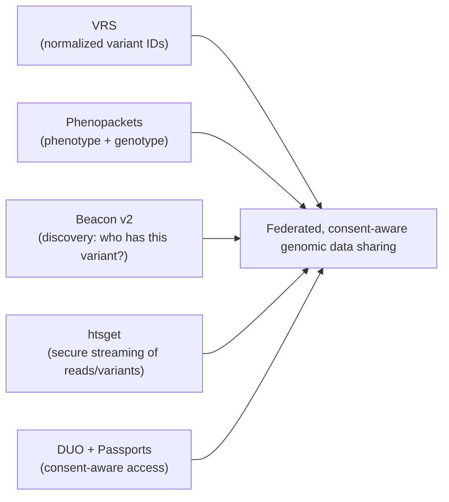

# Genomics data standards & GA4GH

> _Last reviewed: 2026-06-28 — see the [freshness policy](../appendix/maintenance.md)._

## Learning objectives

After this chapter you will be able to:

- Explain why genomics needs data-sharing standards beyond file formats.
- Place the key GA4GH standards (VRS, Phenopackets, htsget, Beacon, DUO, Passports).
- Design federated, consent-aware genomic data sharing.

## Beyond FASTQ/BAM/VCF

Earlier chapters covered the [pipeline file formats](./00-sequencing-pipelines.md) (FASTQ→BAM→VCF) and [storing variants at scale](./02-variant-stores.md). But genomics' real promise — discovery across populations — requires **sharing** data across institutions and borders, and that needs standards for *how to identify a variant*, *how to ask who has it*, *how to stream it securely*, and *who is allowed to*. The **Global Alliance for Genomics and Health (GA4GH)** publishes exactly these.

## The key GA4GH standards

| Standard | Purpose |
| --- | --- |
| **VRS** (Variation Representation Spec) | A computable, normalized way to represent and *identify* a variant — so the same variant gets the same ID everywhere, enabling federated matching. |
| **Phenopackets** | A computable package of an individual's phenotype + disease + genotype; interoperates with FHIR for precision-medicine exchange. |
| **htsget** | Secure HTTP streaming of reads/variants (BAM/CRAM/VCF) by genomic region — fetch a gene's worth of data without moving whole files. |
| **Beacon (v2)** | A discovery API: "does any dataset have this variant / this query?" — answers without exposing record-level data. |
| **DUO** (Data Use Ontology) | Machine-readable encoding of a dataset's permitted uses/consent (e.g. "disease-specific research only"). |
| **Passports / AAI** | Standardized researcher authentication and authorization for controlled-access data. |

## Reference genomes (get this right first)

Every coordinate is relative to a **reference genome**. Mixing references silently corrupts analysis. Know which you're on:

- **GRCh37 (hg19)** — legacy, still common in older pipelines and databases.
- **GRCh38 (hg38)** — the current mainstream reference.
- **T2T-CHM13** — the first complete (telomere-to-telomere) human genome; increasingly used for hard regions.

Record the reference assembly with the data, and use VRS (which is assembly-aware) when sharing variant identity across systems.

## Federated, consent-aware sharing

The standards compose into a pattern where **data stays home and only answers travel**:

- **Discovery** — a **Beacon** lets a researcher ask whether a cohort contains a variant of interest, without downloading anything.
- **Access control** — **DUO** tags each dataset's allowed uses; **Passports** carry the researcher's authorizations; together they enforce consent at query time.
- **Retrieval** — once authorized, **htsget** streams just the needed regions.
- **Identity & phenotype** — **VRS** normalizes variant identity; **Phenopackets** (and FHIR) carry the linked phenotype.

This is the genomics counterpart to the privacy-preserving patterns in [de-identification & consent](../03-compliance/04-deidentification-consent.md) and [RWD tokenization](../05-data-platforms/02-rwd-rwe.md): genomic data is inherently re-identifying, so federation + consent-aware access beats copying data around.

## Architecture implications

- **Adopt GA4GH for cross-org sharing** rather than bespoke APIs — it is the lingua franca of genomic networks (national programs, research consortia).
- **Pin the reference assembly** everywhere and use VRS for portable variant identity.
- **Enforce DUO/consent at query time**, not by trust — the [variant store](./02-variant-stores.md) and access layer must check permitted use.
- **Bridge to the clinic** via Phenopackets ↔ FHIR so genotype and phenotype stay linked (key for [oncology](../02-interoperability/10-oncology-data.md) and rare disease).

## Check yourself

1. What problem does VRS solve that a chromosome-position-ref-alt string does not?
2. How do Beacon, DUO, and Passports combine to share data without copying it?
3. Why is recording the reference genome assembly non-negotiable?

## Further reading

- [GA4GH standards](https://www.ga4gh.org/our-products/) · [VRS](https://vrs.ga4gh.org/) · [Phenopackets](https://www.ga4gh.org/product/phenopackets/)
- [htsget](https://samtools.github.io/hts-specs/htsget.html) · [Beacon v2](https://docs.genomebeacons.org/) · [Data Use Ontology](https://www.ga4gh.org/product/data-use-ontology-duo/)
- [T2T-CHM13 reference](https://github.com/marbl/CHM13)
