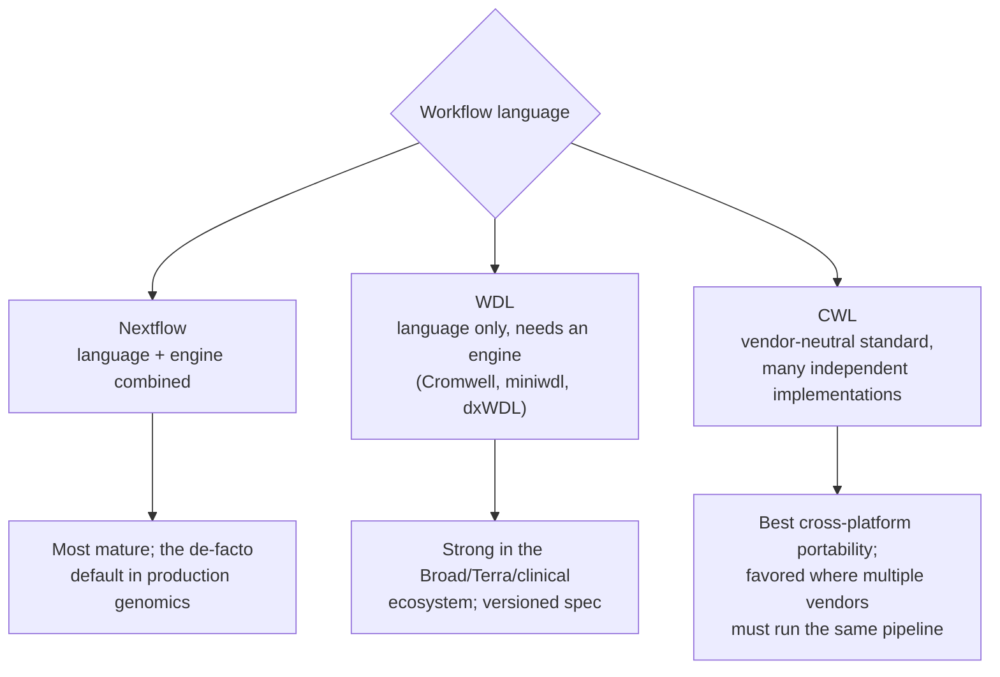
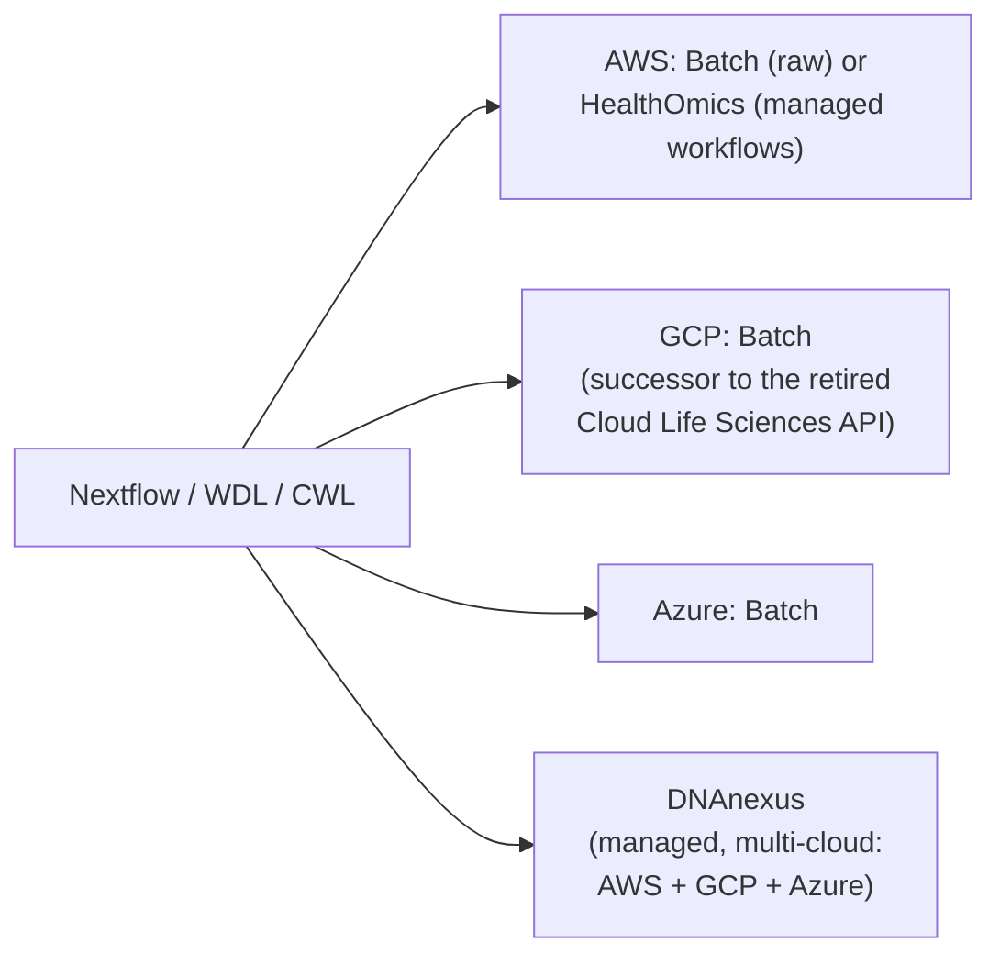

# Genomics workflow orchestration: engines, execution & acceleration

> _Last reviewed: 2026-07-03 — see the [freshness policy](../appendix/maintenance.md)._

## Learning objectives

After this chapter you will be able to:

- Compare CWL, WDL, and Nextflow and choose one for a given team and portability need.
- Map each engine onto Slurm/HPC, cloud instances, and containers across AWS, GCP, and Azure.
- Choose between Illumina DRAGEN and NVIDIA Parabricks for acceleration, and know the trade-off each makes.

## From "which store" to "how does the pipeline actually run"

[Sequencing pipelines](./00-sequencing-pipelines.md) introduced the FASTQ→BAM→VCF flow and named
Nextflow/nf-core as a workflow-engine option. This chapter is the deeper orchestration
layer: which **workflow language**, on which **execution substrate**, on which **cloud**,
with how much **acceleration** — the decisions that determine whether a genomics platform is
portable, fast, or affordable (usually pick two).

## The three workflow languages

| Engine | Nature | Strength | Where it dominates |
| --- | --- | --- | --- |
| **Nextflow** (+ nf-core) | A complete system — language and execution engine combined | Handles local, HPC, and cloud execution transparently; the largest curated pipeline library (nf-core) | Production research and increasingly clinical pipelines — now the "quiet default" |
| **WDL** | A language specification; needs a separate engine (Cromwell, miniwdl, or a vendor's own interpreter) | Clean, readable, versioned specs; deep tooling in the Broad/Terra ecosystem | Academic and clinical genomics tied to GATK/Broad tooling |
| **CWL** | A vendor-neutral, multi-implementation standard | Maximum cross-platform portability — the same CWL document runs on many independent engines (Toil, Arvados, cwltool, and commercial platforms) | Regulated or multi-institution settings where no single vendor can own the pipeline definition |

**Rule of thumb:** default to **Nextflow** for production velocity, reach for **WDL** if
you're embedded in the Broad/Terra/GATK ecosystem, and choose **CWL** when true multi-vendor
portability outranks convenience — e.g. a consortium pipeline that must run unmodified on
several institutions' independent infrastructure.

## Execution substrates

The same workflow definition can run on very different compute underneath it:

- **Slurm / on-prem HPC** — a traditional job scheduler across a fixed cluster. Cost-predictable
  once built, but capacity-bound; bursting past your cluster's size means queueing, not
  elastic scale. See [on-premises & hybrid](../04-cloud-platforms/06-on-prem-hybrid.md).
- **Cloud instances/VMs** — elastic compute (EC2, GCE, Azure VMs), typically orchestrated via
  the cloud's batch scheduler rather than raw instances directly.
- **Containers** (Docker, Singularity/Apptainer) — package the tool + dependencies once,
  run identically everywhere; nearly every modern genomics pipeline ships as containerized
  steps regardless of which workflow language or substrate executes them. Containers are what
  make the "write once, run on Slurm or cloud" promise of Nextflow/WDL/CWL actually true in
  practice — without them, portability is theoretical.

## Cloud mapping

| Cloud / platform | Execution service | Notes |
| --- | --- | --- |
| **AWS** | **AWS Batch** (raw compute scheduling) or **[HealthOmics](./01-healthomics.md)** (managed Nextflow/WDL/CWL execution with built-in storage and provenance) | See [HealthOmics](./01-healthomics.md) for the managed-vs-DIY trade-off in depth |
| **GCP** | **Google Cloud Batch** | GCP's prior genomics-specific service, **Cloud Life Sciences API, was fully retired July 8, 2025** — Batch is now the only supported path; if you see tutorials referencing Life Sciences API, they are stale |
| **Azure** | **Azure Batch** (+ Azure CycleCloud for Slurm-style HPC clusters) | See [on-premises & hybrid](../04-cloud-platforms/06-on-prem-hybrid.md) for the CycleCloud pattern |
| **DNAnexus** | A managed, **multi-cloud** genomics platform (runs across AWS, GCP, and Azure) with native WDL/CWL/Nextflow support and its own workflow interpreter | HIPAA/GDPR/ISO 27001/SOC 2 certified; powers the UK Biobank Research Analysis Platform at population scale — a strong option when you want managed execution without picking a single cloud |

**Design implication:** if cloud portability matters more than any single vendor's managed
convenience, standardize on containerized Nextflow/WDL/CWL and treat AWS Batch/HealthOmics,
GCP Batch, Azure Batch, or DNAnexus as interchangeable execution backends — this is the
genomics-specific instance of the [cloud portability](../04-cloud-platforms/08-portability-lock-in.md)
principle: push the vendor-specific service to the edge, keep the workflow definition portable.
When you need that portability across infrastructure you don't own — a multi-institution
consortium or national genomics platform — [GA4GH's Cloud work stream](./04-genomics-data-standards.md)
(WES, TES, TRS) adds a common API layer above these engines for exactly that case.

## Acceleration: DRAGEN vs Parabricks

Both dramatically cut secondary-analysis time versus CPU-only pipelines, but they make
different trade-offs:

| | Illumina DRAGEN | NVIDIA Parabricks |
| --- | --- | --- |
| **Hardware** | FPGA-based (bitstream), on-prem appliance or cloud instance | GPU-based, runs on any NVIDIA GPU (cloud or on-prem DGX) |
| **Speed** | ~25 minutes for a 30× genome (vs 15+ hours CPU-only) | ~10 minutes for a 30× genome; up to 107× acceleration with multiple GPUs |
| **Licensing/cost** | Proprietary license required; on the cloud, the **license can be ~80% of total run cost** — the compute itself is comparatively cheap | Free for research use via NVIDIA NGC; a licensed **NVIDIA AI Enterprise** tier adds enterprise support — materially cheaper at scale |
| **Functionality breadth** | Broader — includes single-cell workflows and star-allele calling for pharmacogenomics that Parabricks doesn't match | Narrower but simpler and more cost-effective for standard germline/somatic variant calling |

**Choose DRAGEN** when you need its broader clinical functionality (pharmacogenomics,
single-cell) and can absorb the license cost — common in accredited clinical labs already
standardized on it. **Choose Parabricks** when standard WGS/WES secondary analysis at the
lowest cost and GPU flexibility matters more than DRAGEN's extra functionality — see also
[NVIDIA for HLS](../04-cloud-platforms/07-nvidia.md) for how Parabricks fits the broader
NVIDIA healthcare stack.

## Design guidance

1. **Containerize every step**, regardless of workflow language — this is what actually
   delivers "runs anywhere," not the language choice alone.
2. **Decide your portability requirement before your engine.** Multi-vendor consortium work
   pulls toward CWL; Broad/Terra-ecosystem work pulls toward WDL; general production velocity
   pulls toward Nextflow.
3. **Model the DRAGEN license cost explicitly** in any TCO comparison (see
   [Trade-offs, TCO & cost](../01-foundations/03-tradeoffs-tco.md)) — it is usually the
   dominant line item, not the compute.
4. **Treat GCP's Life Sciences API as gone.** If you inherit an older pipeline referencing it,
   migrating to Batch is mandatory, not optional, as of mid-2025.

## Check yourself

1. You need the same pipeline to run unmodified across three independent research institutions' infrastructure. Which workflow language fits best, and why?
2. Why is containerizing pipeline steps more important to portability than the choice of workflow language itself?
3. A clinical lab already licenses DRAGEN and needs pharmacogenomic star-allele calling. Why might Parabricks not be a drop-in replacement despite being cheaper?

## Further reading

- [nf-core pipelines](https://nf-co.re/) · [Cromwell (WDL engine)](https://cromwell.readthedocs.io/) · [Common Workflow Language](https://www.commonwl.org/)
- [DNAnexus](https://www.dnanexus.com/) · [AWS HealthOmics](https://aws.amazon.com/omics/) · [Google Cloud Batch](https://cloud.google.com/batch)
- [NVIDIA Parabricks](https://docs.nvidia.com/clara/parabricks/) · [Illumina DRAGEN](https://www.illumina.com/products/by-type/informatics-products/dragen-secondary-analysis.html)
