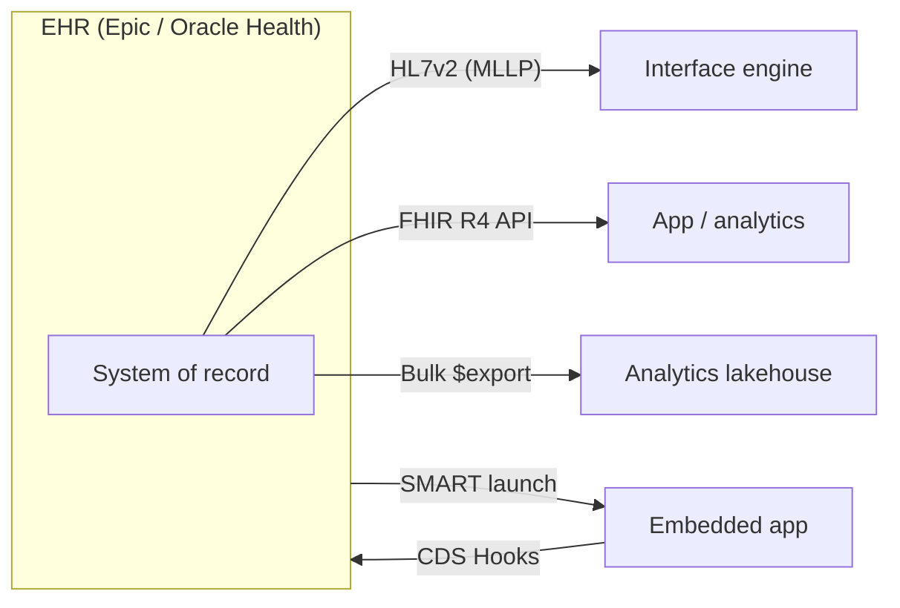

# EHR integration

> _Last reviewed: 2026-06-28 — see the [freshness policy](../appendix/maintenance.md)._

## Learning objectives

After this chapter you will be able to:

- Map the ways to integrate with an EHR and choose the right one per use case.
- Describe how Epic and Oracle Health (Cerner) expose data and apps.
- Design an EHR integration that respects the vendor's model and the clinical workflow.

## The EHR is the center of gravity

In provider settings, the EHR (Epic, Oracle Health/Cerner, MEDITECH) is the system of record and the clinician's primary workspace. Almost every provider-facing solution must integrate with it. The architecture question is *how* — the options range from real-time messaging to modern APIs to launching inside the EHR itself, and the right choice depends on whether you are reading, writing, or embedding.

## The integration options

| Mechanism | Use it for | Notes |
| --- | --- | --- |
| **HL7v2 over MLLP** | Real-time events (ADT, ORU, ORM) | The operational backbone; via an interface engine. See [HL7v2](../02-interoperability/00-hl7v2.md). |
| **FHIR R4 API** | App reads/writes, patient access | Mandated for certified EHRs (ONC § 170.315(g)(10)). See [FHIR](../02-interoperability/01-fhir.md). |
| **Bulk Data `$export`** | Analytics / population extracts | Async NDJSON to object storage; feed the lakehouse. |
| **SMART on FHIR launch** | Embedding an app in the EHR | OAuth2 + launch context. See [SMART on FHIR](../02-interoperability/05-smart-on-fhir.md). |
| **CDS Hooks** | In-workflow decision support | EHR fires a hook at a clinical event; your service returns a card. |
| **Vendor app program** | Distribution + deeper access | Epic and Oracle Health run app marketplaces with their own onboarding. |

## Epic and Oracle Health specifics

- **Epic** exposes a large FHIR R4 API and supports SMART on FHIR and CDS Hooks; third-party apps are distributed via **Epic's app program (Showroom/Connection Hub)** and often need patient or health-system authorization. Many Epic deployments run on **Azure** (relevant for co-locating your integration — see [Azure for HLS](../04-cloud-platforms/03-azure.md)).
- **Oracle Health (Cerner)** similarly exposes FHIR and SMART on FHIR via its developer program (**code console**).
- Both still emit **HL7v2** for real-time downstream feeds — modern API access and legacy messaging coexist; you will usually use both.

## Design guidance

- **Read vs write vs embed.** Reading population data → Bulk `$export`. Real-time reaction to events → HL7v2/FHIR Subscriptions. Acting in the clinician's flow → SMART launch + CDS Hooks. Pick the mechanism that matches the interaction, not the newest one.
- **Respect the workflow.** Adoption fails if clinicians must leave the EHR. Prefer SMART/CDS Hooks for clinician-facing features.
- **Authorization is per-vendor and per-health-system.** Plan for the EHR's app-onboarding and the health system's approval — these are lead-time items, not afterthoughts.
- **Least-privilege scopes** and full audit ([HIPAA](../03-compliance/00-hipaa.md)) on every integration.

## Lab

[`hls-fhir-interop`](https://github.com/anothernoise/hls-fhir-interop) covers HL7v2→FHIR ingestion and a SMART on FHIR app — the two most common EHR-integration patterns.

## Check yourself

1. You need to react in real time to patient admissions and also extract a nightly population dataset. Which two mechanisms fit, and why not use one for both?
2. Why are SMART on FHIR and CDS Hooks preferred for clinician-facing features over a standalone app?
3. What lead-time items does EHR integration introduce beyond writing code?

## Further reading

- [Epic on FHIR](https://fhir.epic.com/) · [Oracle Health (Cerner) developer](https://fhir.cerner.com/)
- [SMART on FHIR](https://hl7.org/fhir/smart-app-launch/) · [CDS Hooks](https://cds-hooks.org/)
