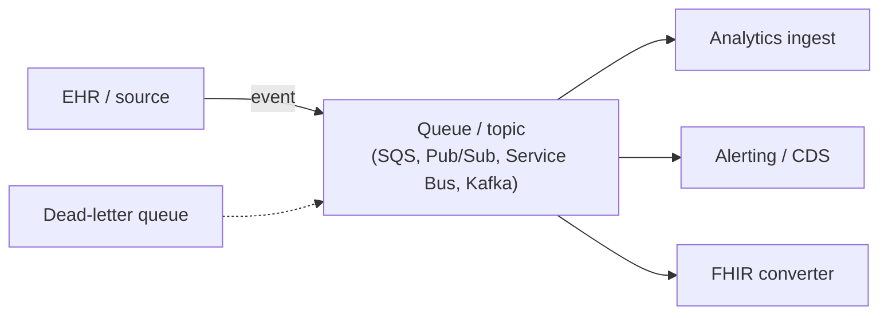

# Event-driven patterns

## Learning objectives

After this chapter you will be able to:

- Explain why event-driven architecture fits clinical and operational HLS workflows.
- Apply queues, topics, and FHIR Subscriptions to decouple HLS systems.
- Design for reliability, ordering, and replay with PHI in the payload.

## Why events in HLS

Healthcare is full of events: a patient is admitted, a result is ready, a device reports a reading, a referral is placed. Event-driven architecture lets systems **react** to these without tight coupling — the EHR emits an event and any number of consumers (analytics, alerts, an AI triage service) act on it independently. This decoupling is what lets you add capabilities around a legacy EHR without modifying it.

## The building blocks

- **Queues** (point-to-point: SQS, etc.) — one consumer processes each message; good for work distribution and the [HL7v2 converter](../02-interoperability/00-hl7v2.md) pattern.
- **Topics / pub-sub** (fan-out: SNS, Pub/Sub, Service Bus topics, Kafka) — many consumers each get the event; good for "notify everyone who cares."
- **FHIR Subscriptions** — the FHIR-native mechanism: a client subscribes to a resource/criteria and the server notifies it on change. The standards-based way to get clinical events out of a FHIR server.
- **Streaming** (Kafka/Kinesis) — high-throughput device telemetry, monitoring, and event sourcing.

## Reliability concerns that matter more in HLS

- **Delivery guarantees.** Use at-least-once delivery with **idempotent** consumers (the same ADT message may arrive twice — processing it twice must not create two encounters).
- **Ordering.** Some clinical sequences matter (admit before discharge). Use ordered partitions/FIFO where required, keyed by patient/encounter.
- **Dead-letter queues.** Never silently drop a clinical message; route failures to a DLQ for inspection and replay.
- **Replay.** Keep events durable so you can reprocess (e.g. after fixing a converter bug) — this pairs with the immutable bronze layer ([lakehouse](../05-data-platforms/00-lakehouse-vs-warehouse.md)).
- **Backpressure.** A burst of results must not overwhelm a downstream model; the queue absorbs spikes (a [Well-Architected](../01-foundations/01-well-architected.md) reliability concern).

## PHI in events

Event payloads often contain PHI, so the bus is in scope for [HIPAA](../03-compliance/00-hipaa.md):

- Encrypt at rest and in transit; use HIPAA-eligible services with a BAA.
- Apply least-privilege access to topics/queues; audit access.
- Consider carrying a **reference** (resource ID) rather than the full PHI payload where consumers can fetch from the source — smaller blast radius if a subscription is misconfigured.

## Design guidance

1. **Decouple with a bus** between the EHR/interface engine and downstream consumers, so each scales and fails independently.
2. **Make consumers idempotent** — assume duplicates.
3. **DLQ + replay** are mandatory for clinical messages, not optional.
4. **Match the primitive to the need** — queue for work, topic for fan-out, FHIR Subscription for standards-based clinical notifications, stream for telemetry.

## Lab

The [`hls-fhir-interop`](https://github.com/anothernoise/hls-fhir-interop) pattern places a queue between the interface engine and the HL7v2→FHIR converter — the canonical HLS event-driven decoupling.

## Check yourself

1. Why must clinical-event consumers be idempotent, and what real HL7v2 behavior forces this?
2. When would you carry a resource reference in an event instead of the full PHI payload?
3. What is a dead-letter queue for, and why is silently dropping a clinical message unacceptable?

## Further reading

- [FHIR Subscriptions](https://hl7.org/fhir/subscriptions.html)
- [AWS messaging (SQS/SNS)](https://aws.amazon.com/messaging/) · [GCP Pub/Sub](https://cloud.google.com/pubsub)
