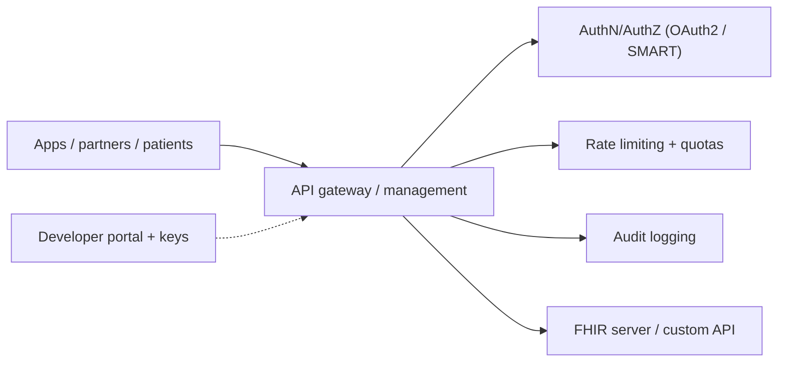

# API management

> _Last reviewed: 2026-06-28 — see the [freshness policy](../appendix/maintenance.md)._

## Learning objectives

After this chapter you will be able to:

- Explain what an API gateway / management layer provides for HLS APIs.
- Secure a FHIR or custom health API with auth, rate limiting, and audit.
- Design API access for internal, partner, and patient-facing consumers.

## Why a management layer

When you expose a [FHIR](../02-interoperability/01-fhir.md) API or a custom health API to apps, partners, or patients, you need consistent control over **security, traffic, and observability** in front of the service. An API gateway / management platform provides that cross-cutting layer so each backend doesn't reinvent auth, throttling, and logging.

## What it provides

- **Authentication & authorization** — terminate OAuth2 / [SMART on FHIR](../02-interoperability/05-smart-on-fhir.md) flows; enforce scopes so a token only reaches permitted resources.
- **Rate limiting & quotas** — protect the FHIR store from runaway query costs (managed FHIR is priced per request — see [TCO](../01-foundations/03-tradeoffs-tco.md)) and enforce fair use per consumer.
- **Traffic management** — routing, versioning, request/response transformation, caching of safe reads.
- **Audit & observability** — log who called what, when ([HIPAA](../03-compliance/00-hipaa.md) audit); metrics and tracing for SLOs.
- **Developer experience** — a portal, API keys/credentials, and docs for partner onboarding.

Options: AWS API Gateway, Azure API Management, Google Apigee, or Kong/other gateways — all sit cleanly in front of a managed FHIR store or custom API.

## Designing for three audiences

API access differs sharply by consumer:

| Consumer | Auth | Concerns |
| --- | --- | --- |
| **Internal services** | service credentials / `system` scopes | least privilege, network isolation |
| **Partners** | OAuth2 client credentials, contracts | quotas, data-sharing agreements (BAA), versioning |
| **Patients** | SMART standalone launch / patient login | consent, scope to *their* record only, strong identity |

Patient-facing access (driven by the [CMS Patient Access rule](../02-interoperability/01-fhir.md)) demands the tightest scoping — a patient must reach only their own data — plus solid identity proofing.

## Design guidance

- **Put PHI APIs behind the gateway and behind the network boundary** — private endpoints to the backend; the gateway is the only front door.
- **Enforce scopes at the edge** and again at the resource (defense in depth) — never trust the client's claims alone.
- **Rate-limit by cost, not just count**, when the backend is a per-request-priced managed FHIR store.
- **Audit every call** with enough context to answer "who accessed which patient's data" for 6 years.
- **Version explicitly** so partner integrations don't break on change (pairs with [data contracts](../05-data-platforms/03-governance-contracts.md)).

## Check yourself

1. Why rate-limit a FHIR API by cost, and what backend pricing model makes this important?
2. How does required authorization differ for internal, partner, and patient consumers of the same FHIR API?
3. Why enforce scopes both at the gateway and at the resource server?

## Further reading

- [SMART App Launch (scopes)](https://hl7.org/fhir/smart-app-launch/scopes-and-launch-context.html)
- [Azure API Management for FHIR](https://learn.microsoft.com/en-us/azure/healthcare-apis/fhir/) · [Apigee](https://cloud.google.com/apigee)
- [Building a production GenAI application for HLS](../06-ai-ml/10-genai-app-stack.md) — the LLM gateway applies these same gateway concerns (routing, rate limiting, central audit) to model traffic
