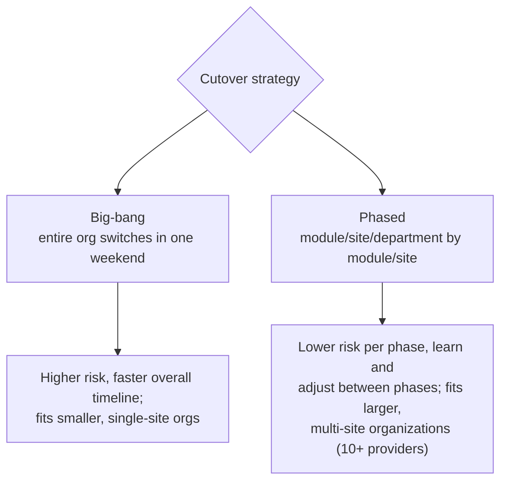

# EHR migration & data conversion

> _Last reviewed: 2026-07-03 — see the [freshness policy](../appendix/maintenance.md)._

## Learning objectives

After this chapter you will be able to:

- Choose between big-bang and phased EHR cutover strategies and know when each fits.
- Design a legacy-data-conversion and parallel-run plan that catches errors before go-live.
- Name the failure modes that make EHR migrations one of the highest-risk SA engagements.

## Why this is its own chapter

[EHR integration](./00-ehr-integration.md) covers *ongoing* integration with a stable EHR.
**Migration** — replacing one EHR with another, or one instance with a re-platformed one — is
a different, higher-stakes problem: a fixed cutover date, irreversible data conversion, and
clinicians who must be productive on day one. It is one of the highest-risk, highest-profile
engagements an HLS SA runs, and a bad one produces real patient-safety incidents, not just
schedule slips.

## Big-bang vs phased cutover

- **Big-bang** — the whole organization moves in one cutover window. Faster overall, but every
  mistake is discovered in production, at scale, simultaneously.
- **Phased** — roll out by site, department, or module, learning from each wave. Slower
  end-to-end but each phase's failures are contained and inform the next. The right default
  for larger, multi-site organizations.

## The migration pipeline

```mermaid
flowchart LR
  Legacy["Legacy EHR"] --> Extract["Extract"]
  Extract --> Map["Map & transform<br/>(codes, identifiers, structures)"]
  Map --> Test1["Test migration #1<br/>(clinician validation)"]
  Test1 --> Fix1["Fix mappings"]
  Fix1 --> Test2["Test migration #2"]
  Test2 --> Mock["Mock cutover<br/>(rehearse the actual weekend)"]
  Mock --> Parallel["Parallel run<br/>(both systems live, compared)"]
  Parallel --> GoLive["Go-live cutover"]
  GoLive --> ReadOnly["Legacy kept read-only<br/>(6-24 months)"]
```

- **Budget at least two full test migrations** before production cutover, with clinicians
  validating the *content*, not just engineers validating that the job ran — a technically
  successful ETL that silently drops a medication list is worse than a job that fails loudly.
- **Parallel run matters more than teams expect.** A JAMIA study found medication-dosage
  errors **doubled** during transitions that skipped adequate parallel testing — this is a
  patient-safety control, not a nice-to-have.
- **Mock cutovers** rehearse the actual go-live weekend (downtime windows, staff roles,
  rollback triggers) so the real one isn't the first attempt.
- **Keep the legacy system read-only** for 6–24 months (scaled to organization size) so any
  gap discovered post-go-live can be reconciled against the source of truth.

## What breaks (and how to design against it)

- **Missing labs, medications, allergies, or notes.** The most dangerous class of error —
  a clinician acting on an incomplete history has no way to know what's missing. Mitigate with
  clinician-led validation on every test migration, not just row-count checks.
- **Incorrect code mappings.** Legacy local codes mapping to the target system's
  [terminologies](../02-interoperability/03-terminologies.md) (or a different local scheme) is
  exactly the terminology-mapping problem — track and report the unmapped-code rate, don't
  silently drop what doesn't map.
- **Duplicated or merged patients.** A migration is a large-scale identity-resolution event —
  apply the [patient-matching](../02-interoperability/13-patient-provider-identity.md)
  discipline explicitly, don't assume source MRNs line up.
- **Productivity dip.** Budget a real, expected **10–25% temporary productivity decrease** in
  the first 2–4 weeks post-go-live — plan staffing and go-live timing (never a Friday before a
  holiday) around it, don't treat it as a surprise to manage reactively.

## Architecture guidance

1. **Treat conversion as its own ETL pipeline** with the same rigor as any [data platform](../05-data-platforms/00-lakehouse-vs-warehouse.md)
   build: staged, versioned, re-runnable, with data-quality gates before promotion.
2. **Resolve identity once, explicitly** (see [patient & provider identity](../02-interoperability/13-patient-provider-identity.md))
   rather than trusting that MRNs, names, or NPIs already line up across systems.
3. **Make the parallel-run comparison automatic**, not manual spot-checks — diff key clinical
   facts (active meds, allergies, problem list) between old and new systems continuously
   during the parallel period.
4. **Write the rollback plan before go-live**, with an explicit, pre-agreed trigger for
   invoking it — deciding this live, under pressure, is how bad cutovers get worse.

## Check yourself

1. When would you choose a phased cutover over big-bang, and what do you trade for the lower per-phase risk?
2. What did the JAMIA parallel-testing finding show, and why does it make parallel run a patient-safety control rather than a scheduling nicety?
3. Why keep the legacy system read-only for months after go-live instead of decommissioning it immediately?

## Further reading

- [EHR integration](./00-ehr-integration.md) · [Patient & provider identity matching](../02-interoperability/13-patient-provider-identity.md)
- [Clinical terminologies](../02-interoperability/03-terminologies.md) (code-mapping discipline)
- [Failure-mode case studies](../10-sa-craft/05-failure-mode-case-studies.md) — case 4 covers the JAMIA parallel-run finding in more depth
