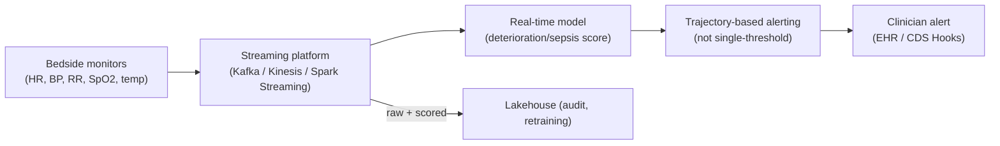

# Real-time streaming clinical analytics

> _Last reviewed: 2026-07-03 — see the [freshness policy](../appendix/maintenance.md)._

## Learning objectives

After this chapter you will be able to:

- Explain why continuous clinical monitoring needs a streaming architecture distinct from the general event-driven patterns.
- Design a sepsis-prediction-style pipeline where false-alarm rate, not just latency, is the dominant NFR.
- Place model monitoring and FDA considerations correctly for a real-time clinical AI alert.

## Why this needs its own pattern

[Event-driven patterns](./01-event-driven.md) covers discrete clinical events (an admission, a
lab result). **Continuous physiological monitoring** — ICU vital signs, bedside waveforms,
telemetry — is a different shape of problem: a **high-frequency stream** that must be scored
continuously against a deteriorating-patient model, with an architecture built around
minimizing **alert fatigue**, not just processing events promptly.

## The problem alert fatigue creates

Traditional single-threshold vital-sign alerts (a classic early-warning score crossing a
fixed line) have a well-documented failure mode: **low sensitivity for genuine early
deterioration alongside a high false-alarm rate**, which trains clinicians to routinely
override or ignore alerts — the opposite of the intended safety effect. Modern sepsis- and
deterioration-prediction systems are explicitly designed around **minimizing false alarms**
as the primary objective, not a secondary nicety:

- Systems in current clinical use predict sepsis **hours before** symptom onset (lead times of
  several hours are reported in the literature) by continuously scoring dozens to over a
  hundred clinical variables, rather than one threshold on one vital sign.
- The architectural technique that reduces false alarms most is **trajectory-based
  alerting** — tracking how a prediction is *trending* over a window, and alerting on a
  sustained pattern rather than a single noisy reading crossing a line. Published systems
  report false-alarm ratios in the low single digits (percent), far below traditional
  threshold alarms.

## Architecture components

- **Ingestion.** Continuous device/monitor telemetry into a streaming platform (Kafka, AWS
  Kinesis, Spark Streaming) — a genuinely different throughput/latency profile than the
  discrete-message patterns in [event-driven patterns](./01-event-driven.md).
- **Real-time scoring.** A model evaluated continuously (not batch) against the incoming
  stream — this is where [MLOps & model governance](../06-ai-ml/04-mlops-governance.md)'s
  monitoring-for-drift discipline matters most acutely: a model silently drifting on live
  ICU data is a patient-safety issue, not just a data-science one.
- **Trajectory/window logic**, not point thresholds — smooth or aggregate over a rolling
  window before deciding to alert.
- **Interpretability at the point of alert.** Clinicians act faster and trust alerts more when
  the system shows *why* (e.g. via SHAP-style feature attribution) rather than a bare score —
  design the alert UI to answer "why now" alongside "what."
- **Delivery into the clinical workflow**, typically via [CDS Hooks](../02-interoperability/00-hl7v2.md)
  or a direct EHR integration — an alert nobody sees at the point of care doesn't help, however
  accurate the model.

## Regulatory note

A model that predicts sepsis or deterioration and drives a clinical alert is very likely
[SaMD](../06-ai-ml/05-fda-samd.md) — some systems in this space are FDA-cleared devices, not
research tools. Design the [MLOps](../06-ai-ml/04-mlops-governance.md) pipeline (versioned
data, reproducible training, monitored deployed performance) from day one so it can produce
the evidence a submission or an ongoing PCCP needs, rather than retrofitting it later.

## Design guidance

1. **Optimize for false-alarm rate as a first-class NFR**, alongside latency and accuracy —
   a technically accurate model that alerts too often will be ignored regardless.
2. **Use trajectory/windowed evaluation**, not single-point thresholds, as the default alerting
   pattern.
3. **Monitor the deployed model continuously** — streaming clinical AI drifts with case-mix
   and instrumentation changes faster than most batch clinical models.
4. **Design interpretability into the alert**, not as an afterthought — it directly affects
   whether clinicians act on it.
5. **Assume SaMD from the start** if the alert could plausibly change a clinical decision.

## Check yourself

1. Why is false-alarm rate treated as a primary design objective for a sepsis-prediction system, not a secondary metric?
2. What does trajectory-based alerting do differently from a single-threshold vital-sign alarm, and why does it reduce false alarms?
3. Why does continuous streaming clinical AI need tighter model-drift monitoring than a typical batch clinical model?

## Further reading

- [Event-driven patterns](./01-event-driven.md) · [MLOps & model governance](../06-ai-ml/04-mlops-governance.md)
- [FDA SaMD & GMLP](../06-ai-ml/05-fda-samd.md)
- [SepsisAI — minimizing false alarms in ICU sepsis prediction (PLOS Digital Health)](https://journals.plos.org/digitalhealth/article?id=10.1371%2Fjournal.pdig.0000569)
