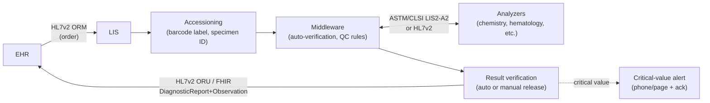

# Laboratory Information System (LIS) architecture

> _Last reviewed: 2026-07-04 — see the [freshness policy](../appendix/maintenance.md)._

## Learning objectives

After this chapter you will be able to:

- Distinguish a clinical LIS from a research LIMS and pick the right regulatory lens for each.
- Design the order-to-result lifecycle across the EHR, LIS, middleware, and instruments.
- Apply CLIA/CAP compliance and critical-value alerting as first-class architecture requirements.

## Why labs need their own architecture chapter

Every prior integration chapter in this bootcamp assumes the EHR is the hub. But a huge share
of clinical data — labs, pathology, microbiology — is generated and first validated in a
**laboratory information system**, a distinct system with its own workflow, its own wire
protocols, and its own regulator. [LIMS](../02-interoperability/03-terminologies.md) has been
a glossary term throughout this book; this chapter is the dedicated architecture treatment.

## LIS vs LIMS: same acronym family, different regulatory world

- **LIS (Laboratory Information System)** — runs a **clinical diagnostic lab** testing patient
  specimens for care decisions. Regulated by **CLIA** and (often) accredited by **CAP**.
  Results flow back into the EHR and directly affect treatment.
- **LIMS (Laboratory Information Management System)** — runs a **research or manufacturing**
  lab (pharma R&D, biotech, QC labs). Falls under [GxP & 21 CFR Part 11](../03-compliance/02-gxp-part11.md)
  data-integrity rules rather than CLIA, and its outputs feed a study or a batch record, not
  a clinical chart.

Same shape of problem — order, track a specimen, run an instrument, capture a result — but
**different regulator, different consumer of the result, different consequence of an error**.
Confirm which world you're in before applying either compliance chapter.

## The order-to-result lifecycle

1. **Order** — the EHR sends an order as an **HL7v2 ORM** message (or, increasingly, a FHIR
   `ServiceRequest`); see [HL7v2 messaging](../02-interoperability/00-hl7v2.md).
2. **Accessioning** — the LIS assigns a specimen ID and prints a barcode label; this ID is
   what every downstream instrument and result references.
3. **Instrument analysis** — the specimen runs on an analyzer (chemistry, hematology,
   coagulation, immunoassay, microbiology ID, etc.). A single clinical lab commonly runs
   **dozens of different analyzers**, each needing its own bidirectional interface.
4. **Middleware** — many labs run a dedicated interface layer between instruments and the LIS
   that applies **auto-verification rules** (e.g. Westgard QC rules, delta checks against the
   patient's prior result) before a result is allowed to auto-release — this is where most of
   the day-to-day result-quality logic actually lives, not in the LIS core.
5. **Result** — released back to the EHR as **HL7v2 ORU** or, on modern platforms, as a FHIR
   `DiagnosticReport` + `Observation` pair, coded with [LOINC](../02-interoperability/03-terminologies.md)
   for the test and its units.

## Instrument interfacing: two protocol worlds

- **HL7v2** — the standard at the **LIS↔EHR** boundary (ORM/ORU), consistent with the rest of
  this bootcamp's [HL7v2 chapter](../02-interoperability/00-hl7v2.md).
- **ASTM/CLSI LIS2-A2** (and some proprietary serial/TCP protocols) — common at the
  **instrument↔LIS/middleware** boundary. Many analyzer vendors speak this rather than HL7v2
  natively; expect to build or buy a protocol-translating driver per instrument family, not
  a single universal interface.

Design implication: budget interface work **per instrument**, not once — a lab replacing or
adding an analyzer is effectively standing up a new point-to-point integration each time,
unless the middleware layer already has a driver for that model.

## Compliance: CLIA, CAP, and the audit trail

- **CLIA (Clinical Laboratory Improvement Amendments)** — the federal floor for any US lab
  testing human specimens: personnel qualifications, quality control, and proficiency testing
  requirements. Not optional for a clinical LIS.
- **CAP (College of American Pathologists) accreditation** — voluntary but widely
  expected/required by payers and referring institutions; audits go deeper than the CLIA
  minimum.
- **The audit trail is the common evidence artifact** across CAP, CLIA, and
  [HIPAA](../03-compliance/00-hipaa.md) simultaneously — a comprehensive, timestamped log of
  every order, result, correction, and release satisfies all three inspection regimes at once
  if designed well; see [governance & data contracts](../05-data-platforms/03-governance-contracts.md).

## Critical values: a patient-safety-critical alerting path

A **critical value** (e.g. a dangerously low potassium or glucose) must reach a clinician
fast, with a **confirmed acknowledgment**, not just a fire-and-forget message. This is the LIS
world's version of the [alert-fatigue](../08-integration/04-realtime-streaming-analytics.md)
design problem: too many "critical" thresholds trains staff to deprioritize them, but a missed
one is a serious safety failure. Design this path as a positive-acknowledgment workflow
(phone call, page, or an EHR alert that requires an explicit acknowledgment) — never a silent
inbox message.

## Design guidance

1. **Decide LIS vs LIMS early** — it determines your compliance chapter (CLIA/CAP vs GxP)
   and who consumes the output (a clinician vs a study/batch record).
2. **Treat middleware as first-class**, not an afterthought — QC/auto-verification rules
   living there directly determine result quality and turnaround time.
3. **Budget per-instrument integration effort**, especially when the interface protocol is
   ASTM/CLSI LIS2-A2 or proprietary rather than HL7v2.
4. **Design critical-value alerting as an acknowledged workflow**, not a fire-and-forget
   message — this is a patient-safety control, not a notification feature.
5. **Code results in LOINC** from the LIS outward so downstream consumers ([OMOP](../02-interoperability/04-omop-cdm.md),
   analytics, RWE) don't need lab-specific mapping tables.

## Check yourself

1. A hospital lab and a pharma QC lab both ask for "a LIMS." What's the first question that determines whether they actually need a CLIA/CAP-regulated LIS or a GxP-regulated LIMS?
2. Why might an instrument vendor's interface not simply be HL7v2, and what does that mean for integration effort per analyzer?
3. Why must a critical-value alert require acknowledgment rather than just delivery?

## Further reading

- [HL7v2 messaging](../02-interoperability/00-hl7v2.md) · [Clinical terminologies](../02-interoperability/03-terminologies.md) (LOINC)
- [GxP & 21 CFR Part 11](../03-compliance/02-gxp-part11.md) · [Governance & data contracts](../05-data-platforms/03-governance-contracts.md)
- [CLIA (CMS)](https://www.cms.gov/regulations-and-guidance/legislation/clia) · [CAP accreditation](https://www.cap.org/laboratory-improvement/accreditation)
