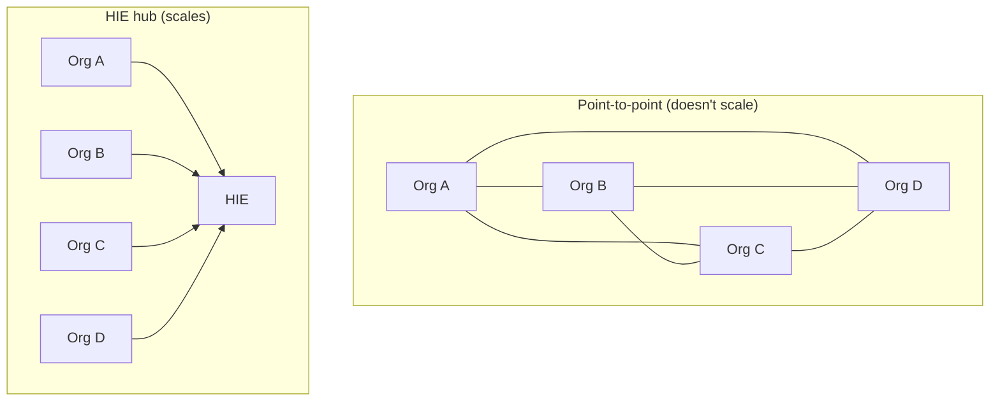
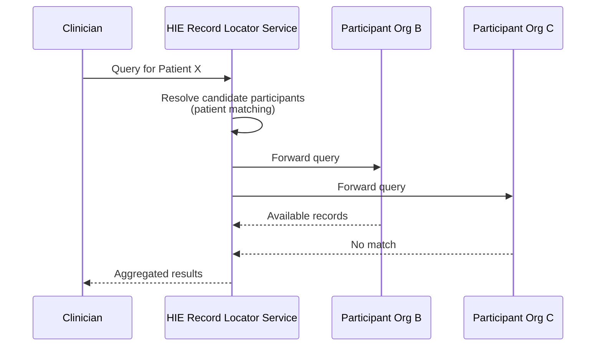

# Health Information Exchange (HIE) architecture

> _Last reviewed: 2026-07-06 — see the [freshness policy](../appendix/maintenance.md)._

## Learning objectives

After this chapter you will be able to:

- Distinguish an HIE's centralized, federated, and hybrid architectural models.
- Explain what a Record Locator Service does and why federated HIEs need one instead of a central store.
- Place HIE architecture correctly between point-to-point EHR integration and nationwide TEFCA exchange.

## The N-to-N problem HIEs exist to solve

[EHR integration](./00-ehr-integration.md) covers point-to-point connections — your system to
one EHR you have a direct relationship with. That doesn't scale to a region: if every provider
needed a direct connection to every other provider to share records, a metro area with 50 health
systems would need over a thousand pairwise connections. A **Health Information Exchange (HIE)**
solves this by acting as a hub: each participant connects once, to the HIE, and reaches everyone
else through it. HIEs have been mentioned in passing throughout this book (the
[industry map](../00-orientation/01-hls-industry-map.md), [Canadian architecture](../02-interoperability/17-canadian-hls-architecture.md))
— this chapter is the architecture treatment.

## Three architectural models

- **Centralized (data-warehouse model)** — the HIE ingests and stores copies of participant data
  centrally, enabling fast query and population-level analytics. Less common today: participants
  must trust the HIE with a full copy of their data, staleness and duplication are real problems,
  and the governance/liability surface is larger.
- **Federated / query-based (the dominant model)** — the HIE holds **no clinical data centrally**,
  only an index of who might have data on a given patient. A query triggers real-time retrieval
  directly from each participant's system. This is the pull model behind most modern HIEs,
  Carequality, CommonWell, and TEFCA itself.
- **Hybrid** — a federated core with some cached or replicated summary data (e.g. a recent-encounter
  summary) for performance, while the full record is still pulled on demand.

## The Record Locator Service (RLS)

The core component of a federated HIE is the **Record Locator Service** — it does not store
clinical data, only a patient-matching index answering "which participants likely hold data on
this patient." The query workflow:

**Patient matching is the crux of the whole design** — the same discipline as
[patient & provider identity matching](../02-interoperability/13-patient-provider-identity.md),
but harder here: HIE participants are genuinely unaffiliated organizations with no shared
identifier space, so match rates are lower and a false match carries real clinical risk.

## HIE vs. EHR integration vs. TEFCA — three different scopes

| Layer | Scope | Typical mechanism |
| --- | --- | --- |
| [EHR integration](./00-ehr-integration.md) | Point-to-point, within your app landscape or known partners | HL7v2, FHIR API, SMART launch |
| **HIE (this chapter)** | Regional/state network of unaffiliated organizations | Federated query via a Record Locator Service |
| [TEFCA / QHIN](../02-interoperability/16-uscdi-tefca-labs.md) | Nationwide network **of networks** | Inter-QHIN exchange under the Common Agreement |

Many QHINs are themselves built on existing HIE infrastructure — **Carequality** (a trust
framework connecting many HIEs and networks under common technical and legal requirements) and
**CommonWell Health Alliance** (an EHR-vendor-driven network enabling patient lookup and record
retrieval across participating vendors' installed bases) both predate TEFCA and now participate in
it. The practical hierarchy an SA should carry: **point-to-point → regional HIE → nationwide
network of networks**, each layer solving a scope the one below it cannot.

## Governance: the trust framework behind the technology

An HIE is as much a legal and policy construct as a technical one. Participants sign a data-use
agreement (the pattern is often called a **DURSA** — Data Use and Reciprocal Support
Agreement — in US networks like eHealth Exchange) covering permitted purpose of use, minimum
necessary access, and liability. **Patient consent models vary by state** — some states run an
opt-out model (data is exchanged unless a patient objects), others require explicit opt-in —
verify this per jurisdiction rather than assuming one model. Many regional HIEs are non-profit,
state-designated entities funded by participation fees or grants, which shapes their governance
incentives differently from a for-profit vendor network.

## Design guidance

1. **Decide the query pattern you actually need.** Real-time federated lookup at the point of
   care is a different integration than a proactive **ADT-based notification service** (many HIEs
   offer this — alerting a PCP when their patient is admitted elsewhere), which is a subscription,
   not a query.
2. **Budget for lower match rates than an internal MPI.** Cross-organization patient matching in a
   federated HIE is a harder problem than matching within one health system's own data.
3. **Verify the consent model per state/jurisdiction** before assuming exchange is either default-on
   or default-off.
4. **Join a network once, not many partners bilaterally.** Network effects mean one well-chosen
   HIE/Carequality/CommonWell connection typically reaches most of the data you need, rather than
   negotiating separate agreements per potential partner.

## Check yourself

1. Why does a federated HIE's Record Locator Service not store clinical data itself?
2. A vendor asks whether to integrate directly with 20 hospitals or join one regional HIE. What
   architectural property of an HIE hub makes the second option scale better?
3. How does an HIE differ in scope from both point-to-point EHR integration and TEFCA/QHIN
   exchange?

## Further reading

- [ONC — Health Information Exchange basics](https://www.healthit.gov/topic/health-it-and-health-information-exchange-basics/what-hie)
- [Carequality](https://carequality.org/) · [CommonWell Health Alliance](https://www.commonwellalliance.org/)
- [EHR integration](./00-ehr-integration.md) · [USCDI, information blocking & TEFCA](../02-interoperability/16-uscdi-tefca-labs.md)
