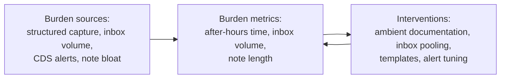

# EHR usability & clinical documentation burden

> _Last reviewed: 2026-07-06 — see the [freshness policy](../appendix/maintenance.md)._

## Learning objectives

After this chapter you will be able to:

- Explain why interoperability's demand for structured data directly competes with clinician time.
- Evaluate the main technical interventions (ambient documentation, inbox routing, templates, CDS tuning) and their trade-offs.
- Measure a clinician-facing feature's burden impact before and after shipping it, not just its adoption.

## The tension this book has been implying all along

Almost every earlier chapter asks for **more structured data at the point of care**: US Core's
must-support elements, HEDIS's move to ECDS/FHIR reporting, HCC risk-adjustment documentation
completeness, Gaps-in-Care alerts from Da Vinci DEQM. Every one of those is, from a clinician's
seat, **another click, dropdown, or discrete field** instead of writing or saying what happened in
their own words. This isn't a UX nicety — it's an architectural tension that determines whether a
feature gets adopted or quietly worked around, as the [health system operations](../00-orientation/04-health-system-operations.md)
stakeholder-incentive example already previewed. This chapter treats it as its own subject.

## Measuring the problem before designing for it

The tension is not anecdotal — it's been measured. The most-cited time-motion study (Sinsky et
al., *Annals of Internal Medicine*, 2016) found ambulatory physicians spending roughly **two hours
on EHR and desk work for every one hour of direct face-to-face patient time** — a ratio that
reframes "the EHR is annoying" as a quantified, architecturally addressable problem. Three metrics
an SA should know exist and can use as before/after evidence for a project's business case:

- **After-hours documentation time** ("pajama time") — work completed in the EHR outside scheduled
  clinical hours; several EHR vendors now surface this natively as a burnout proxy.
- **Note length / "note bloat"** — driven by copy-forward and copy-paste features that make notes
  longer and harder to read without adding information.
- **In-basket/inbox volume** — the combined queue of results, refill requests, and patient portal
  messages landing on one person.

These are increasingly available as **vendor-native analytics** (e.g. Epic's Signal), which means
an SA proposing a burden-reduction project already has an instrument to measure it — use it, rather
than relying on adoption metrics alone, which measure usage, not relief.

## Technical interventions

### 1. Ambient clinical documentation (AI scribes)

A fast-growing category: ambient audio capture of the patient encounter, transcribed and
summarized by an LLM into a draft note, which the clinician reviews and signs rather than typing
from scratch. Architecturally this is a pipeline: **consented audio capture → transcription → LLM
summarization → mandatory human review before the note enters the legal record → integration back
into the EHR** (via a native or partner integration many EHRs now support). Treat the output the
same way you'd treat any AI system touching the clinical record — human-in-the-loop sign-off is
not optional, and the [regulated AI artifacts](../06-ai-ml/07-regulated-ai-artifacts.md) discipline
(intended use, validation, monitoring) applies even though an ambient scribe is not itself making a
clinical decision. **Exact regulatory classification of ambient scribes is still settling** as the
category matures — verify current guidance before assuming a fixed answer.

### 2. Inbox/in-basket routing and pooling

Redesigning message routing from a single physician-owned queue to a **team-based pooled inbox**
(nurse/MA/physician triage by message type) reduces burden without dropping information — but it's
a workflow *and* architecture decision: the system needs configurable routing rules, not a
hard-coded "everything goes to the ordering physician" default.

### 3. Smart phrases, templates & the note-bloat trade-off

Pre-built content blocks (macros/smart phrases) let a clinician capture structured data in one
click instead of manual entry — genuinely useful, but the same mechanism that reduces typing time
also produces long, templated, hard-to-read notes when overused. Design for **the read side too**:
a note optimized purely for fast capture that nobody can usefully read later has just moved the
burden downstream.

### 4. CDS alert tuning

[Real-time streaming clinical analytics](./04-realtime-streaming-analytics.md) and the
[LIS critical-value workflow](./05-lis-architecture.md) already establish the **alert fatigue**
discipline — high false-positive rates train clinicians to override or ignore alerts. The exact
same discipline applies to documentation-adjacent CDS: best-practice advisories and Gaps-in-Care
reminders ([payer value-based care](../02-interoperability/11-payer-value-based-care.md)) are one
of the largest contributors to burden when fired indiscriminately. Tier severity, suppress
non-actionable alerts, and measure override rate as a design metric, not an afterthought.

## Design guidance

1. **Pair every new structured-data requirement with an explicit cost analysis** — who captures
   it, and what does it cost them — before mandating it.
2. **Govern ambient/AI-assisted documentation like any other clinical AI system** — mandatory
   human review and sign-off before anything reaches the legal record, not a convenience exemption.
3. **Design inbox routing as configurable, team-based workflow**, not a fixed physician-only queue.
4. **Reuse the alert-fatigue discipline for every new CDS or reminder feature** — burden and alert
   fatigue are the same failure mode in different clothes.
5. **Measure before and after with the same burden metrics** (after-hours time, inbox volume, note
   length) as part of a project's evidence — not adoption rate alone, which can rise even as burden
   does.

## Check yourself

1. Why does a feature that increases US Core/HEDIS structured-data completeness not automatically
   count as a win for the SA proposing it?
2. Name two specific burden metrics an SA could use as before/after evidence for a documentation
   project, and why adoption rate alone isn't sufficient.
3. Why does an ambient AI scribe need mandatory human review before its output enters the record,
   even though it isn't making a clinical decision itself?

## Further reading

- [Sinsky et al. — "Allocation of Physician Time in Ambulatory Practice"](https://www.acpjournals.org/doi/10.7326/M16-0961) (Annals of Internal Medicine, 2016)
- [Real-time streaming clinical analytics](./04-realtime-streaming-analytics.md) · [Regulated AI artifacts](../06-ai-ml/07-regulated-ai-artifacts.md)
- [AMA — physician burnout and EHR usability resources](https://www.ama-assn.org/practice-management/physician-health)
