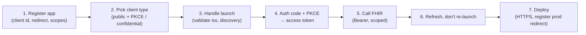

# Building a SMART on FHIR app: end-to-end

> _Last reviewed: 2026-07-20 — see the [freshness policy](../appendix/maintenance.md)._

## Learning objectives

After this chapter you will be able to:

- Take a SMART on FHIR app from registration to a working, deployed build — not just describe the standard.
- Choose the right client type (public vs confidential) and auth flow for a patient-facing vs backend app.
- Avoid the specific build-time mistakes that break real SMART launches.

## From "what SMART is" to "ship one"

[SMART on FHIR](../02-interoperability/05-smart-on-fhir.md) explains the standard — launch flows,
scopes, the OAuth2 mechanics. This chapter is the **build walkthrough**: the concrete steps and
decisions to get a working app against a real EHR sandbox and into production. It's the practical
starting point the `hls-fhir-interop` lab points at, written as the "how do I actually begin" guide
the rest of the interoperability material assumes.



## 1. Register the app

Every EHR runs a developer program ([Epic on FHIR](https://fhir.epic.com/),
[Oracle Health/Cerner code console](https://fhir.cerner.com/)) where you register the app before it
can launch. Registration establishes:

- **Client ID** — your app's identity to that EHR.
- **Redirect URI(s)** — where the EHR sends the authorization code back; must match **exactly**,
  including trailing slash, or the launch fails with an opaque error. Register every environment's
  URI (localhost for dev, staging, prod).
- **Requested scopes** — declared up front; the EHR (and often the health system) reviews them.
  Over-broad scope requests are the most common cause of an app being rejected in review.
- **Launch type** — EHR launch, standalone, or backend.

Registration is per-EHR and, for production, often per-health-system — a lead-time item, not a
code task (the same [EHR integration](./00-ehr-integration.md) reality noted earlier).

## 2. Pick the client type — the decision that trips people up

This choice determines your entire auth implementation, and getting it wrong is a security bug:

| Client type | Can it keep a secret? | Use for | Auth mechanism |
| --- | --- | --- | --- |
| **Public** | No | Browser SPAs, mobile apps — anything running on the user's device | Authorization code + **PKCE** (no client secret) |
| **Confidential** | Yes | Server-side web apps with a backend that can hold a secret | Authorization code + client secret (or asymmetric JWT auth) |
| **Backend** | Yes (asymmetric key) | Server-to-server, no user present | Client-credentials + signed JWT, `system/` scopes |

**PKCE (Proof Key for Code Exchange) is mandatory for public clients** and recommended for all —
it's baked into OAuth 2.1 and the SMART v2 expectation. A browser or mobile app **cannot** safely
hold a client secret (anyone can extract it from shipped code), so a public client uses PKCE
instead: it generates a random `code_verifier`, sends its hash (`code_challenge`) on the
authorization request, and proves possession of the verifier at token exchange. **Never ship a
"confidential" app whose secret is actually embedded in a mobile binary or SPA bundle** — that's
the classic mistake.

## 3. Handle the launch

- **EHR launch** — the EHR opens your `launch_url` with two parameters: `launch` (an opaque token)
  and `iss` (the FHIR base URL). **Validate `iss` against an allow-list of EHRs you trust** before
  doing anything — an unvalidated `iss` is an attack vector (a forged launch pointing your app at a
  malicious server).
- **Discovery** — fetch `{iss}/.well-known/smart-configuration` to get the authorization and token
  endpoints rather than hard-coding them; endpoints differ per EHR and per environment.
- **Standalone launch** — no `launch` token; the user selects their provider, and your app starts
  the auth flow directly against that EHR's discovered endpoints.

## 4. Authorization → token

The authorization-code flow, with the SMART additions:

1. Redirect the user to the EHR's authorization endpoint with `client_id`, `redirect_uri`,
   requested `scope`, `state` (CSRF protection — validate it on return), `aud` set to the FHIR
   base URL, and (public client) the PKCE `code_challenge`.
2. The user authenticates and approves scopes; the EHR redirects back to your `redirect_uri` with
   an authorization `code`.
3. Exchange the code at the token endpoint (with the PKCE `code_verifier`, or the client secret for
   a confidential app) for an **access token**, a **refresh token** (if granted), and the **launch
   context** (`patient`, sometimes `encounter`).

**Never put the token or PHI in a URL, query string, or browser history** — tokens travel in the
`Authorization: Bearer` header only.

## 5. Call the FHIR API

With the access token and the `patient` context from the launch, call the EHR's
[FHIR R4 API](../02-interoperability/01-fhir.md):

```
GET {iss}/Observation?patient={patientId}&category=vital-signs
Authorization: Bearer {access_token}
```

The token is scoped: a `patient/Observation.rs` scope returns only the launched patient's
Observations, read/search only. If you request a resource outside your granted scopes, you get a
403 — which in practice usually means you under-requested at registration, not that the code is
wrong.

## 6. Refresh, don't re-launch

Access tokens are short-lived (often ~1 hour). When one expires, use the **refresh token** to get a
new access token silently — do **not** send the user back through a full launch. If the EHR didn't
issue a refresh token (some don't, by policy), design the app to re-acquire context gracefully
rather than losing the user's work.

## 7. Deploy

- **HTTPS everywhere, no exceptions** — SMART requires it; an `http://` redirect URI won't work
  outside localhost dev.
- **Register the production redirect URI** in the EHR developer console before go-live; a
  dev-only registration is a common launch-day failure.
- **Rotate and protect keys** — for backend/confidential apps using JWT auth, register the public
  key with the EHR and rotate the private key on a schedule (see the
  [security review](../10-sa-craft/02-security-review.md) checklist).
- **Log for audit** — every FHIR call your app makes against PHI is subject to
  [HIPAA](../03-compliance/00-hipaa.md) audit; log who, what, when in-boundary.

## Common build-time pitfalls

1. **Redirect URI mismatch** — the single most common "it worked yesterday" failure; must match
   character-for-character, per environment.
2. **A secret in a public client** — a mobile/SPA app is public; use PKCE, never an embedded
   secret.
3. **Hard-coded endpoints** — always discover via `.well-known/smart-configuration`; they differ
   per EHR and environment.
4. **Skipping `iss`/`state` validation** — both are security controls, not optional ceremony.
5. **Re-launching to refresh** — use the refresh token; re-launching loses context and annoys
   users.
6. **Testing only in the sandbox** — the [SMART App Launcher](https://launch.smarthealthit.org/) is
   great for the flow, but real EHRs have quirks (missing must-support fields, non-standard error
   bodies); test against the actual target EHR's sandbox before production.

## Lab

[`hls-fhir-interop`](https://github.com/anothernoise/hls-fhir-interop) includes a minimal SMART app
that performs an EHR launch against a sandbox and reads scoped patient data. Start there, then point
it at the [SMART App Launcher](https://launch.smarthealthit.org/) to exercise both launch flows
without a real EHR.

## Check yourself

1. You're building a patient-facing mobile app. Which client type is it, and what replaces the
   client secret — and why can't a mobile app use a secret?
2. Your app launches fine in dev but fails in production with an authorization error before the user
   even logs in. What is the most likely cause?
3. The user's access token expires mid-session. What should the app do, and what should it *not*
   do?

## Further reading

- [SMART on FHIR](../02-interoperability/05-smart-on-fhir.md) (the standard) · [FHIR R4](../02-interoperability/01-fhir.md)
- [SMART App Launch v2.2.0](https://hl7.org/fhir/smart-app-launch/) · [SMART App Launcher sandbox](https://launch.smarthealthit.org/)
- [Epic on FHIR](https://fhir.epic.com/) · [Oracle Health developer](https://fhir.cerner.com/)
