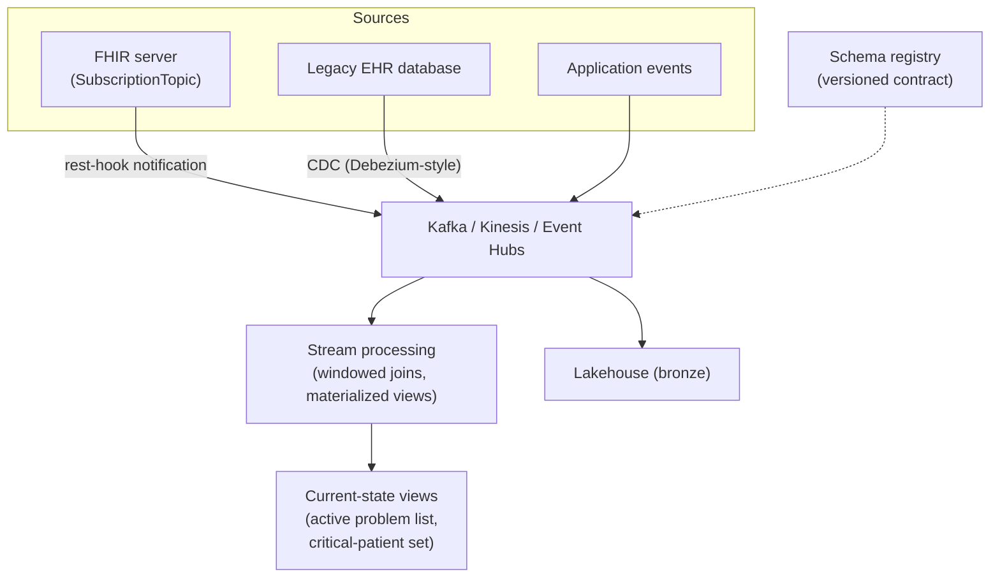

# Event-driven & real-time architecture on modern infra

> _Last reviewed: 2026-08-03 — see the [freshness policy](../appendix/maintenance.md)._

## Learning objectives

After this chapter you will be able to:

- Design a topic-based FHIR Subscriptions pipeline and know when to fall back to polling.
- Choose between a message broker and change data capture (CDC) for a given source system.
- Wire a schema registry and stream processing into an event-driven HLS platform so it survives growth.

## From "which primitive" to "how it's actually built"

[Event-driven patterns](./01-event-driven.md) gives you the decision framework — queue vs. topic
vs. FHIR Subscription vs. stream — and the reliability concerns (idempotency, ordering, DLQs) that
apply regardless of which you pick. This chapter is the concrete build-out: the specific mechanics
of FHIR's modern Subscriptions model, how to wire Kafka/Kinesis/Event Hubs for HLS event volume,
when CDC is the right (or wrong) call, and the two things that keep an event-driven platform from
degrading as it scales — a schema registry and stream processing for derived state.

## FHIR Subscriptions, in depth

[FHIR version migration](../02-interoperability/15-fhir-version-migration.md) already flags that
R5's Subscriptions are a genuine capability shift, backported into R4B — this is what that shift
actually looks like to build against.

- **R4's model was criteria-based and fragile.** A `Subscription` embedded its own filter criteria,
  re-evaluated by the server against every resource change. Criteria drifted from what the server
  could actually evaluate efficiently, and subscriptions broke silently at scale.
- **R5's model is topic-based.** A `SubscriptionTopic` — defined and tested by the server — declares
  a well-known category of change (e.g. "new laboratory Observations"). A client's `Subscription`
  references that topic rather than inventing its own criteria. The server owns correctness of the
  topic; the client just subscribes to something known to work.
- **Delivery channels:** `rest-hook` (webhook — the common case; your endpoint must be a public
  HTTPS URL that accepts POSTs), `websocket` (good for a browser-based app that's already
  connected), and `email` (rare, low-volume use). A `rest-hook` channel also receives periodic
  **heartbeat notifications** — handle them to detect a silently-dead subscription rather than
  discovering the gap when a clinical event goes missing.
- **Content setting** controls payload size: `empty` (just a ping — go fetch the resource yourself),
  `id-only`, or `full-resource`. Prefer `id-only`/`empty` for high-volume topics and fetch on
  demand — it keeps PHI out of the notification channel itself, the same "reference, not payload"
  guidance [event-driven patterns](./01-event-driven.md) already gives for buses generally.

**Design implication:** prefer topic-based Subscriptions whenever the server supports R4B+; treat
polling as the fallback for servers that don't, not the default.

## Kafka, Kinesis, and Event Hubs: wiring for HLS volume

The three managed-stream services converge on the same design once you're past "which vendor":

- **Partition/topic key on patient or encounter ID** — the same ordering requirement
  [event-driven patterns](./01-event-driven.md) already establishes (admit before discharge),
  implemented concretely as a partition key so all of one patient's events land in order on one
  partition.
- **Consumer groups scale independently.** The analytics consumer, the alerting consumer, and the
  FHIR converter each run their own consumer group against the same topic — one slow consumer
  never blocks another, and each scales its own instance count to its own load.
- **At-least-once + idempotent consumers, not exactly-once, as the default.** Exactly-once
  semantics (Kafka transactions) exist but add real complexity; an idempotent consumer (dedupe on
  a natural key, e.g. `messageControlId` + patient) is usually simpler and suffices — consistent
  with the idempotency guidance already established.
- **Cross-cloud equivalents** — Kafka (self-managed, MSK, or Confluent Cloud), Kinesis (AWS-native),
  Event Hubs (Azure-native, Kafka-protocol-compatible). Pick one, but keep the event *schema* and
  consumer logic portable — the same [cloud portability](../04-cloud-platforms/08-portability-lock-in.md)
  principle applied to streaming infrastructure specifically.

## When change data capture is the right (or wrong) call

**CDC** is a fundamentally different integration pattern from HL7v2/FHIR messaging: instead of
waiting for the source system to *emit* an event, a CDC tool (the Debezium pattern is the common
open-source reference) tails the source database's transaction log directly and turns every row
change into an event.

**When it's the right call:**

- The legacy system has no message or event interface at all — no HL7v2 feed, no FHIR API.
- HL7v2 feeds are well known to be **incomplete** — a source system only messages what it was
  configured to message, while CDC captures every row change regardless of whether anyone thought
  to wire up an interface for it.

**Why it's still a last resort, not a default:**

- CDC exposes the **source system's raw internal schema** — table and column names never designed
  for external consumption. This is a direct data-model leak, and it requires a transformation/
  anti-corruption layer between CDC output and any consumer, without exception.
- It requires **database-level access** (a replication slot, binlog access) — a materially
  different, more invasive risk and privilege footprint than a sanctioned interface-engine feed,
  and one an EHR vendor may not permit at all.
- Schema changes on the source database (a column rename during a vendor upgrade) break CDC
  consumers silently, in a way an HL7v2 interface's versioned message spec does not.

**Design implication:** reach for CDC only when no event/message interface exists, and always
insert a transformation layer immediately downstream so nothing consumes the raw source schema
directly.

## Schema registry: the event-stream data contract

As topic count and consumer count grow, an unmanaged payload schema is where things quietly break:
a producer adds a field, renames one, or changes a type, and every consumer parsing that shape
breaks independently, discovered only when each one fails. A **schema registry** (Confluent Schema
Registry, AWS Glue Schema Registry) enforces a versioned contract (Avro, Protobuf, or JSON Schema)
at write time — an incompatible change is rejected before it ever reaches a consumer. This is the
event-stream analogue of the [data contract](../05-data-platforms/03-governance-contracts.md)
discipline already established for pipelines: same idea, enforced at the bus instead of the
warehouse boundary.

## Stream processing for derived, current-state views

Beyond moving events, a mature platform often needs a continuously-updated **view** of current
state — "this patient's active problem list right now," "the set of currently critical patients" —
computed by a stream-processing framework (Kafka Streams, Flink, Spark Structured Streaming)
maintaining windowed aggregates and joins across topics, rather than a consumer re-querying the
source on every request. This is the general-purpose infrastructure underneath the specific
clinical use case [real-time streaming clinical analytics](./04-realtime-streaming-analytics.md)
already covers (continuous deterioration scoring) — that chapter is one application of this
pattern, not the whole of it.

## Design guidance

1. **Default to topic-based FHIR Subscriptions** on any R4B+ server; treat criteria-based polling
   as a compatibility fallback, not the baseline design.
2. **Key streams by patient/encounter ID** for ordering, and let consumer groups scale
   independently rather than sharing one consumer across concerns.
3. **Reach for CDC only when no event interface exists**, and never let a consumer see the raw
   source schema — insert a transformation layer unconditionally.
4. **Enforce a schema registry once you have more than a couple of consumers** — the cost of
   adopting one late is a production incident, not a migration.
5. **Distinguish moving events from maintaining current-state views** — the latter needs stream
   processing (windowed joins/aggregates), not just a bus.

## Check yourself

1. Why is R5's topic-based Subscriptions model more reliable at scale than R4's criteria-based
   model, and what capability gap exists for a server still on plain R4?
2. A legacy lab system has no HL7v2 or FHIR interface at all. What integration pattern applies, and
   what must sit immediately downstream of it before any consumer sees the data?
3. Why does adding a schema registry become necessary as consumer count grows, even if no schema
   change has broken anything yet?

## Further reading

- [FHIR Subscriptions (R5)](https://hl7.org/fhir/subscriptions.html) · [FHIR version migration & compatibility](../02-interoperability/15-fhir-version-migration.md)
- [Debezium (CDC)](https://debezium.io/) · [Confluent Schema Registry](https://docs.confluent.io/platform/current/schema-registry/index.html)
- [Event-driven patterns](./01-event-driven.md) · [Real-time streaming clinical analytics](./04-realtime-streaming-analytics.md)
