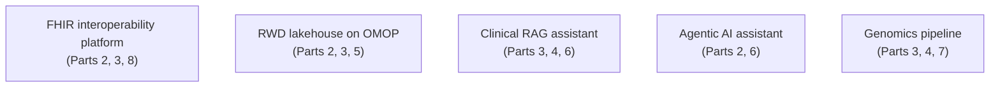

# Reference architectures: overview

> _Last reviewed: 2026-06-28 — see the [freshness policy](../appendix/maintenance.md)._

## Learning objectives

After this chapter you will be able to:

- Read the case studies in this part as worked, end-to-end SA deliverables.
- Use a consistent structure to document any reference architecture.
- Map each case study to the concepts and labs earlier in the bootcamp.

## What this part is

Parts 1–8 taught the building blocks. This part puts them together into **five worked reference architectures** — the kind of artifact an SA produces and defends. Each is a complete solution to a realistic brief, not a feature tour, and each links to a hands-on [lab](../00-orientation/03-bootcamp-format.md).

## How each case study is structured

Every case study follows the same SA deliverable shape — the structure you should reuse for your own designs and the [capstone](../10-sa-craft/03-capstone.md):

1. **Problem & context** — the business problem and who has it.
2. **Requirements (NFRs)** — the measurable bar (security, latency, availability, compliance, cost).
3. **Architecture** — the design, as a [C4-style](../01-foundations/02-c4-and-adrs.md) diagram.
4. **Key decisions & trade-offs** — the [ADRs](../01-foundations/02-c4-and-adrs.md): what was chosen and what was given up.
5. **Compliance mapping** — which controls satisfy which regime.
6. **Cost** — the [TCO](../01-foundations/03-tradeoffs-tco.md) shape.
7. **Lab** — where to build it.

## The five case studies

| Case study | Brings together | Lab |
| --- | --- | --- |
| [FHIR interoperability platform](./01-fhir-interop.md) | HL7v2/FHIR, HIPAA, EHR integration | `hls-fhir-interop` |
| [RWD lakehouse](./02-lakehouse-rwd.md) | OMOP, lakehouse, governance, RWE | `hls-lakehouse-rwd` |
| [Clinical RAG](./03-clinical-rag.md) | GCP/Vertex, RAG, PHI boundary | `RAGonGCP` |
| [Agentic AI assistant](./04-agentic-ai.md) | Bedrock agents, tools, guardrails | `aws-health-agents` |
| [Genomics pipeline](./05-genomics.md) | Sequencing, HealthOmics, variant stores | `RNASEQ` |

Read them as exemplars: the value is in *why* each decision was made and what it traded — that reasoning is the SA craft this bootcamp builds.

## Check yourself

1. What seven sections make up a reference-architecture write-up here, and why does "trade-offs" matter as much as the diagram?
2. Which earlier parts does the RWD lakehouse case study draw on?
3. Why are these framed as worked deliverables rather than product tours?

## Further reading

- [C4 diagrams & ADRs](../01-foundations/02-c4-and-adrs.md)
- [The SA operating model](../00-orientation/02-sa-operating-model.md)
