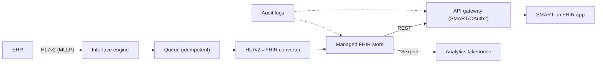

# FHIR interoperability platform

## Problem & context

A mid-size health system receives clinical events from its EHR as HL7v2 and needs to (a) expose them to modern apps over FHIR R4 and (b) feed an analytics platform — without mishandling PHI. This is the most common provider-facing SA brief.

## Requirements (NFRs)

| ID | Requirement | Source |
| --- | --- | --- |
| NFR-1 | PHI encrypted at rest (AES-256) and in transit (TLS 1.2+) | [HIPAA](../03-compliance/00-hipaa.md) |
| NFR-2 | FHIR read API P95 < 500 ms at expected load | Clinical apps |
| NFR-3 | All PHI access audited, logs retained 6 years | HIPAA §164.312(b) |
| NFR-4 | Operable by a small team | Org constraint |
| NFR-5 | Run cost predictable at current volume | Finance |

## Architecture

Built from: [HL7v2](../02-interoperability/00-hl7v2.md) ingestion → [event-driven](../08-integration/01-event-driven.md) decoupling → [FHIR](../02-interoperability/01-fhir.md) store → [API management](../08-integration/02-api-management.md) + [SMART](../02-interoperability/05-smart-on-fhir.md), with [Bulk Data](../02-interoperability/01-fhir.md) feeding the [lakehouse](../05-data-platforms/00-lakehouse-vs-warehouse.md).

## Key decisions & trade-offs

- **Managed FHIR store vs self-hosted HAPI** → managed, for operability and built-in audit; accept per-request cost and some lock-in. (Revisit if volume → millions/day.)
- **Convert-on-ingest vs store-raw** → convert-on-ingest for a clean FHIR read path; accept that mapping changes need reprocessing (replay from the durable queue).
- **Queue between engine and converter** → decouples real-time MLLP from conversion; enables retry/replay and idempotency.

## Compliance mapping

Encryption + KMS (NFR-1) · least-privilege IAM + SMART scopes at the gateway · CloudTrail/audit logs 6-yr retention (NFR-3) · BAA-covered managed services · private endpoints to the FHIR store.

## Cost

Dominated by the managed FHIR store's per-request and storage pricing plus audit-log volume; cheap at this scale, re-evaluated with growth (see [TCO worked example](../01-foundations/03-tradeoffs-tco.md)).

## Lab

[`hls-fhir-interop`](https://github.com/anothernoise/hls-fhir-interop) — build this on AWS HealthLake / GCP Healthcare API / Azure Health Data Services.

## Check yourself

1. Why place a queue between the interface engine and the converter?
2. What does convert-on-ingest cost you when the HL7v2→FHIR mapping changes, and how is that mitigated?
3. Which NFR most threatens the managed-FHIR decision as the system grows?
