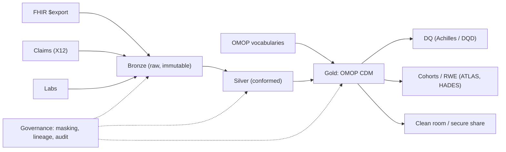

# RWD lakehouse

> _Last reviewed: 2026-06-28 — see the [freshness policy](../appendix/maintenance.md)._

## Problem & context

An organization wants to run real-world-evidence studies across clinical and claims data from multiple sources, each with a different schema and vocabulary, with governed access to PHI and reproducible results acceptable to regulators.

## Requirements (NFRs)

| ID | Requirement | Source |
| --- | --- | --- |
| NFR-1 | Analysts query one model, not N source schemas | Research |
| NFR-2 | Column-level PHI access control + audit | [HIPAA](../03-compliance/00-hipaa.md)/[HITRUST](../03-compliance/01-hitrust.md) |
| NFR-3 | Reproducible: pinned data + vocabulary versions | [RWE](../05-data-platforms/02-rwd-rwe.md) credibility |
| NFR-4 | Incremental ingest at TB scale (no full reloads) | Cost/scale |
| NFR-5 | Cross-org collaboration without moving PHI | Partnerships |

## Architecture

Built from the [medallion lakehouse](../05-data-platforms/00-lakehouse-vs-warehouse.md), [OMOP on cloud](../05-data-platforms/01-omop-on-cloud.md) gold, [governance & data contracts](../05-data-platforms/03-governance-contracts.md), and [tokenized linkage](../05-data-platforms/02-rwd-rwe.md) for external sources.

## Key decisions & trade-offs

- **OMOP as gold vs source-specific marts** → OMOP for cross-source comparability and the OHDSI tool ecosystem; accept upfront mapping cost.
- **Lakehouse vs warehouse** → lakehouse for cheap raw retention + ML; Snowflake variant narrows the ops gap for SQL-first teams.
- **Tokenization for external linkage** → link trial/claims/EHR by patient token without exposing PII; manage residual re-identification risk on the linked set.
- **Clean room / secure share for collaboration** (NFR-5) → partners compute without seeing row-level PHI.

## Compliance mapping

Unity Catalog / Horizon masking + row filters (NFR-2) · immutable bronze + pinned versions + lineage (NFR-3, GxP/[21 CFR Part 11](../03-compliance/02-gxp-part11.md) integrity) · residency-pinned storage ([regional](../03-compliance/05-regional-compliance.md)) · audited access.

## Cost

Storage-heavy but cheap object tiers for bronze; compute auto-suspends; biggest lever is co-locating compute with storage to avoid egress (see [TCO](../01-foundations/03-tradeoffs-tco.md)).

## Lab

[`hls-lakehouse-rwd`](https://github.com/anothernoise/hls-lakehouse-rwd) — OMOP lakehouse on Databricks and Snowflake.

## Check yourself

1. Why OMOP as the gold model rather than per-source marts?
2. How does the design let a partner analyze your data without seeing row-level PHI?
3. Which two practices make the RWE reproducible enough to defend to a regulator?
