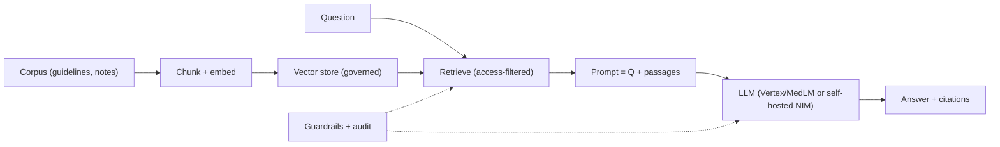

# Clinical RAG

> _Last reviewed: 2026-06-28 — see the [freshness policy](../appendix/maintenance.md)._

## Problem & context

Clinicians and staff need fast, trustworthy answers grounded in the institution's own documents — guidelines, policies, protocols, and (with authorization) patient records — without the hallucination risk of a bare LLM and without sending PHI to an un-covered service.

## Requirements (NFRs)

| ID | Requirement | Source |
| --- | --- | --- |
| NFR-1 | Answers cite their sources | Clinical trust |
| NFR-2 | PHI stays in-boundary (BAA-covered or self-hosted) | [HIPAA](../03-compliance/00-hipaa.md) |
| NFR-3 | Retrieval respects record-level access | Authorization |
| NFR-4 | Measurable faithfulness / low hallucination | Safety |
| NFR-5 | Predictable cost per query | Finance |

## Architecture

Built from [RAG over clinical corpora](../06-ai-ml/02-rag-clinical.md) on [GCP](../04-cloud-platforms/02-gcp.md) (Vertex AI + BigQuery), with the PHI-boundary options from [NVIDIA NIM](../04-cloud-platforms/07-nvidia.md).

## Key decisions & trade-offs

- **RAG vs fine-tuning** → RAG, so answers are grounded in current, citable sources and the corpus updates without retraining; accept retrieval-quality dependence.
- **Managed model vs self-hosted (NIM)** → managed (BAA-covered) for speed, or self-hosted when PHI policy/sovereignty forbids external APIs (NFR-2).
- **Access-filtered retrieval** → enforce the user's record permissions at retrieval so RAG can't bypass authorization (NFR-3).
- **Strict grounding** → instruct + evaluate the model to answer only from context and say "not found" otherwise (NFR-4).

## Compliance mapping

BAA-covered or self-hosted inference (NFR-2) · vector store in the governed environment · retrieval authorization mirrors record access · prompt/response/citation logging for audit · output PHI filtering where required.

## Cost

Embedding + storage of the corpus (one-time-ish) plus per-query retrieval + generation tokens; cache safe reads; choose model size to balance quality vs cost (see [TCO](../01-foundations/03-tradeoffs-tco.md)).

## Lab

[`RAGonGCP`](https://github.com/anothernoise/RAGonGCP) — clinical/biomedical RAG with citations on Vertex AI + BigQuery.

## Check yourself

1. Why RAG rather than fine-tuning for institution-specific clinical Q&A?
2. How do you stop RAG from surfacing records a user isn't authorized to see?
3. What two controls keep PHI in-boundary, and when must you self-host the model?
