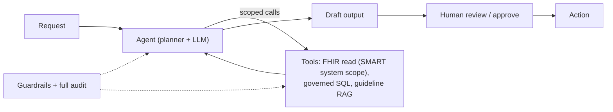

# Agentic AI assistant

> _Last reviewed: 2026-06-28 — see the [freshness policy](../appendix/maintenance.md)._

## Problem & context

A health organization wants to automate a multi-step workflow — e.g. assembling a prior-authorization packet or triaging and routing referrals — that requires gathering data from several systems (FHIR, claims, labs), reasoning over it, and drafting an output. A single LLM call cannot do this; an agent that calls tools can.

## Requirements (NFRs)

| ID | Requirement | Source |
| --- | --- | --- |
| NFR-1 | Tools scoped to least privilege | [HIPAA](../03-compliance/00-hipaa.md) minimum-necessary |
| NFR-2 | Human approval before consequential actions | Clinical safety |
| NFR-3 | Full audit of plan, tool calls, outputs | HIPAA + debuggability |
| NFR-4 | PHI stays in-boundary | HIPAA |
| NFR-5 | Bounded behavior (guardrails, no out-of-scope actions) | Safety |

## Architecture

Built from [agentic AI](../06-ai-ml/03-agentic-ai.md) on [AWS](../04-cloud-platforms/01-aws.md) Bedrock, using [SMART backend scopes](../02-interoperability/05-smart-on-fhir.md) for the FHIR tool and [RAG](./03-clinical-rag.md) for guideline lookup.

## Key decisions & trade-offs

- **Advisory vs autonomous** → advisory by default (agent drafts, human acts); automate only low-risk, reversible steps (NFR-2). Trades speed for safety — the right trade in clinical contexts.
- **Narrow, typed tools** → many small scoped tools instead of one broad tool; easier to authorize and audit (NFR-1, NFR-3).
- **Treat the agent as an untrusted actor** → authorize every tool call as if a user made it; the agent never holds standing broad access.
- **Self-hosted vs managed model** → as with [RAG](./03-clinical-rag.md), self-host (NIM) when PHI policy forbids external APIs (NFR-4).

## Compliance mapping

Least-privilege [SMART](../02-interoperability/05-smart-on-fhir.md)/IAM scopes per tool (NFR-1) · human-in-the-loop gate (NFR-2) · audit of plan + every tool call + outputs (NFR-3) · in-boundary inference (NFR-4) · guardrails block out-of-scope actions and filter PHI from any external call.

## Cost

Per-task token cost (multiple LLM turns) plus tool-call costs; track cost-per-task and unsafe-action rate as first-class metrics; cap iterations to bound runaway loops.

## Lab

[`aws-health-agents`](https://github.com/anothernoise/aws-health-agents) — agentic AI over health data on Bedrock with tools, guardrails, and CDK.

## Check yourself

1. Why default to advisory rather than autonomous in a clinical agent, and what may be automated?
2. Why prefer many narrow tools over one broad tool?
3. What must be audited for an agent, and why is "treat the agent as untrusted" the right stance?
