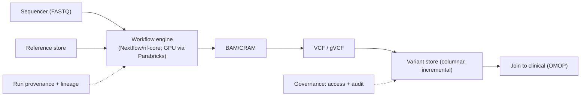

# Genomics pipeline

## Problem & context

A diagnostics lab or research group must turn raw sequencer output into variant calls and downstream evidence — reproducibly, at scale, and (for clinical use) with the provenance a regulated report demands.

## Requirements (NFRs)

| ID | Requirement | Source |
| --- | --- | --- |
| NFR-1 | Reproducible: pinned pipeline + container versions | Science / [GxP](../03-compliance/02-gxp-part11.md) |
| NFR-2 | Run provenance captured (inputs, versions, params) | Clinical reporting |
| NFR-3 | Cost-efficient at population scale | Finance |
| NFR-4 | Variants queryable across samples (not loose VCFs) | Analysis |
| NFR-5 | Genomic data governed as high-sensitivity PHI | [HIPAA](../03-compliance/00-hipaa.md) |

## Architecture

Built from [sequencing pipelines](../07-genomics/00-sequencing-pipelines.md) (FASTQ→BAM→VCF), executed on managed [HealthOmics](../07-genomics/01-healthomics.md) or cloud batch / on-prem HPC, with a [variant store](../07-genomics/02-variant-stores.md) for cross-sample analysis and optional [Parabricks](../04-cloud-platforms/07-nvidia.md) GPU acceleration.

## Key decisions & trade-offs

- **Managed (HealthOmics) vs DIY (AWS Batch / HPC)** → managed for built-in provenance and storage with less ops (NFR-2); DIY/HPC for maximum control or an existing validated cluster.
- **GPU acceleration (Parabricks) vs CPU** → GPU when throughput/SLA demands it (hours → minutes); accept GPU cost and a specific toolchain.
- **Variant store vs per-sample VCFs** → columnar, incremental store so cross-cohort queries scale and adding sample N+1 doesn't reprocess all N (NFR-4).
- **CRAM over BAM; archive raw after QC** → cut storage cost at population scale (NFR-3).

## Compliance mapping

Pinned pipeline + container versions + immutable inputs (NFR-1) · captured run provenance (NFR-2, [GxP](../03-compliance/02-gxp-part11.md)) · genomic data treated as high-sensitivity PHI — inherently re-identifying, strict access + audit (NFR-5, see [de-identification](../03-compliance/04-deidentification-consent.md)).

## Cost

Compute-dominated (per-run); use spot/preemptible for fault-tolerant steps, GPU where it pays off, and co-locate compute with storage to avoid moving terabytes (see [TCO](../01-foundations/03-tradeoffs-tco.md)).

## Lab

[`RNASEQ`](https://github.com/anothernoise/RNASEQ) — nf-core/Nextflow pipeline; maps onto HealthOmics or cloud batch, with Parabricks as the GPU path.

## Check yourself

1. Why is a columnar variant store preferred over a folder of per-sample VCFs at population scale?
2. When does managed HealthOmics beat a DIY AWS Batch / HPC build, and when not?
3. Why must genomic data be governed as high-sensitivity PHI even when "de-identified"?
