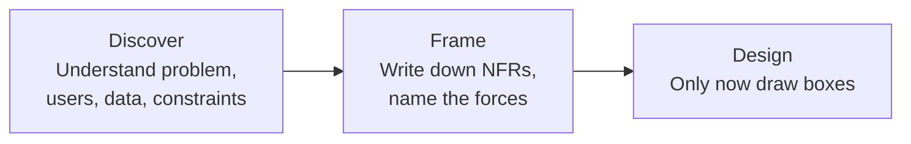

# Discovery & requirements

> _Last reviewed: 2026-06-28 — see the [freshness policy](../appendix/maintenance.md)._

## Learning objectives

After this chapter you will be able to:

- Run a discovery interview with clinical, IT, and compliance stakeholders and extract meaningful requirements.
- Convert vague compliance statements into measurable non-functional requirements (NFRs).
- Produce a one-page requirements summary that a design can be traced back to.

## Why discovery comes before design

The biggest mistake an SA makes is solving the problem they imagined rather than the one that exists. In HLS, the cost of this error is amplified: a HIPAA control missed in discovery becomes a compliance gap found in the security review — or worse, in an audit.

**Discovery is the Discover + Frame steps of the SA operating loop** (see [The SA operating model](../00-orientation/02-sa-operating-model.md)):



Resist the pull to design during discovery. You are listening, not proposing.

## Who to talk to — and what to ask

A discovery engagement touches at least three stakeholder types. Each knows something the others don't.

### Clinical / scientific stakeholders

**Goal:** understand the workflow and what "wrong" looks like at the patient or researcher level.

| Question | Why it matters |
| --- | --- |
| "Walk me through what you do today, step by step." | Surfaces the real workflow — not the documented one. |
| "What breaks most often?" | Identifies integration points and reliability requirements. |
| "What worries you at 3am?" | Uncovers the failure mode the stakeholder is most afraid of — often a hidden requirement. |
| "If this system were down for an hour, what would you do?" | Reveals the real RTO tolerance — often stricter than IT knows. |
| "What data do you need that you can't get today?" | Surfaces the actual value proposition. |

### IT / security stakeholders

**Goal:** understand the current technical landscape and what the architecture must integrate with or avoid.

| Question | Why it matters |
| --- | --- |
| "What's already in place that we must connect to or not replace?" | Existing EHR, FHIR server, identity provider — these are constraints. |
| "What has broken badly in the past?" | Prior incidents reveal fragility and non-obvious constraints. |
| "Who owns the network and firewall rules?" | Tells you whether a cloud-native architecture is feasible or whether on-prem stays in the path. |
| "What is your patching and deployment cadence?" | Constrains the deployment model. |
| "What monitoring and alerting do you have today?" | Shapes the Operational Excellence pillar. |

### Compliance / regulatory / privacy stakeholders

**Goal:** identify the regulations, certifications, and past audit findings that constrain the design.

| Question | Why it matters |
| --- | --- |
| "Which regulations apply — HIPAA, HITRUST, GxP, GDPR?" | Determines the control framework. Don't assume. |
| "Have you had a HIPAA breach or audit finding in the last 3 years?" | Prior findings often recur; surface them now. |
| "Is there a BAA with your cloud provider?" | If not, you can't store ePHI there until there is. |
| "What is your data residency requirement?" | EU data may not leave the EU; GovCloud may be required. |
| "Who approves a new business associate?" | Signals the BAA approval process and timeline. |

## Converting vague requirements to NFRs

Discovery interviews produce statements like "it needs to be secure" and "it should be HIPAA-compliant." These are not requirements — they are goals. Your job is to translate goals into **measurable NFRs** that a design can be tested against.

| Vague statement | Measurable NFR |
| --- | --- |
| "It needs to be secure." | PHI must be encrypted at rest (AES-256) and in transit (TLS 1.2+). Access to PHI must be logged and retained for 6 years. |
| "It should be HIPAA-compliant." | All ePHI must be stored in HIPAA-eligible cloud services covered by a signed BAA. Access to ePHI must require MFA and be logged in a tamper-evident audit trail. |
| "It should be fast." | FHIR read API P95 latency < 500 ms at 1 k requests/minute. |
| "It should be reliable." | System availability ≥ 99.9% per calendar month (excluding scheduled maintenance). RTO ≤ 4 hours, RPO ≤ 1 hour. |
| "It should scale." | The system must handle 10× current patient volume (from 100 k to 1 M patients) without architectural change. |
| "We need an audit trail." | All PHI read and write events must be logged with user ID, timestamp, resource type, and resource ID. Logs must be immutable and retained for 6 years. |

**Push until you can measure it.** "HIPAA-compliant" is not testable. "PHI encrypted at rest and in transit, access logged, audit trail retained 6 years" is.

## The discovery output: a one-page requirements summary

Produce this document before touching a diagram tool. It is the contract between what the business asked for and what you design.

```markdown
# [Project name] — Requirements Summary

## Problem statement
[One paragraph: what is broken or missing today, and what does success look like?]

## In scope
- [System or process being changed]

## Out of scope
- [What is explicitly not being addressed]

## Stakeholders
| Name | Role | Interest |
| --- | --- | --- |
| | | |

## Functional requirements
1. [FR-01] The system shall allow clinicians to search patient medication lists by patient MRN.
2. ...

## Non-functional requirements
| ID | Requirement | Source |
| --- | --- | --- |
| NFR-01 | FHIR read API P95 < 500 ms at 1k req/min | Clinical stakeholder |
| NFR-02 | PHI encrypted at rest (AES-256) and in transit (TLS 1.2+) | HIPAA Security Rule |
| NFR-03 | Audit logs retained 6 years, immutable | HIPAA §164.312(b) |

## Constraints
- Must integrate with existing Epic EHR (MLLP HL7v2 ADT feed available).
- Cloud budget: < $2k/month run cost.
- Must be operational by Q3 2025.

## Open questions
- [ ] Does the existing BAA with AWS cover HealthLake?
- [ ] What is the patient volume growth forecast for the next 3 years?
```

## Check yourself

1. A clinical stakeholder says "it needs to be always on." How do you convert this to a measurable NFR, and what is the minimum information you need from them?
2. You ask a compliance officer "which regulations apply?" and they say "all of them." What are the three most likely regulations for a US provider health system, and what is the next clarifying question?
3. Why is it important to write the requirements summary *before* drawing any architecture diagrams?

## Further reading

- [arc42: Requirements and Quality Goals](https://docs.arc42.org/section-1/)
- [TOGAF: Stakeholder Management](https://pubs.opengroup.org/architecture/togaf9-doc/arch/chap21.html)
- [NIST SP 800-66r2: HIPAA Security Rule implementation guide](https://csrc.nist.gov/publications/detail/sp/800-66/rev-2/final)
