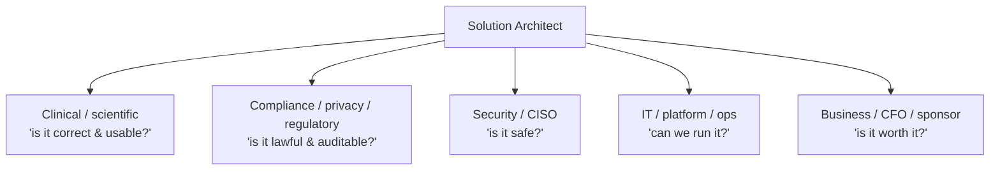

# Stakeholder management

> _Last reviewed: 2026-06-28 — see the [freshness policy](../appendix/maintenance.md)._

## Learning objectives

After this chapter you will be able to:

- Map HLS stakeholders and tailor your communication to each.
- Translate one architecture for a CISO, a clinician, and a CFO.
- Use stakeholder dynamics to de-risk a design before it is built.

## Why this is core SA work, not soft skills

An architecture that is technically excellent but cannot be explained, funded, or approved does not ship. In HLS the stakeholder set is unusually broad and any one of them can stop a project — the compliance officer, the clinician, the CISO. Managing them is not a nicety bolted onto the SA role; it *is* the role. (This is the human side of the [operating model](../00-orientation/02-sa-operating-model.md) and the [discovery](./00-discovery-requirements.md) work.)

## The HLS stakeholder map

Each cares about a different question and speaks a different language. Your job is to give each the answer to *their* question, grounded in the same design.

## One architecture, five translations

The same FHIR platform, explained to each:

| Stakeholder | What they want to hear |
| --- | --- |
| **Clinician** | "It surfaces the med list inside your existing chart view; it won't add clicks or slow you down." |
| **Compliance** | "PHI is encrypted, access is logged for 6 years, every vendor has a BAA, and here's the control-to-HIPAA mapping." |
| **CISO** | "Least-privilege scopes, private endpoints, no public data stores, audited access, tested incident response." |
| **IT/ops** | "Managed services, IaC, runbooks; a 3-person team can operate it." |
| **CFO** | "~\$X/month at current volume, scaling linearly; cheaper than the integration engine it replaces." |

Lead with the stakeholder's concern, not your favorite technical detail. The [C4 Context diagram](../01-foundations/02-c4-and-adrs.md) is your universal opener — everyone can read it; then zoom in for the audience that needs more.

## Using stakeholders to de-risk

- **Engage compliance and security on day one**, not at launch. A control missed in [discovery](./00-discovery-requirements.md) becomes a costly redesign late — and these stakeholders can veto.
- **Find the skeptic early.** The person most worried ("what happens at 3am?") surfaces your hardest requirement.
- **Make trade-offs explicit and shared.** Present options and what each trades (an [ADR](../01-foundations/02-c4-and-adrs.md)); let stakeholders own the decision with you, so it sticks.
- **Write it down.** A one-page requirements summary + decision log turns hallway agreement into a durable contract.

## Check yourself

1. Why can stakeholder management make or break a technically sound HLS architecture?
2. Take one design decision and phrase it for a clinician, a CISO, and a CFO.
3. Why engage compliance and security in discovery rather than at the security review?

## Further reading

- [Discovery & requirements](./00-discovery-requirements.md)
- [TOGAF stakeholder management](https://pubs.opengroup.org/architecture/togaf9-doc/arch/chap21.html)
