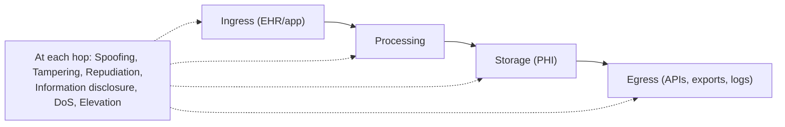

# Security review

> _Last reviewed: 2026-06-28 — see the [freshness policy](../appendix/maintenance.md)._

## Learning objectives

After this chapter you will be able to:

- Run a structured security review of an HLS architecture before build.
- Apply threat modeling and a PHI-focused control checklist.
- Produce review evidence that supports HIPAA/HITRUST and a security sign-off.

## The review is a gate, not a formality

Before an HLS design is built, it passes a **security review** — and in regulated settings, it must. The SA owns getting the architecture through it: not by hoping, but by designing to a checklist and threat-modeling the PHI flows up front. A design that reaches review with these answers ready sails through; one that doesn't gets sent back. This is the [Validate](../00-orientation/02-sa-operating-model.md) step made concrete, and it leans on the [Security pillar](../01-foundations/01-well-architected.md) and [HIPAA](../03-compliance/00-hipaa.md).

## Threat-model the PHI flows

Trace PHI through the architecture and ask, at each hop, what could go wrong. A lightweight STRIDE pass works well:

Pay special attention to the **edges**: ingress auth, egress (APIs, exports, **logs**, backups, support access) — the places PHI leaks are usually at a boundary someone forgot, not in the core store.

## PHI-focused control checklist

- **Encryption** — at rest (AES-256, customer-managed keys) and in transit (TLS 1.2+); no exceptions for "internal" traffic.
- **Access** — least privilege (IAM + [SMART scopes](../02-interoperability/05-smart-on-fhir.md)), MFA, automatic session timeout; deny by default.
- **Network** — PHI stores in private subnets; private endpoints; no public buckets/DBs; egress controls.
- **Audit** — who accessed which PHI, when; immutable logs retained ≥ 6 years; alerting on anomalous access.
- **BAA surface** — every vendor touching PHI has a BAA; minimize the count (see [HIPAA](../03-compliance/00-hipaa.md)).
- **Secrets** — managed secret store, rotation, no secrets in code or env files.
- **Data lifecycle** — retention, secure deletion, de-identification where data leaves the trust boundary.
- **Backups & DR** — encrypted, tested restore, RTO/RPO defined.
- **Logging hygiene** — no PHI in application logs sent to un-covered tooling. See [Observability for clinical platforms](./07-observability-for-clinical-platforms.md) for the full PHI-safe telemetry architecture.
- **Incident response** — a tested runbook and breach-notification path.

## Make it evidence, not opinion

The strongest review posture is **policy-as-code + IaC**: if encryption, private networking, and access controls are enforced by reusable modules, you can *prove* they apply uniformly rather than asserting it. That same evidence feeds [HITRUST](../03-compliance/01-hitrust.md) and (for regulated software) [GxP validation](../03-compliance/02-gxp-part11.md). Bring to the review: the [C4 + data-flow diagrams](../01-foundations/02-c4-and-adrs.md), the control-to-regime mapping, the threat model, and the IaC that enforces it.

## Check yourself

1. Where do PHI leaks most commonly hide, and why focus the threat model on the edges?
2. List five controls from the checklist and the threat each mitigates.
3. Why does policy-as-code + IaC make a security review (and a HITRUST assessment) easier to pass?

## Further reading

- [Architecting HIPAA on AWS (whitepaper)](https://docs.aws.amazon.com/whitepapers/latest/architecting-hipaa-security-and-compliance-on-amazon-web-services/welcome.html)
- [STRIDE threat modeling](https://learn.microsoft.com/en-us/azure/security/develop/threat-modeling-tool-threats)
- [NIST SP 800-66r2 (HIPAA Security)](https://csrc.nist.gov/publications/detail/sp/800-66/rev-2/final)
