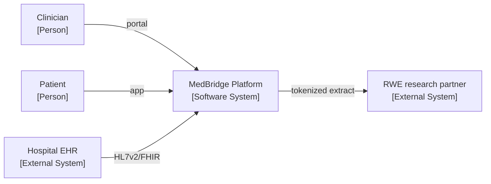
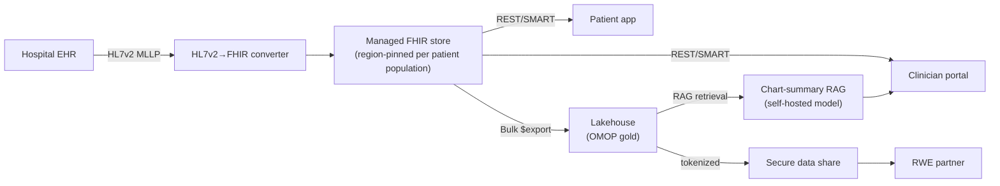

# Capstone exemplar (worked example)

> _Last reviewed: 2026-06-29 — see the [freshness policy](../appendix/maintenance.md)._

## Learning objectives

After this chapter you will be able to:

- Calibrate your own capstone submission against a complete worked example.
- See how the seven deliverables and five design questions come together in one design.
- Self-score a submission against the Part 10 rubric before it's reviewed.

## What this is (and isn't)

This is **one credible answer** to the [capstone brief](./03-capstone.md) — not *the* answer.
It exists so you can calibrate: read it *after* you've drafted your own, and compare
structure and rigor, not the specific technology choices (a different cloud, a different AI
feature, or a different dominant quality attribute can all be equally "good" if defended
well). Read the [Reference architectures overview](../09-reference-architectures/00-overview.md)
first — this exemplar follows the same seven-section shape.

## 1. Requirements summary

**Problem.** MedBridge Health runs a patient-facing app and a clinician portal, integrates
with hospital EHRs, and wants AI features and RWE partnerships. It serves US and Canadian
patients today and is opening a pilot in Germany next year.

**Scope.** In: patient app, clinician portal, EHR ingestion, one AI feature, an RWD/RWE data
layer. Out: billing/revenue-cycle systems, the EHR itself.

**Stakeholders.** Clinicians (chart access, alert fatigue), patients (access, consent),
compliance/privacy officer, CISO, CFO (run cost), RWE research partners.

**Functional requirements (excerpt).** FR-01: clinicians can search a patient's problem list
and meds via the portal. FR-02: patients can view their own record and message their care
team. FR-03: the platform ingests HL7v2 ADT + FHIR from partner EHRs. FR-04: an AI feature
summarizes a patient's chart for the clinician on login.

**Non-functional requirements (excerpt — see [discovery template](./00-discovery-requirements.md)):**

| ID | Requirement | Source |
| --- | --- | --- |
| NFR-01 | PHI encrypted at rest (AES-256, CMK) and in transit (TLS 1.2+) | HIPAA |
| NFR-02 | US patient data resides in US regions; Canadian in Canadian regions; German (pilot) in EU regions | [Regional compliance](../03-compliance/05-regional-compliance.md) |
| NFR-03 | Clinician portal FHIR read P95 < 500 ms | Clinical stakeholders |
| NFR-04 | Audit trail for all PHI access, retained 6 years | HIPAA §164.312(b) |
| NFR-05 | AI chart summary must cite source resources and support human override | Clinical safety, [RAG best practices](../06-ai-ml/02-rag-clinical.md) |
| NFR-06 | Run cost < $15k/month at current volume (50-bed pilot health system) | CFO |

## 2. Architecture — C4 context & container

*(This is the L1/L2 pair the [C4 chapter](../01-foundations/02-c4-and-adrs.md) calls for —
one box for "everyone," one for the engineering/security review.)*

## 3. Key ADRs (three of six)

- **ADR-01: Region-pinned managed FHIR stores per population**, not one global store.
  *Rationale:* NFR-02 forces residency; a single global FHIR store would violate it for at
  least one population. *Trade-off:* three smaller stores to operate instead of one, but each
  is simpler and residency is structurally enforced, not policy-enforced.
- **ADR-02: Self-hosted RAG model (NIM) for the chart-summary feature**, not a managed
  external API. *Rationale:* NFR-05 plus HIPAA/GDPR — PHI must stay in-boundary; see
  [RAG over clinical corpora](../06-ai-ml/02-rag-clinical.md). *Trade-off:* more infrastructure
  to run than calling a hosted API, in exchange for no new business associate/processor.
- **ADR-03: Tokenized linkage for the RWE partnership**, not raw data transfer. *Rationale:*
  the partner must never receive identified PHI; tokenization (see
  [RWD/RWE](../05-data-platforms/02-rwd-rwe.md)) lets both sides link records without either
  exposing identities. *Trade-off:* match-rate tuning overhead vs. a much smaller BAA/DPA
  surface.

## 4. Compliance mapping

| Control | Regime(s) | How |
| --- | --- | --- |
| Region-pinned storage | HIPAA, PIPEDA/PHIPA, GDPR | ADR-01: per-population managed FHIR stores |
| Article 9 lawful basis (Germany) | GDPR | Care relationship = Art. 9(2)(h); explicit consent for RWE secondary use |
| Self-hosted AI, no PHI egress | HIPAA, GDPR | ADR-02 |
| Tokenized RWE sharing | HIPAA (min. necessary), GDPR | ADR-03 |
| Audit trail 6 years | HIPAA §164.312(b) | Immutable logs on every FHIR store |
| Future AI transparency | ONC HTI-1 (US), EU AI Act (Germany pilot) | MLOps pipeline emits source attributes; human-override UI satisfies human-oversight design requirement — see the [decision guide](../03-compliance/06-compliance-decision-guide.md) triage that surfaced both regimes |

Run this system through the [compliance decision guide](../03-compliance/06-compliance-decision-guide.md)
yourself: segment = digital health; jurisdictions = US + Canada + EU; AI = yes. That triage is
exactly how this table was derived — it is the "correctness" evidence for the Compliance
rubric line.

## 5. Cost model (back-of-envelope)

| Component | Monthly (approx.) |
| --- | --- |
| 3× regional managed FHIR stores (US/CA/EU), low volume | $250 |
| Lakehouse storage + compute (OMOP gold, auto-suspend) | $600 |
| Self-hosted RAG inference (GPU, right-sized) | $2,000 |
| API gateway, audit logging, misc | $150 |
| **Total** | **~$3,000/month** |

Comfortably under NFR-06's $15k ceiling at pilot volume; the GPU inference line is the one to
re-model first if volume grows 10× (see [TCO](../01-foundations/03-tradeoffs-tco.md)).

## 6. Security review pack (excerpt)

Threat-modeled per the [security review](./02-security-review.md) checklist: ingress (EHR
MLLP feed) authenticated per-partner; egress to the RWE partner is tokenized only, never raw
FHIR; the self-hosted model has no outbound network egress rule; audit logs shipped to an
immutable, region-matched store (not a US-only SIEM, to respect NFR-02).

## 7. Stakeholder brief

- **Clinician:** "The chart summary appears when you open the portal, cites its sources, and
  you can always click through to the original record — it doesn't replace your judgment."
- **CISO:** "Patient data never crosses a border it isn't supposed to, the AI model runs
  inside our own network with no external API calls, and every access is logged for six
  years."
- **CFO:** "About $3k/month at pilot scale, scaling roughly linearly with patients; the AI
  compute is the line to watch if we grow fast."

## Self-scoring against the rubric

| Dimension | Self-assessment |
| --- | --- |
| Correctness | Data flows end-to-end from EHR to portal/app to lakehouse to RWE partner; nothing hand-waved |
| Compliance | All three jurisdictions mapped via the decision guide; residency structurally enforced, not just documented |
| Trade-offs | Three ADRs each name what was given up, not just what was chosen |
| Cost | Concrete monthly figure with the volume-sensitive line identified |
| Communication | Three distinct one-paragraph framings, each answering that stakeholder's actual question |

**The dominant quality attribute here is compliance/interoperability, traded against
operational simplicity** (three regional stores instead of one, a self-hosted model instead
of a managed API) — name yours as explicitly as this when you defend your own design.

## Check yourself

1. Where does this exemplar's design most resemble your own, and where does it diverge — and is the divergence a defensible trade-off or a gap?
2. The exemplar chose a self-hosted RAG model. Under what NFR change would a managed API become the better ADR?
3. Run this same brief through the [compliance decision guide](../03-compliance/06-compliance-decision-guide.md) yourself, from scratch, before reading section 4 again — did you get the same regime list?

## Further reading

- [Capstone project](./03-capstone.md) — the brief and rubric this exemplar answers
- [Reference architectures overview](../09-reference-architectures/00-overview.md) — the same seven-section shape used here
